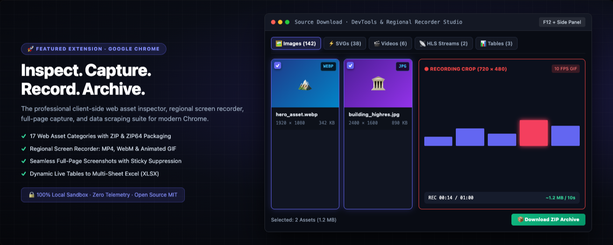
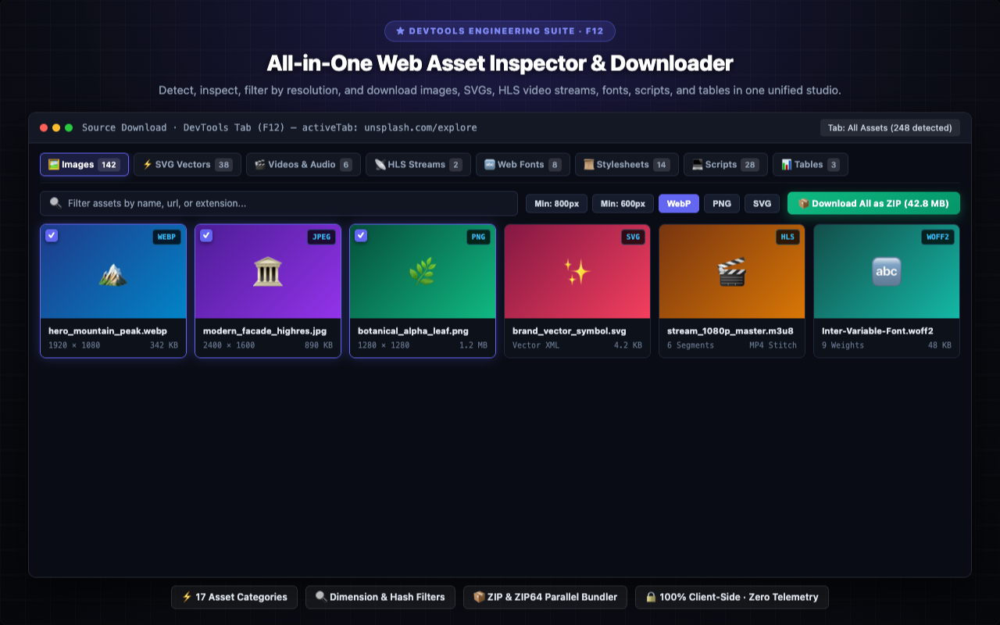
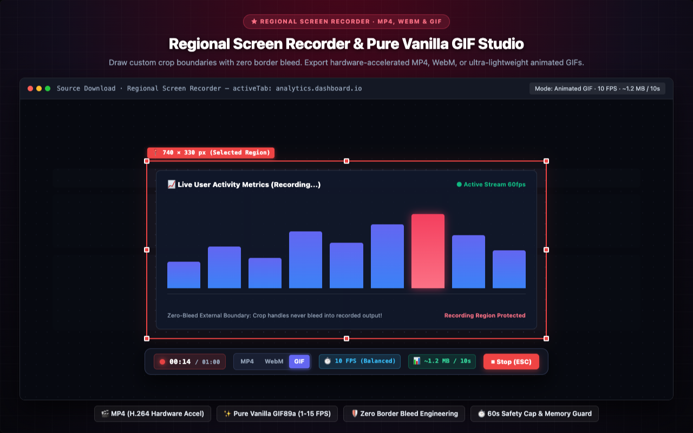
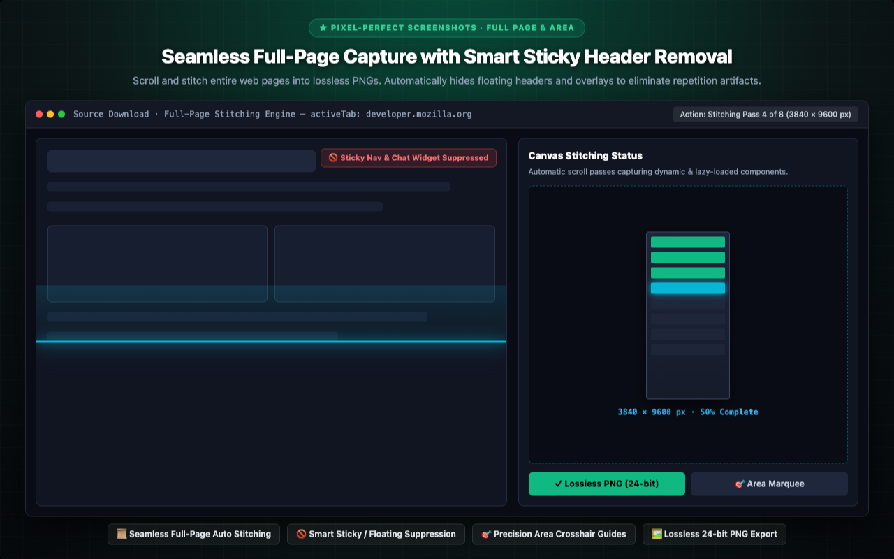
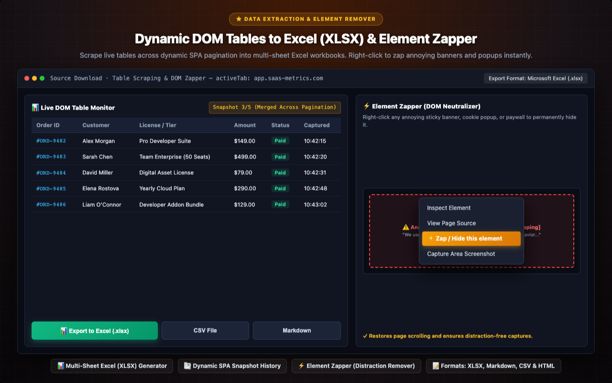
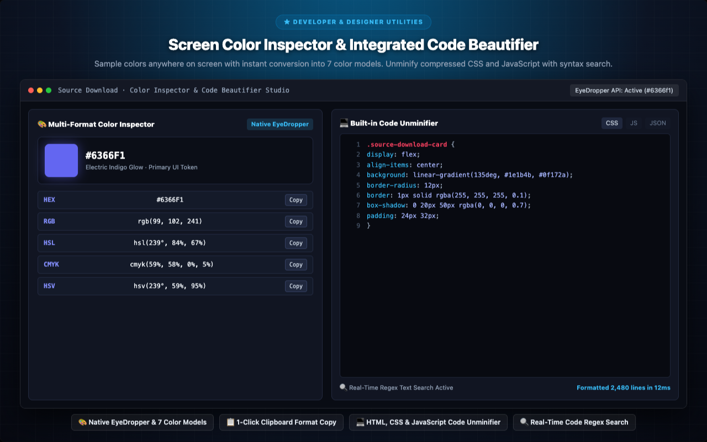

<p align="center">
  
</p>

<h1 align="center">Source Download</h1>

<p align="center">
  <a href="README.md"></a>
  <a href="docs/locales/README.tr.md"></a>
  <a href="docs/locales/README.de.md"></a>
  <a href="docs/locales/README.es.md"></a>
  <a href="docs/locales/README.ja.md"></a>
  <a href="docs/locales/README.ru.md"></a>
  <a href="docs/locales/README.zh-CN.md"></a>
</p>

<p align="center">
  <em>The all-in-one web asset downloader, full page screenshot engine & live DOM workbench.</em><br>
  Browse, inspect and download <b>every asset</b> a web page loads — images, SVG, video, audio, JS, CSS, fonts, JSON, WASM, manifests, live tables, and pixel-perfect full page screenshots — seamlessly as a folder-structured ZIP.
</p>

<p align="center">
  <a href="https://chromewebstore.google.com/detail/source-download/nockdgincmpfojabnhbofkddgcmnodpd"></a>
  
  
  
  
  
  <a href="LICENSE"></a>
  
  
</p>

---

<p align="center">
  
</p>

---

## Hi, I'm Turan Burak Yeşilyurt

For years I built automations for **web scraping**, **data analysis** and **QA workflows**. Then SPAs took over the web — and I kept hitting the same wall: as an end user you can't easily grab the things you *see* on screen, and as a developer the Chrome DevTools area often feels either insufficient or overwhelming. That frustration is exactly why I built **Source Download**.

This is my **first open-source project**, so your feedback means the world to me — it's the single biggest driver for making this thing better. And please, don't forget to [**connect with me on LinkedIn**](https://www.linkedin.com/in/turan-burak-yesilyurt/) or check out [**2run.dev**](https://2run.dev) — I'd love to hear how you use it and chat about what else we could build together. Enjoy!

> **Chrome Web Store:** [Install Source Download from Chrome Web Store](https://chromewebstore.google.com/detail/source-download/nockdgincmpfojabnhbofkddgcmnodpd)

---

> **A confession & open-source pledge:** Almost every "download this page's assets" tool you'll find on the store is a wrapper around a pile of third-party libraries. This one is different. Every byte of Source Download — including the **ZIP writer**, the **XLSX builder**, the **HLS merger**, the **GIF encoder** and the **code formatters** — is hand-written from scratch. No frameworks, no external dependencies, no build step, no telemetry. Just vanilla JavaScript, readable and auditable in a sitting.

---

## Visual Tour & Core Modules

Explore the high-resolution interface modules built directly into Google Chrome DevTools, Side Panel, and Toolbar Popup.

### 1. All-in-One Web Asset Inspector & Downloader
> **★ DEVTOOLS ENGINEERING SUITE · F12** — Detect, inspect, filter by resolution, and download images, SVGs, HLS video streams, fonts, scripts, and tables in one unified studio.
> 
> `⚡ 17 Asset Categories` · `🔍 Dimension & Hash Filters` · `📦 ZIP & ZIP64 Parallel Bundler` · `🔒 100% Client-Side · Zero Telemetry`

<p align="center">
  
</p>

---

### 2. Regional Screen Recorder & Pure Vanilla GIF Studio
> **★ REGIONAL SCREEN RECORDER · MP4, WEBM & GIF** — Draw custom crop boundaries with zero border bleed. Export hardware-accelerated MP4, WebM, or ultra-lightweight animated GIFs.
> 
> `🎬 MP4 (H.264 Hardware Accel)` · `✨ Pure Vanilla GIF89a (1-15 FPS)` · `🛡️ Zero Border Bleed Engineering` · `⏱️ 60s Safety Cap & Memory Guard`

<p align="center">
  
</p>

---

### 3. Seamless Full-Page Capture with Smart Sticky Header Removal
> **★ PIXEL-PERFECT SCREENSHOTS · FULL PAGE & AREA** — Scroll and stitch entire web pages into lossless PNGs. Automatically hides floating headers and overlays to eliminate repetition artifacts.
> 
> `📜 Seamless Full-Page Auto Stitching` · `🚫 Smart Sticky / Floating Suppression` · `🎯 Precision Area Crosshair Guides` · `🖼️ Lossless 24-bit PNG Export`

<p align="center">
  
</p>

---

### 4. Dynamic DOM Tables to Excel (XLSX) & Element Zapper
> **★ DATA EXTRACTION & ELEMENT REMOVER** — Scrape live tables across dynamic SPA pagination into multi-sheet Excel workbooks. Right-click to zap annoying banners and popups instantly.
> 
> `📊 Multi-Sheet Excel (XLSX) Generator` · `📑 Dynamic SPA Snapshot History` · `⚡ Element Zapper (Distraction Remover)` · `📝 Formats: XLSX, Markdown, CSV & HTML`

<p align="center">
  
</p>

---

### 5. Screen Color Inspector & Integrated Code Beautifier
> **★ DEVELOPER & DESIGNER UTILITIES** — Sample colors anywhere on screen with instant conversion into 7 color models. Unminify compressed CSS and JavaScript with syntax search.
> 
> `🎨 Native EyeDropper & 7 Color Models` · `📋 1-Click Clipboard Format Copy` · `💻 HTML, CSS & JavaScript Code Unminifier` · `🔍 Real-Time Code Regex Search`

<p align="center">
  
</p>

---

Source Download is the professional, all-in-one web asset inspection, extraction, screen capture, and recording studio built natively into Google Chrome. Engineered for web developers, UI/UX designers, QA engineers, digital archivists, and researchers, Source Download eliminates the friction of scraping resources, inspecting network streams, capturing long-scrolling pages, and recording high-definition screen clips.

Operating through an advanced DevTools Engineering Suite (F12), an instant Side Panel companion, and a fast toolbar popup, Source Download detects, categorizes, formats, and archives everything a web page loads. From high-resolution media and vector graphics to HLS video streams, dynamic DOM tables, web fonts, and API responses, you can inspect every asset with deep technical metrics and export them individually or bundled into a clean, folder-structured ZIP archive.


## COMPLETE FEATURE OVERVIEW


### 1. COMPREHENSIVE ASSET DETECTION & EXTRACTION (17 CATEGORIES)

Inspect, preview, and download every component loaded by any modern website across 17 dedicated resource categories:
- **Images & Visual Media:** Filter and isolate high-resolution hero photography and interface graphics from tiny tracking pixels using custom width and height thresholds. Detect byte-identical duplicate files with instant hash matching. Inspect visual assets in a full-screen zoomable lightbox with transparent checkerboard background for alpha channels.
- **SVG Vectors:** Extract inline SVG DOM elements, linked SVG files, and CSS background vectors. Inspect raw XML vector code, copy clean SVG markup directly to clipboard, or download standalone vector assets ready for Figma, Sketch, or Illustrator.
- **Videos & Audio:** Detect HTML5 media elements, blob streams, and direct media links. Preview audio and video directly in the built-in media player with playback controls before saving.
- **HLS Stream Sniffing & Merging:** Intercept HTTP Live Streaming manifests (.m3u8). Parse master and media playlists, inspect available bitrate variants (1080p, 720p, 480p), fetch stream segments in 6-way parallel queues, and stitch them into a clean, unified MP4 file without external software. Detects DRM/AES-128 encryption with immediate status notices.
- **Web Typography:** Extract modern compressed web fonts and scalable typefaces. Test fonts dynamically in a live specimen waterfall view with editable pangrams, weight variations, and glyph inspections.
- **Stylesheets & Scripts:** Download complete CSS and JavaScript files. Built-in unminifier/beautifier formats compressed code into clean syntax with syntax highlighting and instant regex search.
- **API & JSON Responses:** Monitor REST API requests, GraphQL queries, and JSON responses. Inspect parsed JSON object trees, analyze URL query parameters, review request headers, and measure latency.
- **Dynamic DOM Tables:** Real-time DOM table monitor capturing standard tables and ARIA grid components. Maintain snapshot histories across dynamic SPA pagination, merge multi-page states, and export directly to clean multi-sheet Excel (XLSX) workbooks, Markdown tables, or CSV spreadsheets.
- **Live Text Extraction:** Walk the entire DOM text stream in natural reading order. Filter content in real time using plain text, Regular Expressions, CSS selectors, or complex XPath queries.
- **Web App Manifest & Metadata:** Inspect PWA manifests (manifest.json), favicons, Apple touch icons, and social sharing preview meta tags (Open Graph, Twitter Cards).
- **Documents & Binaries:** Extract digital publications, portable document files, compiled WebAssembly modules, compressed archive bundles, and structured text documents.


### 2. REGIONAL SCREEN RECORDER & ANIMATED GIF STUDIO

Capture high-definition video and lightweight animated GIFs from any region of your screen:
- **Interactive Crop Box:** Draw a crop box anywhere on the active tab or screen. Drag and resize smoothly with 8 grab handles and live coordinate readouts.
- **Zero-Bleed Boundary Engineering:** Crop handles and drag headers are rendered strictly outside the active capture boundary. An external outline offset prevents red selection borders, handles, or toolbar elements from ever bleeding into your recorded footage.
- **Non-Overlapping Floating Toolbar:** A draggable recording bar automatically docks above or below your crop box, preventing unwanted visual overlap with the recording area.
- **Versatile Video & Animated Formats:** Export your screen captures in hardware-accelerated high-definition video, open web media streams, or lightweight animated GIFs.
- **High-Performance Pure Vanilla GIF Encoder:** Built-in GIF89a encoding engine crafted in 100% pure vanilla JavaScript. Features 15-bit median-cut color quantization and integer-keyed LZW compression with zero external dependencies.
- **Configurable GIF Frame Rates (FPS):** Choose from 5 tailored frame rate tiers:
  - 15 FPS (Smooth): High fluidity for smooth UI animations, product demos, and web interactions.
  - 10 FPS (Standard / Balanced): The industry standard for web memes and bug reports, offering an optimal balance between quality and compact file size.
  - 5 FPS (Compact / Meme): Stepped motion with significantly reduced file size, ideal for lightweight tutorials.
  - 2 FPS (Stop-Motion / "Tık-Tık" Step-by-Step): Half a second per frame. Perfect for step-by-step documentation, slide walkthroughs, and nostalgic stop-motion animations. Consumes 5x less memory and produces a 5x smaller file size than 10 FPS.
  - 1 FPS (Slideshow / Presentation): Exactly 1 frame per second. Ideal for static page transitions, code walkthroughs, and minimal file footprints (10x smaller than 10 FPS).
- **Real-Time File Size Estimator:** Live toolbar badge calculates estimated GIF file size (~X MB per 10s) based on your selected crop dimensions and chosen FPS before and during recording.
- **4K UHD Safety Ceiling:** Protects browser memory by establishing a 3840px safety ceiling with proportional aspect ratio preservation, preventing out-of-memory tab crashes on retina displays.
- **60-Second Safety Cap:** Enforces a maximum duration of 1 minute (60 seconds) for GIF recording with a live countdown display (00:00 / 01:00) and automatic encoding finalization.


### 3. PIXEL-PERFECT FULL-PAGE & REGIONAL SCREENSHOTS

Capture flawless web page imagery without relying on cloud rendering:
- **Seamless Full-Page Capture:** Scroll-and-stitch entire web pages into crystal-clear PNG images.
- **Smart Sticky Header Suppression:** Automatically detects and suppresses fixed, sticky, and absolute floating elements during scrolling passes, eliminating repeated banner artifacts in long-page captures.
- **Lazy-Load Synchronization:** Simulates viewport scroll pauses to ensure dynamic images and lazy-loaded components render fully before capturing.
- **Precision Area Screenshot:** Select any custom rectangular section on the screen using crosshair guides with instant PNG download.


### 4. SCREEN COLOR PICKER & INSPECTOR

Sample colors from anywhere on your display with designer-grade precision:
- **Native EyeDropper API:** Sample pixel colors directly from the web page or anywhere within your browser window.
- **Comprehensive Color Inspection:** Floating inspector modal automatically converts sampled colors across digital and print color models, including standard hexadecimal notation, RGB color channels with alpha transparency, HSL representations, and print CMYK values.
- **1-Click Clipboard Copy:** Instant copy buttons for every format make it seamless to paste color values straight into CSS files, design tools, or styling tokens.


### 5. ELEMENT ZAPPER (DISTRACTION & OVERLAY REMOVER)

Clean up web pages before taking screenshots or archiving content:
- **Context Menu Integration:** Right-click any annoying sticky banner, cookie consent popup, newsletter modal, or chat widget and select "Zap / Hide this element".
- **Instant DOM Neutralization:** Immediately removes the targeted element from the DOM tree, restoring scrolling ability and ensuring clean, distraction-free page captures.


### 6. SINGLE-FILE OFFLINE HTML ARCHIVING

Preserve web pages permanently as independent, portable documents:
- **Self-Contained Archive:** Bundles the entire web page into a single offline .html file.
- **Resource Inlining:** Embeds external CSS stylesheets, converts visual assets into Base64 data URIs, and neutralizes live scripts to prevent hydration conflicts or execution errors when opened locally.
- **Zero Cloud Dependencies:** Open and review your saved archives on any device or browser without an internet connection.


### 7. DATA SCRAPING WORKBENCH: LIVE TABLES TO EXCEL (XLSX)

Turn web tables into structured business spreadsheets with zero coding:
- **Multi-Sheet Excel (XLSX) Generator:** Built-in native XLSX builder that converts DOM tables into formatted Microsoft Excel workbooks with properly typed numeric and text cells.
- **Dynamic Snapshot History:** Monitor live tables that update dynamically via AJAX or user interactions. Capture snapshots across multiple page states and merge them into a single export.
- **Universal Formats:** Export captured tabular data to Excel (XLSX), Markdown tables, CSV, or formatted HTML.


### 8. DEVELOPER SUITE: CODE BEAUTIFIER & SYNTAX VIEWER

Format and analyze messy web code directly inside your browser:
- **Clean Unminification:** Format minified HTML, CSS, JavaScript, and JSON into beautifully indented code.
- **Integrated Search:** Search through unminified source code with real-time text matching and Regular Expressions.
- **Line Numbering & Syntax Styling:** Code viewer includes readable line numbers and clear syntax highlighting.


### 9. CUSTOM TOKENIZED NAMING TEMPLATES

Take complete control over your download organization with intelligent file naming:
- **Configurable Filename Patterns:** Define custom naming structures using dynamic template tokens: {domain}, {title}, {type}, {date}, {time}, {ext}.
- **Category-Specific Presets:** Assign distinct naming rules for screenshots, screen recordings, media downloads, and ZIP archives.


### 10. ADVANCED ZIP & ZIP64 PACKAGING

Bundle hundreds of files into an organized archive with one click:
- **Pure Client-Side PKZIP Engine:** Compresses and packages downloaded assets locally in your browser memory.
- **ZIP64 Architecture:** Seamlessly handles archives exceeding 4 GB in file size or containing more than 65,535 files, ensuring reliable bulk extraction.
- **Organized Directory Structure:** Automatically sorts downloaded files into clean subdirectories (/images, /videos, /fonts, /css, /js, /documents).
- **Compression Control:** Choose between standard Deflate compression for smaller archives or uncompressed Store mode for lightning-fast bundling.


## TARGET USERS & REAL-WORLD WORKFLOWS


- **Front-End Developers:** Inspect network assets, analyze API responses, extract SVGs and fonts, and debug CSS stylesheets without cluttered tabs.
- **UI/UX Designers:** Extract vector icons, inspect palettes with EyeDropper, audit typography, and capture pixel-perfect layout references.
- **QA & Test Engineers:** Record bug reproduction clips in MP4 or 2 FPS stop-motion GIF, capture long visual regression screenshots, and export DOM tables.
- **Data Analysts:** Scrape live tabular data across interactive pagination and export directly to multi-sheet Excel workbooks or CSV files with zero manual work.
- **Content Creators:** Create lightweight, looping animated GIFs of software features or memes for documentation, email newsletters, and changelogs.
- **Digital Archivists:** Save complete, self-contained single-file offline HTML snapshots of articles and documentation that remain readable forever.


## PRIVACY, SECURITY & ZERO-DEPENDENCY MANIFESTO


Source Download is engineered under a strict privacy-first architecture:
- **100% Local Processing:** All operations — network sniffing, video recording, GIF encoding, canvas stitching, and archive generation — occur strictly within your local browser sandbox.
- **Zero External Network Requests:** The extension contains no analytics beacons, no tracking pixels, no telemetry endpoints, and no remote server connections.
- **No Account Required:** No registration, no login credentials, and no subscriptions. All features are fully unlocked out of the box.
- **Auditable Open Source:** Built entirely in pure vanilla JavaScript without third-party runtime dependencies, licensed under the MIT License.


## SCOPED PERMISSIONS TRANSPARENCY


Source Download requests only the minimal permissions required to deliver its functionality:
- **activeTab:** Enables reading resources, capturing screenshots, and recording video strictly on the active tab when invoked.
- **storage:** Saves your interface preferences, naming pattern templates, and recording settings locally across browser sessions.
- **downloads:** Allows saving captured screenshots, recordings, and ZIP bundles to your default downloads folder.
- **contextMenus:** Adds quick-access right-click actions (Element Zapper, Area Screenshot, Full-Page Capture).
- **sidePanel:** Displays the Side Panel companion for convenient side-by-side asset management without taking over your main viewport.


## KEYBOARD SHORTCUTS & PRO-TIPS


- **Open DevTools Suite:** Press F12 or Ctrl+Shift+I (Cmd+Option+I on macOS) and navigate to the "Source Download" tab.
- **Open Side Panel Companion:** Click the Side Panel icon in your Chrome toolbar and select Source Download.
- **Stop Recording:** Press ESC or click the Stop button on the floating recording toolbar.
- **Cancel Capture / Overlay:** Press ESC at any time to immediately dismiss the recording box or area screenshot crosshairs.
- **Cycle GIF Frame Rates:** When format is set to GIF, click the FPS badge on the floating toolbar to cycle between 10 -> 5 -> 2 -> 1 -> 15 FPS.
- **Cycle GIF Resolutions:** Click the Resolution badge on the floating toolbar to switch between 1:1 (Original), 1080p, 720p, or 480p.


## FREQUENTLY ASKED QUESTIONS (FAQ)


#### Q: Does Source Download send any data to external servers?

A: Absolutely not. Everything runs 100% locally in your browser sandbox. No images, videos, recordings, or URLs are ever transmitted to any third-party server.


#### Q: How does the HLS stream merger work?

A: Source Download intercepts HLS (.m3u8) manifests, downloads stream segments directly in your browser, and stitches them into a playable MP4 file without external software.


#### Q: Why is GIF recording capped at 1 minute?

A: High-resolution animated GIFs store uncompressed raster frames in memory. The 60-second cap and FPS presets prevent memory overload while ensuring fast, stable encoding in your browser.


#### Q: Can I record only a specific portion of my screen?

A: Yes. Draw an exact crop box anywhere on screen. Crop handles and floating toolbars remain outside the recording area to ensure clean, zero-bleed results.


#### Q: Can I export dynamic SPA tables that update across pages?

A: Yes. The Dynamic Table monitor captures snapshot histories. As you paginate or filter a table, Source Download records each state and lets you export the combined dataset to a multi-sheet Excel (.xlsx) workbook.


Install Source Download today to experience the fastest, most comprehensive, and completely private web asset extraction and recording studio for Google Chrome!

---

## Installation & Quick Start

### Method 1: Direct Install from Chrome Web Store (Recommended)
1. Visit the official [Source Download Chrome Web Store Listing](https://chromewebstore.google.com/detail/source-download/nockdgincmpfojabnhbofkddgcmnodpd).
2. Click **Add to Chrome** and grant permissions.
3. Open Chrome DevTools (`F12` or `Ctrl+Shift+I` / `Cmd+Option+I` on macOS) and click the **Source Download** tab, or open the **Side Panel** from the toolbar.

### Method 2: Load Unpacked Extension from Source (Developer Mode)
1. Clone the official GitHub repository:
```bash
git clone https://github.com/turanburakyesilyurt/source-download.git
cd source-download
```
2. Open Google Chrome and navigate to `chrome://extensions`.
3. Enable **Developer mode** toggle in the top-right corner.
4. Click **Load unpacked** and select the cloned `source-download` project folder.

---

## License

Released under the [MIT License](LICENSE). Copyright © Turan Burak Yeşilyurt. Free to use, inspect, and fork.
