<p align="center">
  
</p>

<h1 align="center">Source Download</h1>

<p align="center">
  <em>The everything-downloader for web developers, QA engineers and researchers.</em><br>
  Browse, inspect and download <b>every asset</b> a web page loads — images, SVG, video, audio, JS, CSS, fonts, JSON, WASM, manifests and more — one by one or all at once as a tidy, folder-structured ZIP.
</p>

<p align="center">
  
  
  
  
  
  
  
</p>

---

## Hi, I'm Turan Burak Yeşilyurt

For years I built automations for **web scraping**, **data analysis** and **QA workflows**. Then
SPAs took over the web — and I kept hitting the same wall: as an end user you can't easily grab the
things you *see* on screen, and as a developer the Chrome DevTools area often feels either
insufficient or overwhelming. That frustration is exactly why I built **Source Download**.

This is my **first open-source project**, so your feedback means the world to me — it's the single
biggest driver for making this thing better. And please, don't forget to
[**connect with me on LinkedIn**](https://www.linkedin.com/in/turan-burak-yesilyurt/) — I'd love to
hear how you use it and chat about what else we could build together. Enjoy!

> **Live on the Chrome Web Store:** [Install Source Download](https://chromewebstore.google.com/detail/source-download/nockdgincmpfojabnhbofkddgcmnodpd)

---

> **A confession:** almost every "download this page's assets" tool you'll find on the store is a
> wrapper around a pile of third-party libraries. This one is different. Every byte of Source
> Download — including the **ZIP writer**, the **XLSX builder**, the **HLS merger** and the **code
> formatters** — is hand-written from scratch. No frameworks, no dependencies, no build step, no
> telemetry. Just vanilla JavaScript, readable and auditable in a sitting.

---

## Screenshots

| DevTools panel | Inspector & lightbox | Toolbar popup |
|:---:|:---:|:---:|
| 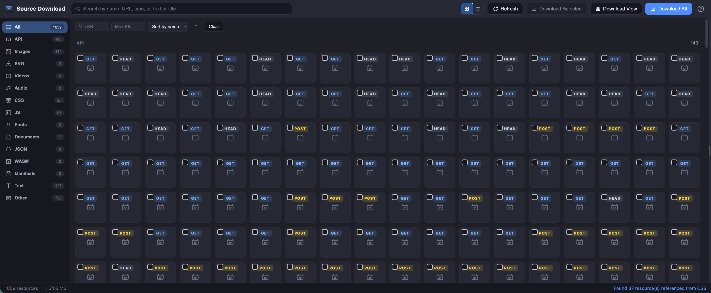 | 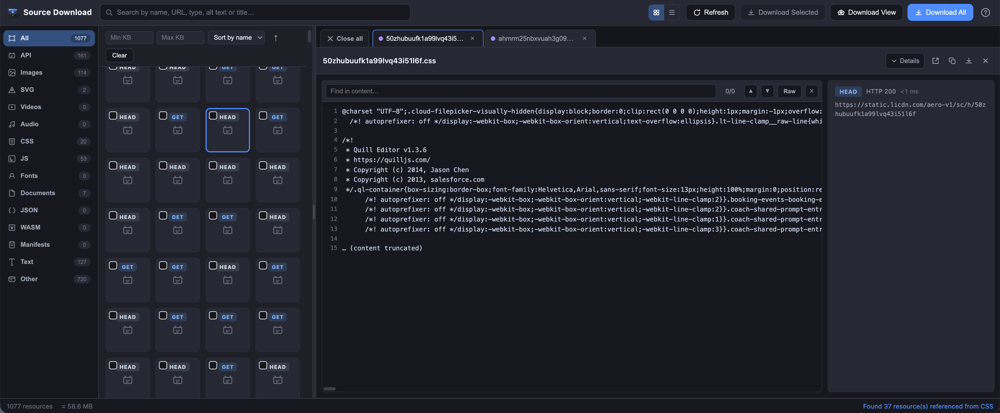 | 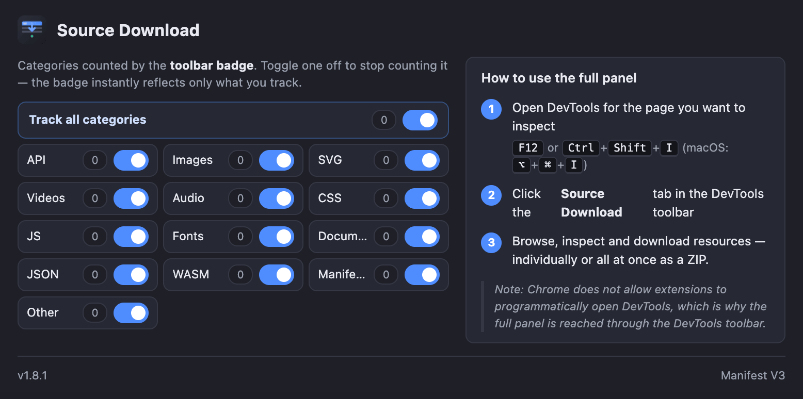 |

---

## Installation

### From the Chrome Web Store
1. Visit the **Source Download** listing on the [Chrome Web Store](https://chromewebstore.google.com/detail/source-download/nockdgincmpfojabnhbofkddgcmnodpd).
2. Click **Add to Chrome** and confirm.
3. Open DevTools (`F12`) on any page and switch to the **Source Download** tab.

### From source (unpacked)
```bash
git clone https://github.com/turanburakyesilyurt/source-download.git
cd source-download
```
1. Open `chrome://extensions`.
2. Toggle **Developer mode** (top-right).
3. Click **Load unpacked** and select the project folder.
4. Open DevTools on any page and switch to the **Source Download** tab.

> The toolbar icon opens the extension popup, which shows a live per-category resource counter and
> the quick-start instructions. (Chrome doesn't let extensions programmatically open DevTools, so the
> icon leads you here instead.)

---

## Features at a glance

- **Network + DOM, combined.** Resources come from the network layer (HAR + live
  `onRequestFinished` events) *and* from scanning the live page DOM — ``, `<video>`,
  `<audio>`, `<script>`, `<link>`, `<source>`, `<iframe>`, `<embed>`, `<object>`, `<track>`,
  `srcset`, Open Graph images, favicons and more.
- **CSS-aware.** Assets referenced from `url(...)` *and* `@import` rules inside stylesheets
  (backgrounds, fonts, sprites) are parsed out and listed automatically — imported stylesheets are
  followed recursively, so font `@font-face` sources buried two levels deep are still found.
- **Content sniffing.** Files that land in *Other* are read back (a few bytes) and promoted to
  their real category — JSON, JS, SVG, HTML, WASM, fonts and binary image signatures are detected
  automatically, so unknown-looking URLs still get the right preview and beautifier.
- **17 category tabs** with live counts: All · API · Images · SVG · Videos · Audio · Captions ·
  CSS · JS · Source maps · Fonts · Documents · JSON · WASM · Manifests · Text · Other.
- **Smart search with regex** — instant filtering across filename, URL, MIME type, tag, alt text
  and title… *plus file contents*. The content index is built in a worker so typing in the search
  box does not freeze the panel. Type `width` and get every stylesheet that references it; wrap a
  query in `/…/` for regex, e.g. `/\.svg$/`.
- **Per-category filter bar** — min/max size (KB), and for images/SVG/videos also **min width /
  min height** (dimensions are decoded on demand in a worker via `createImageBitmap`). Images also
  get **duplicate detection** and a *Hide duplicates* filter. Sort by name, size, type or time.
- **The inspector** — multi-file tabs (newest on the left), true previews for images, video,
  audio, fonts, SVG, code (line numbers + Beautify), API split view, collapsible metadata, and a
  resizable pane. Beautify of large files never leaves you stuck on “Formatting…” — the original
  is shown immediately and swapped when the worker answers.
- **Three download modes** — Selected, View (what you see after filtering), All — all as tidy,
  folder-structured ZIPs with a **size estimate before you click**, live progress and failure retries.
- **List & HAR export** — dump the visible resource list as JSON or CSV, or Chrome’s network log
  as a HAR file.
- **Follows the DevTools theme** — light and dark, including the code highlighter.
- **The live toolbar badge** — the extension icon shows a running total; you decide which
  categories count via the popup's per-category toggles.
- **The Text workbench** — a live content viewer that captures every text-carrying element and
  every `<table>` on the page (with snapshot history) and exports to Markdown, CSV, HTML or a real
  multi-sheet XLSX workbook.
- **Offline & private.** Everything runs locally in your browser. No server, no analytics, no data
  leaves your machine.

---

## Category deep dives

This is where Source Download really shines. Each category below has its own dedicated view,
filters and export options — and its own set of killer use cases.

### Images

**What it captures.** Every raster image on the page — ``, `srcset`, background images inside
CSS, Open Graph thumbnails, favicons, `blob:` images created by the page, everything.

**How the tools help.**
- **Min/max width & height filters** — the panel decodes each image's real dimensions on demand,
  so you can isolate "all hero images ≥ 1200px" or "all tiny icons ≤ 64px".
- **Grid view** — a dense thumbnail wall makes visual triage instant.
- **Duplicate detection** — identical image bytes are marked; *Hide duplicates* keeps one copy.
- **Search** — filter by filename, alt text or even the surrounding page context.
- **Lightbox** — click any thumbnail for a full-screen, zoomable, pannable preview.

**Use cases.**
- **Competitor analysis on YouTube:** browse a channel, set a minimum width filter to skip the
  small avatar icons, scroll the page to load more videos, then hit *Download View* — every video
  thumbnail lands in a single `images/` folder, ready for your competitive research board.
- **E-commerce research:** catalog a competitor's product shots for pricing / layout analysis;
  sort by size to separate high-res product photos from lazy-loading placeholders.
- **Design inspiration:** collect the exact hero/banner imagery a well-designed site uses —
  dimensions, formats and all — without a single right-click.

> ### Screenshot slot
> | 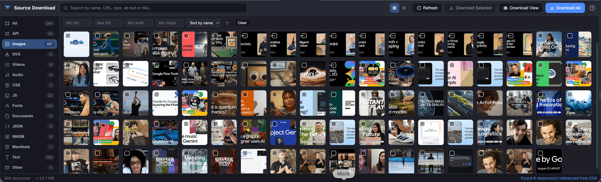 |
> |:---:|

---

### SVG

**What it captures.** Every inline-rendered and linked SVG — logos, icons, charts, illustrations.

**How the tools help.**
- **A true SVG viewer** — the panel renders the vector on a checkerboard canvas with correct MIME
  type and intrinsic-size detection, and a *View source* toggle shows the raw markup.
- **Beautify** — minified single-line SVGs are reformatted into readable, indented markup.
- **Search by regex** — `/logo.*\.svg$/` finds every logo asset instantly.

**Use cases.**
- **Brand kit rescue:** a site you love uses a beautiful logo set — grab every SVG in one ZIP
  and rebuild their brand kit for your own design references.
- **Chart/data-viz capture:** dashboard SVGs (charts, maps) can be saved as perfect, scalable
  vectors instead of losing quality to screenshots.
- **Icon-system mining:** pull an entire icon set from a well-crafted UI library site and study
  how they structure their `viewBox`es and strokes.

> ### Screenshot slot
> | 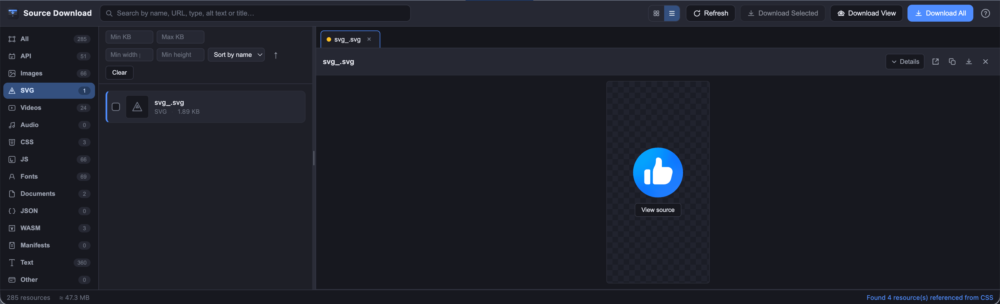 |
> |:---:|

---

### Videos

**What it captures.** Video files from `<video>`/`<source>` tags, dynamically created players,
`blob:` streams and CDN URLs.

**How the tools help.**
- **Inline playback** — the inspector plays the video straight from the captured bytes, even for
  CORS-blocked or `blob:` sources.
- **HLS / DASH fallback** — streams the browser can't render natively (`m3u8`, `mpd`, `.ts`,
  unknown codecs) never leave you with a black box: a fallback explains why and offers
  **Merge segments & download** (my hand-written `lib/hls.js` downloads the master/media playlists
  and every segment in order, then concatenates them into a single `.ts`/`.mp4` file) or
  **Download original** for VLC. Encrypted (AES-128) streams are detected and reported instead of
  failing silently.

**Use cases.**
- **Video research / archiving:** capture the actual video files a competitor streams, merge the
  HLS segments, and keep a local copy for offline analysis.
- **Online-course capture:** many course platforms serve lessons as `blob:` or HLS streams — get
  the real bytes, not screen recordings.
- **QA testing:** verify that the correct video variant (resolution, format) is served in
  different A/B configurations by comparing the captured file details.

> ### Screenshot slot
> | 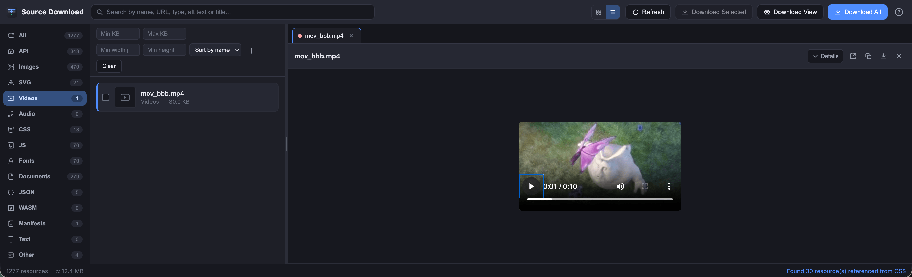 |
> |:---:|

---

### Audio

**What it captures.** MP3, OGG, WAV, AAC, M4A and streamed audio from players and `<audio>` tags.

**How the tools help.**
- **Inline playback** — audition the file before you download it.
- **Size filters** — separate music-length files from short sound effects.

**Use cases.**
- **Podcast research:** a competitor's episode page — grab the actual MP3, inspect the bitrate,
  archive it locally.
- **Game/site sound design:** collect UI sounds and ambient audio from a polished site for
  reference or inspiration.
- **QA:** verify which audio file a player actually requests in each region/locale.

> ### Screenshot slot
> | 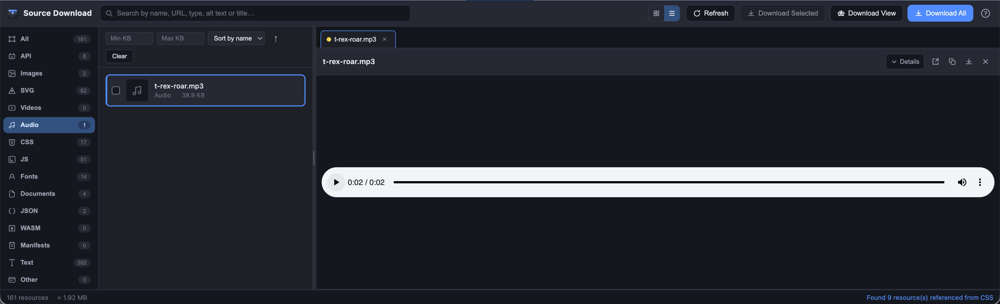 |
> |:---:|

---

### Captions & subtitles

**What it captures.** WebVTT, SRT, TTML and other caption files, including `<track src>` on video.

**How the tools help.**
- **Own tab** — they no longer mix with documents or “other”.
- **Text preview** — captions are treated as text, so you can search inside them.

**Use cases.**
- **Accessibility QA:** download the captions a player actually requested and check they match
  the video.
- **Transcript research:** grab every `.vtt` on a course or news page in one ZIP.

---

### Source maps

**What it captures.** `.map` files and JSON bodies that look like source maps (`mappings` +
`sources`), instead of dumping them into the JSON tab.

**How the tools help.**
- **JSON viewer + Beautify** — same readable preview as other JSON, in a dedicated folder on
  download.

**Use cases.**
- **Debug a production bundle:** collect every source map the page loaded so you can reconstruct
  original sources offline.

---

### Fonts

**What it captures.** `@font-face` sources (woff, woff2, ttf, otf) referenced from stylesheets —
including fonts buried inside `@import`-ed stylesheets (e.g. Google Fonts' CSS2 responses).

**How the tools help.**
- **A live font specimen** — the inspector renders uppercase, digits, punctuation and body text at
  multiple sizes in the actual font, so you see exactly what you'd get.
- **CSS-aware discovery** — fonts are found even when the CSS that declares them was imported into
  another stylesheet, and even when they're loaded as `blob:`.

**Use cases.**
- **Typography teardown:** "which font is this site really using?" — open the Fonts tab, click the
  specimen, and you'll know the family, weight and file format in seconds.
- **Design-system study:** rebuild a competitor's typography palette by downloading their exact
  font files (woff2 for screen, ttf for print).
- **Offline brand kits:** collect the fonts + images + SVGs of a brand in one session, exported as
  a single folder-structured ZIP.

> ### Screenshot slot
> | 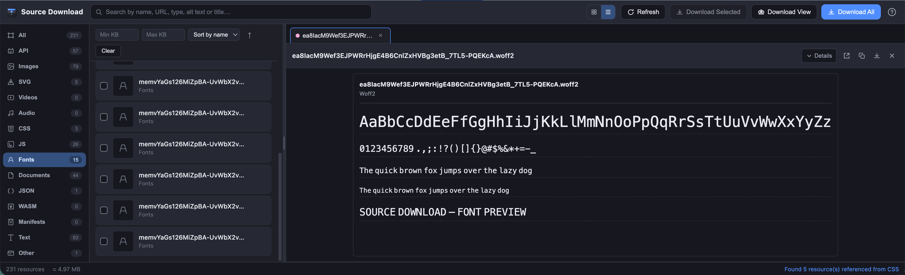 |
> |:---:|

---

### CSS

**What it captures.** Every stylesheet — `<link rel="stylesheet">`, dynamically injected styles,
inline `<style>` blocks, and stylesheets pulled in via `@import`.

**How the tools help.**
- **Deep reference graph** — `url(...)` and `@import` references are followed recursively, so
  background images, sprites, fonts and imported themes are all discovered and categorized.
- **Beautify / Raw toggle** — minified production CSS becomes readable, indented source.
- **Search contents** — find every rule that references a given class, image or keyframe across all
  stylesheets at once.

**Use cases.**
- **Front-end research:** "how does that site build its design system?" — download the full CSS
  stack and study variables, spacing scales and breakpoints at your leisure.
- **Bug reproduction:** keep the exact CSS version that shipped when a bug occurred, so you can
  diff what changed later.
- **Inspiration library:** save beautiful scroll animations, glassmorphism utilities and layout
  patterns into your own reference folder.

> ### Screenshot slot
> | 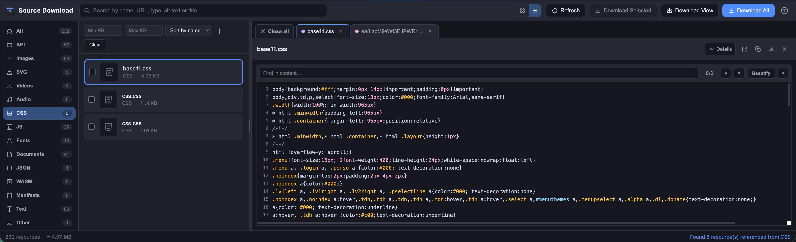 |
> |:---:|

---

### JavaScript

**What it captures.** Script files, module bundles, dynamic chunks and inlined scripts.

**How the tools help.**
- **Beautify / Raw** — un-minify any bundle with a single click for readable analysis.
- **Line numbers + sticky find bar** — jump around a 10k-line bundle without losing your place.
- **Content search** — locate which script defines a given function, API path or string across the
  entire page.

**Use cases.**
- **Reverse-engineering:** a site loads a minified 300KB bundle — beautify it, search for the
  feature you're studying, and understand exactly how it works.
- **Analytics / tracking audit:** find every third-party script a page loads and decide what
  actually gets sent where.
- **Offline archives:** keep the exact JS version of a release for comparison or rollback analysis.

> ### Screenshot slot
> | 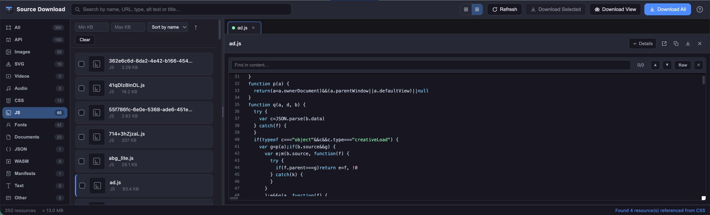 |
> |:---:|

---

### API & JSON

**What it captures.** Every XHR/fetch request, extension-less GETs with query strings, and JSON
responses — the "live table behind the dashboard" traffic that other tools bury.

**How the tools help.**
- **Every response is kept.** Chatty endpoints that return fresh data each poll are all listed
  (FIFO-capped at 500), so you never lose the snapshot you actually needed. Static assets still
  de-duplicate by URL.
- **Method & type filters** — narrow by GET/POST/PUT/PATCH/DELETE/HEAD/OPTIONS and by XHR/Fetch.
- **Colored method badges** — spot the POSTs among the GETs at a glance.
- **A split inspector** — response preview on the left; method, status, duration, full URL, a
  **query-parameter table** and the **request body** pinned on the right (stacks vertically on
  narrow windows).
- **Beautify** — compact JSON becomes a readable, indented tree.

**Use cases.**
- **Scraping without code:** open a SPA, watch its API calls, filter to the endpoint you need, and
  download its exact JSON responses — perfect for building your own integration against an
  undocumented API.
- **Data extraction for analysis:** a dashboard updates a table every few seconds — every response
  is captured, so you can export the complete dataset including intermediate states.
- **Bug hunting:** compare request bodies across two sessions to find why one call fails.
- **QA / contract testing:** verify endpoints return the expected status and payload shape in
  different environments.

> ### Screenshot slot
> | 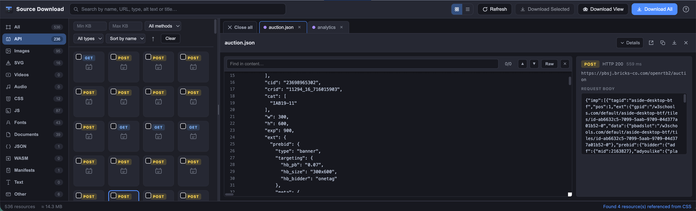 |
> |:---:|

---

### Documents

**What it captures.** PDFs, XML, and other text documents the page loads or links to.

**How the tools help.**
- **Inline preview** — PDFs and XML are previewed in the inspector.
- **Search & filters** — find documents by name or MIME.

**Use cases.**
- **Research:** a reference site links dozens of PDFs — download them all into one folder in one
  click.
- **Compliance snapshots:** keep the exact PDF/terms version a page served on a given date.

> ### Screenshot slot
> | 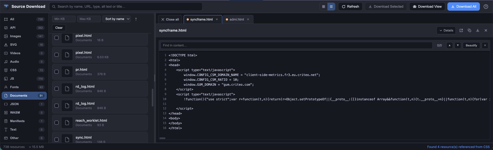 |
> |:---:|

---

### WASM & Manifests

**What it captures.** Compiled WebAssembly modules and PWA/extension `manifest.json` / `.webmanifest`
files.

**How the tools help.**
- **Content sniffing** — `.wasm`-looking binaries are recognized even without a file extension.
- **Beautify** — manifest JSON is formatted and previewed.

**Use cases.**
- **WASM study:** games and heavy apps ship compiled modules — grab them for offline analysis or
  version comparison.
- **PWA teardown:** inspect a site's manifest to learn its app name, icons, theme color and
  installability metadata.

> ### Screenshot slot
> | 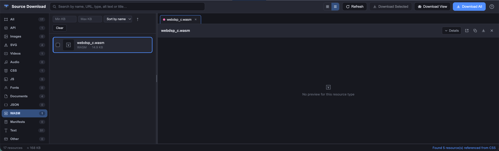 |
> |:---:|

---

### Text & live tables — the SPA content toolkit

**What it captures.** Not a resource list — a live content viewer. Every element that carries text
(headings, paragraphs, list items, `div`, `span`, `a`, `button`, …) is captured in DOM order, plus
every real `<table>` / ARIA grid on the page.

**How the tools help.**
- **One query box, four languages.** Pick the mode next to it: **Contains** and **Regex** filter the
  captured text instantly, while **CSS selector** and **XPath** are evaluated against the live page so
  they can reach anything in the DOM. XPath also handles expressions that return a value instead of
  elements — `count(//a)`, `//@href`, `string(//title)`. Whatever the page says about a broken query
  is shown right under the box, so you are never guessing.
- **Element filter built from the page.** The dropdown lists the element types actually present, each
  with its count, so it doubles as a map of the document. Clearing the query (or pressing **Clear**)
  returns you to *All elements* and recaptures — no extra clicks.
- **Reading mode** hides tags, checkboxes and location crumbs so the stream reads like a document.
- **Tables never lose state** — every DOM change adds a new snapshot (bounded history), and the header
  tells you exactly what you'd export: `8 snapshots · 124 unique rows`. Press **Show all rows** to
  merge every snapshot into one deduplicated table so you can *see* the full harvest instead of
  trusting the export.
- **Exports with automatic duplicate-row removal:**
  - **TXT** — the readable page exactly as shown, tables included as tab-separated rows.
  - **MD** — headings, paragraphs, element blocks and tables as a Markdown document.
  - **CSV** — every table as `text/table-N.csv` inside a ZIP.
  - **HTML** — each table as a self-contained `<table>` page inside a ZIP.
  - **XLSX** — a *real* Excel workbook with one sheet per table, built by my own hand-written
    `lib/xlsx.js` (an XLSX is just a ZIP of XML — no spreadsheet library involved).

**Use cases.**
- **Content mining:** scrape every heading + paragraph of an article-heavy page to Markdown in one
  click — no JS console, no copy-pasting.
- **Table export to Excel:** that analytics dashboard with the auto-refreshing table? Open the Text
  tab, watch snapshots accumulate, then export a multi-sheet XLSX with every intermediate state.
- **Competitor price tracking:** SPAs that re-render their price table on scroll now keep every
  state — CSV/HTML exports include the history, not just the final DOM.

> ### Screenshot slot
> | 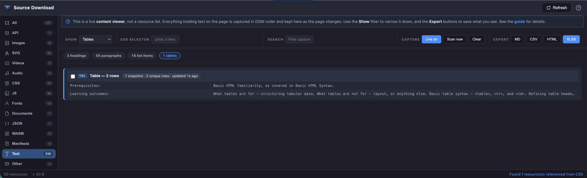 |
> |:---:|

---

### Other

**What it captures.** Everything that doesn't fit a neat category yet — unknown extensions, no
extension, exotic formats.

**How the tools help.**
- **Content sniffing** — the first few bytes are read back and the file is promoted to its real
  category (JSON, JS, SVG, HTML, WASM, fonts, binary image signatures), so *Other* is rarely where
  things actually stay.

**Use case.** Whenever you find an odd file in *Other*, click it — the inspector tells you what it
really is, and it's one keystroke away from being re-categorized and downloaded correctly.

> ### Screenshot slot
> | 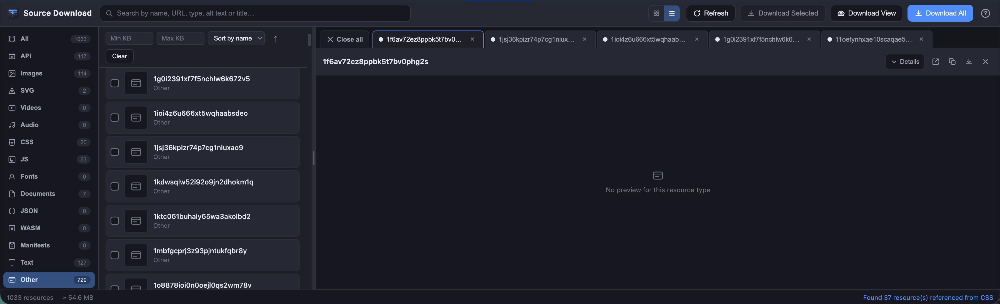 |
> |:---:|

---

## User guide

The panel ships with a built-in, searchable guide — click the **`?`** button in the top-right
toolbar (it also opens automatically on first run). A quick orientation:

### 1 · Reach the panel
The extension cannot open DevTools by itself (Chrome restriction). Press `F12` (or
`Ctrl`/`Cmd`+`Shift`+`I`) and pick the **Source Download** tab in the DevTools toolbar. The toolbar
icon's popup shows per-category counts and lets you choose which categories feed the icon badge.

### 2 · Browse resources
- The vertical tabs on the left group everything by type (Images, Videos, SVG, Fonts, API…), each
  with a live count. Switching categories **resets all filters**, so what you see always matches
  the active tab.
- The search box filters by name, URL, type, alt text or title; wrap a query in `/…/` for regex,
  e.g. `/\.(png|jpg)$/`.
- Toggle between the compact grid and the detailed list with the buttons beside the search box —
  your choice is remembered.

### 3 · Inspect anything
Click a resource to open it in the inspector; each opened file becomes a tab, and the newest lands
on the left so you can compare several at once. Specialized viewers handle images (lightbox with
zoom/pan), video, audio, fonts, SVG, code (with line numbers + Beautify) and API calls (response
| request split view). `Esc` closes the current overlay.

### 4 · Download
- **Download Selected** — only the checked files.
- **Download View** — everything visible under the current category + search + filters; it
  relabels itself *Download Filtered (N)* when filters are active.
- **Download All** — every captured resource, as a folder-structured ZIP.
Downloads stream with a progress bar and survive partial failures (auto-retry + manual retry from
the context menu).

### 5 · The Text tab
The **Text** category swaps the pane for a live, readable copy of the page: everything that holds
text is captured in DOM order and kept updated while **Live** is on. Query it with plain text, a
regular expression, a **CSS selector** or an **XPath** expression, and narrow it further to a single
element type. Dynamic tables store a bounded snapshot history — press **Show all rows** to merge
every snapshot into one deduplicated view. Export as TXT or Markdown, or the tables as CSV, HTML, or
a real multi-sheet **XLSX** workbook. Checked items win; otherwise everything currently visible is
exported.

### 6 · When a video won't play
Streams the browser can't render natively (HLS `.m3u8`, DASH `.mpd`, unknown codecs) show a fallback
instead of a black player: **Merge segments & download** produces a single playable file for HLS, or
**Download original** saves the manifest for VLC.

---

## How it works

```
┌────────────────────────────────────────────────────────────────────────┐
│  toolbar icon            popup (per-category counts + toggles)         │
│      │                         ▲                                       │
│      ▼                         │ counts (storage)                      │
│  background service worker ────┘                                       │
│      ▲                                                                 │
│      │ counts (Resource Timing + DOM scan)                             │
│      │                                                                 │
│  content script (injected into every page)                             │
│                                                                        │
│  DevTools panel (chrome.devtools.*)                                    │
│   ├─ HAR + live network events ──► resource list                      │
│   ├─ DOM + CSS scan               ► resource list                      │
│   └─ getContent() / fetch() / inspectedWindow.eval() ──► bytes ──► ZIP│
└────────────────────────────────────────────────────────────────────────┘
```

1. **Capture** — the panel listens to `chrome.devtools.network` events and scans the page DOM and
   stylesheets.
2. **Classify** — URLs are categorized by extension and MIME, then unknown ("other") resources are
   sniffed from their first bytes and promoted to their true type. API calls are detected
   separately and keep every response.
3. **Fetch** — file bodies come from the network API (`request.getContent()`), which ignores CORS,
   with `fetch()` and in-page `blob:` readback as fallbacks.
4. **Preview** — content is rendered through purpose-built viewers (image, media, font, SVG,
   code, API request view). Code is shown in full and built in windows as you scroll, so a
   multi-megabyte bundle stays readable and **Beautify** always sees the whole file. The **Text**
   tab polls the live DOM and builds a bounded snapshot history for tables.
5. **Name** — before anything reaches disk, `lib/filetype.js` checks the bytes and repairs the file
   name. Extension-less CDN URLs (YouTube thumbnails and the like) and dynamic endpoints such as
   `/photo.aspx` end up as `.jpg`, `.webp` or whatever they actually are, instead of a file the OS
   cannot open.
6. **Archive** — the ZIP is assembled *in your browser* by `lib/zip.js`, a from-scratch writer of
   the PKZIP format (CRC-32, central directory, ZIP64 records and deflate via the browser's native
   `CompressionStream`); XLSX workbooks are produced by `lib/xlsx.js` (a ZIP of hand-written
   spreadsheet XML); HLS streams that can't play natively are merged by `lib/hls.js` into a single
   download. ZIP assembly runs in `lib/zip-worker.js`; Beautify, the content-search index, image
   hashing and `createImageBitmap` decode run in a second worker (`lib/jobs-worker.js`) so a large
   archive never stalls a format click. Files are saved with a standard `<a download>` click, so Chrome
   keeps its normal download prompts and permissions.

---

## Project structure

```text
.
├── manifest.json              # MV3 manifest (permissions, entry points, icons)
├── background.js              # Service worker — aggregates counts, drives the toolbar badge
├── content.js                 # Injected into pages — scans & reports resources
├── devtools.html / .js        # Registers the "Source Download" DevTools panel
├── panel.html / .css / .js    # The DevTools panel UI and all its logic
├── popup.html / .css / .js    # Toolbar popup — tracking toggles + quick-start guide
├── lib/
│   ├── filetype.js            # Byte sniffing + download extension repair — zero deps
│   ├── zip.js                 # Hand-written ZIP writer (CRC-32, deflate, ZIP64) — zero deps
│   ├── zip-worker.js          # ZIP / XLSX off the UI thread — zero deps
│   ├── jobs-worker.js         # Beautify, search index, image hash & decode — zero deps
│   ├── xlsx.js                # Hand-written XLSX builder (ZIP of XML) — zero deps
│   ├── hls.js                 # Hand-written HLS (m3u8) merger — zero deps
│   └── beautify.js            # Hand-written CSS/JS/HTML/JSON formatters — zero deps
├── icons/                     # Generated PNG icons (16 / 32 / 48 / 128)
├── screenshots/               # Store your screenshots here (see the slots above)
├── tools/
│   ├── generate_icons.py      # Icon generator (Python stdlib only)
│   ├── lib_test.js            # Node test suite for lib/* (npm test)
│   └── sniff_test.js          # Node tests for API detection & content sniffing
└── LICENSE                    # MIT
```

**Zero third-party code.** `lib/` contains only seven files, all written for this project. The icon
generator uses the Python standard library. There is no `node_modules`, no bundler, no build
script — the extension you see in the repo is exactly what Chrome loads.

---

## Development

```bash
# Run the library test suite (ZIP writer, XLSX builder, HLS merger + formatters)
npm test

# Regenerate the PNG icons
npm run icons
```

- **Lint:** the codebase targets ES2018+ and runs through standard ESLint rules — no exotic
  syntax, no transpilation.
- **Testing the panel:** load the extension unpacked, open DevTools on any page, and open the
  **Source Download** tab. Reload the page while the panel is open to capture the full request set.
- **Submitting a PR:** please keep the zero-dependency promise. New features should be implemented
  in plain JavaScript without introducing third-party packages.

---

## Privacy & permissions

The extension asks for the bare minimum it needs:

| Permission | Why |
|---|---|
| `devtools_page` | Registers the panel inside Chrome DevTools. |
| `storage` | Saves your tracking toggles and panel preferences locally. |
| `clipboardWrite` | Copies resource URLs to the clipboard. |
| `host_permissions: <all_urls>` | Lets the lightweight content script scan pages and lets the panel fetch resource bodies for previews/downloads. |

That's it — no `tabs`, no `downloads` API, no `scripting` abuse, no analytics. Files are saved
through a standard `<a download>` click, so Chrome keeps its normal download prompts and
permissions.

Nothing is uploaded anywhere. All scanning, fetching, previewing and archiving happens locally in
your browser. The extension makes **no network requests of its own** beyond the ones you trigger by
downloading a page's assets.

---

## What's Next

I know Source Download isn't perfect yet — there are rough edges I'm aware of, and I'll keep fixing
them quickly. But here's where I want to take this next, and **your feedback decides the order**:

- **Site-wide crawl mode** — capture assets from the whole domain (linked pages), not just the
  current one.
- **Batch rename & pattern download** — save files with custom templates like
  `{domain}/{category}/{name}.{ext}`.
- **Diff two sessions** — compare two captures of the same page to spot what changed.
- **Favorites & collections** — pin frequently-used filters and resources across sessions.
- **Command palette** — a Spotlight-style quick launcher for actions and filters.
- **Theme options** — beyond the current dark theme.
- **Performance** — virtualized lists and smarter sniffing for very heavy pages.
- **More formats** — additional Text exports (DOCX, JSON lines) and video container merging.

Open an issue with your ideas, or drop me a message on
[LinkedIn](https://www.linkedin.com/in/turan-burak-yesilyurt/) — I read everything.

---

## Contributing

Contributions are warmly welcome — bug reports, feature ideas and pull requests. If you're
planning something substantial, open an issue first so we can align. Please keep the spirit:
**simple, dependency-free, readable code.**

---

## License

[MIT](LICENSE) © Turan Burak Yeşilyurt. Use it, fork it, learn from it, ship it — just keep the
license notice.

---

*Source Download is maintained by [Turan Burak Yeşilyurt](https://www.linkedin.com/in/turan-burak-yesilyurt/).*
