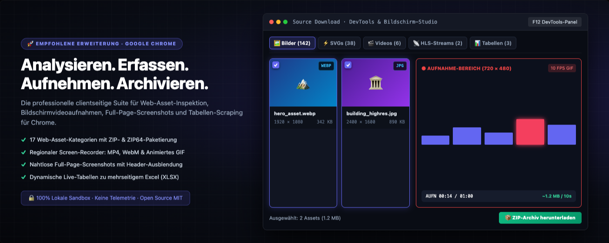
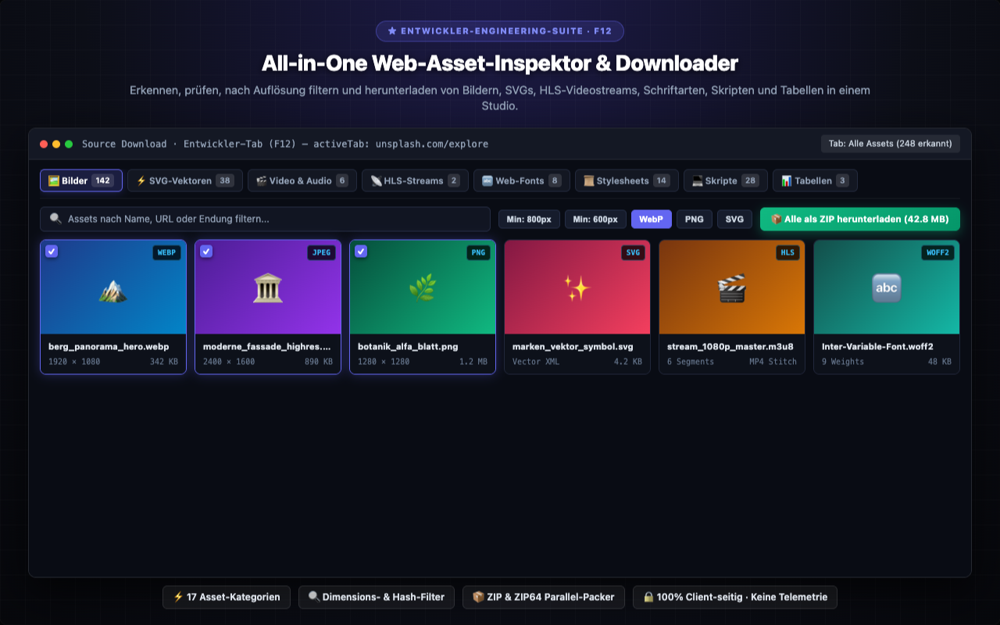
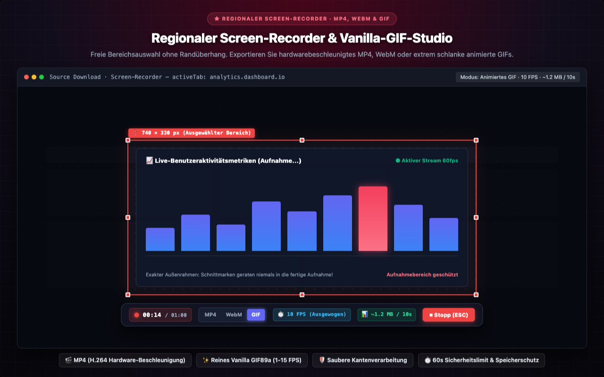
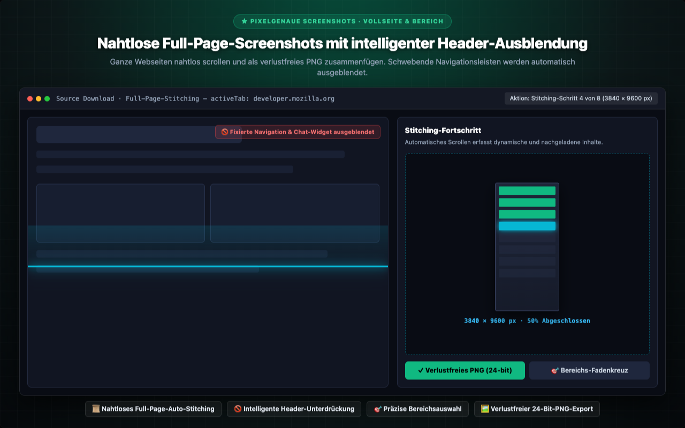
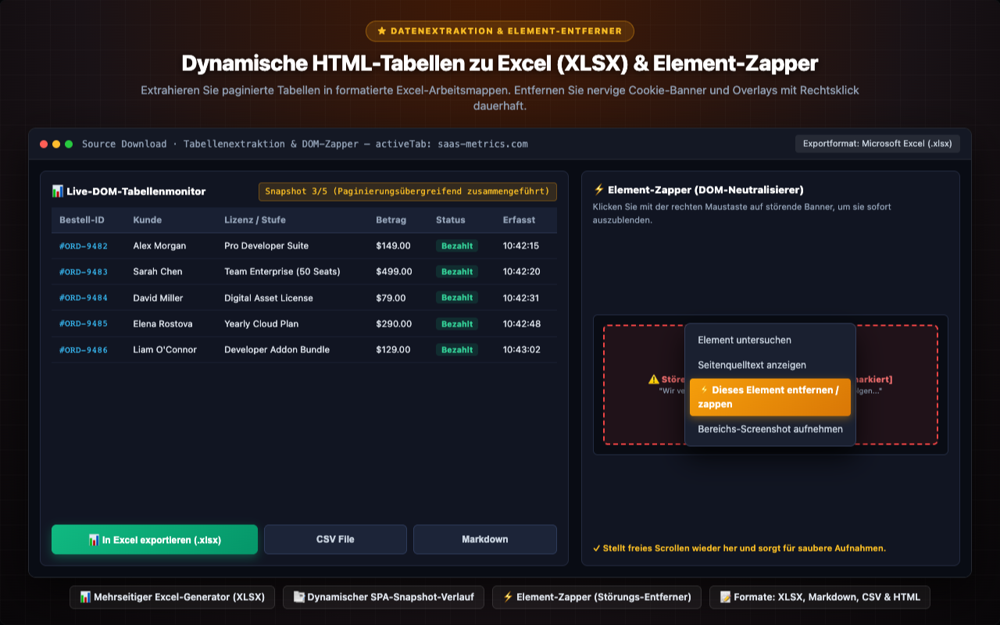
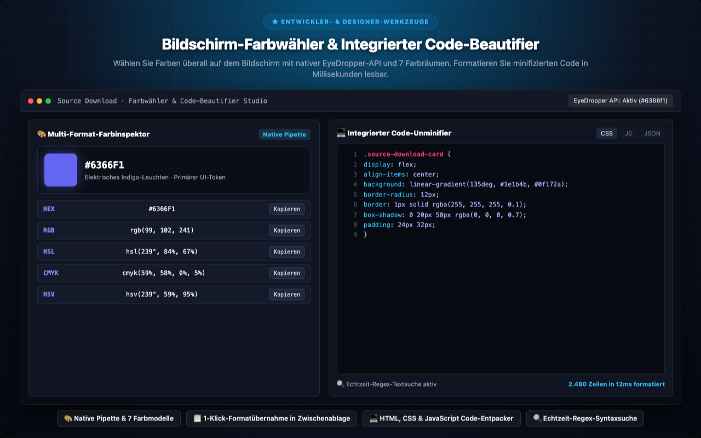

<p align="center">
  
</p>

<h1 align="center">Source Download</h1>

<p align="center">
  <a href="../../README.md"></a>
  <a href="README.tr.md"></a>
  <a href="README.de.md"></a>
  <a href="README.es.md"></a>
  <a href="README.ja.md"></a>
  <a href="README.ru.md"></a>
  <a href="README.zh-CN.md"></a>
</p>

<p align="center">
  <em>Das Komplett-Toolkit für Web-Asset-Downloads, nahtlose Gesamte-Seite-Screenshots und DOM-Datenextraktion für Entwickler, Designer und Tester.</em><br>
  Prüfen und laden Sie <b>alle Ressourcen</b> einer Website — Bilder, SVG, Videos, Audio, JS, CSS, Schriftarten, JSON, WASM, Manifeste, Live-Tabellen und pixelgenaue Screenshots — strukturiert als geordnetes ZIP-Archiv herunter.
</p>

<p align="center">
  <a href="https://chromewebstore.google.com/detail/source-download/nockdgincmpfojabnhbofkddgcmnodpd"></a>
  
  
  
  
  
  <a href="../../LICENSE"></a>
  
  
</p>

---

<p align="center">
  
</p>

---

## Entwickelt von Turan Burak Yeşilyurt

Als Entwickler für Web-Scraping, QA-Automatisierung und Datenanalyse stieß ich immer wieder auf dieselbe Hürde: Einzelne Medien und Datensätze moderner SPAs lassen sich oft nur mühsam speichern, und die Chrome DevTools sind für schnelle Aufgaben oft überdimensioniert. **Source Download** wurde entwickelt, um dieses Problem sauber, lokal und kompromisslos zu lösen.

Vernetzen Sie sich gern auf [**LinkedIn**](https://www.linkedin.com/in/turan-burak-yesilyurt/) oder besuchen Sie [**2run.dev**](https://2run.dev).

> **Chrome Web Store:** [Source Download im Chrome Web Store installieren](https://chromewebstore.google.com/detail/source-download/nockdgincmpfojabnhbofkddgcmnodpd)

---

> **Das Open-Source-Versprechen:** Viele ähnliche Erweiterungen sind schwere Hüllen um fremde Bibliotheken. Bei Source Download ist jedes Byte — von der **ZIP-Engine** über den **XLSX-Builder** und **HLS-Merger** bis zum **GIF-Encoder** — von Grund auf in reinem JavaScript handgeschrieben. Keine Frameworks, keine Abhängigkeiten, kein Build-Schritt, keine Telemetrie.

---

## Visuelle Tour & Kernmodule

Entdecken Sie die nahtlos in Google Chrome DevTools, Rechtsklick-Menü und Symbolleiste integrierten Arbeitsbereiche.

### 1. All-in-One Web-Asset-Inspektor & Downloader
> **★ ENTWICKLER-ENGINEERING-SUITE · F12** — Erkennen, prüfen, nach Auflösung filtern und herunterladen von Bildern, SVGs, HLS-Videostreams, Schriftarten, Skripten und Tabellen in einem Studio.
> 
> `⚡ 17 Asset-Kategorien` · `🔍 Dimensions- & Hash-Filter` · `📦 ZIP & ZIP64 Parallel-Packer` · `🔒 100% Client-seitig · Keine Telemetrie`

<p align="center">
  
</p>

---

### 2. Regionaler Screen-Recorder & Vanilla-GIF-Studio
> **★ REGIONALER SCREEN-RECORDER · MP4, WEBM & GIF** — Freie Bereichsauswahl ohne Randüberhang. Exportieren Sie hardwarebeschleunigtes MP4, WebM oder extrem schlanke animierte GIFs.
> 
> `🎬 MP4 (H.264 Hardware-Beschleunigung)` · `✨ Reines Vanilla GIF89a (1-15 FPS)` · `🛡️ Saubere Kantenverarbeitung` · `⏱️ 60s Sicherheitslimit & Speicherschutz`

<p align="center">
  
</p>

---

### 3. Nahtlose Full-Page-Screenshots mit intelligenter Header-Ausblendung
> **★ PIXELGENAUE SCREENSHOTS · VOLLSEITE & BEREICH** — Ganze Webseiten nahtlos scrollen und als verlustfreies PNG zusammenfügen. Schwebende Navigationsleisten werden automatisch ausgeblendet.
> 
> `📜 Nahtloses Full-Page-Auto-Stitching` · `🚫 Intelligente Header-Unterdrückung` · `🎯 Präzise Bereichsauswahl` · `🖼️ Verlustfreier 24-Bit-PNG-Export`

<p align="center">
  
</p>

---

### 4. Dynamische HTML-Tabellen zu Excel (XLSX) & Element-Zapper
> **★ DATENEXTRAKTION & ELEMENT-ENTFERNER** — Extrahieren Sie paginierte Tabellen in formatierte Excel-Arbeitsmappen. Entfernen Sie nervige Cookie-Banner und Overlays mit Rechtsklick dauerhaft.
> 
> `📊 Mehrseitiger Excel-Generator (XLSX)` · `📑 Dynamischer SPA-Snapshot-Verlauf` · `⚡ Element-Zapper (Störungs-Entferner)` · `📝 Formate: XLSX, Markdown, CSV & HTML`

<p align="center">
  
</p>

---

### 5. Bildschirm-Farbwähler & Integrierter Code-Beautifier
> **★ ENTWICKLER- & DESIGNER-WERKZEUGE** — Wählen Sie Farben überall auf dem Bildschirm mit nativer EyeDropper-API und 7 Farbräumen. Formatieren Sie minifizierten Code in Millisekunden lesbar.
> 
> `🎨 Native Pipette & 7 Farbmodelle` · `📋 1-Klick-Formatübernahme in Zwischenablage` · `💻 HTML, CSS & JavaScript Code-Entpacker` · `🔍 Echtzeit-Regex-Syntaxsuche`

<p align="center">
  
</p>

---

Source Download ist die professionelle All-in-One-Suite zur Inspektion, Extraktion, Bildschirmaufnahme und Video/GIF-Aufzeichnung von Web-Assets – direkt nativ in Google Chrome integriert. Entwickelt für Webentwickler, UI/UX-Designer, QA-Ingenieure, digitale Archivare, Datenanalysten und Content Creator, beseitigt Source Download alle Hürden beim Erfassen von Webinhalten, Analysieren von Netzwerk-Streams, Erstellen von Full-Page-Screenshots und Aufzeichnen hochauflösender Bildschirmaufnahmen.

Ausgestattet mit einer leistungsstarken F12 DevTools Engineering Suite, einem intuitiven Rechtsklick-Menü und einem Toolbar-Popup erfasst und strukturiert Source Download alles, was eine Webseite im Hintergrund lädt: von hochauflösenden Medien und SVG-Vektoren über HLS-Videostreams und dynamische DOM-Tabellen bis hin zu Web-Fonts und API-Antworten – exportierbar einzeln oder als sauberes, strukturiertes ZIP/ZIP64-Archiv.


## VOLLSTÄNDIGE FUNKTIONSÜBERSICHT


### 1. UMFASSENDE ASSET-ERKENNUNG & EXTRAKTION (17 KATEGORIEN)

Analysieren und laden Sie jede Webkomponente über 17 dedizierte Ressourcenkategorien herunter:
- **Bilder & Rastermedien:** Filtern und isolieren Sie hochauflösende Hero-Fotos und Interface-Grafiken von winzigen Tracking-Pixeln anhand präziser Breiten- und Höhenschwellen. Erkennen Sie identische Duplikate blitzschnell per SHA-256-Hash-Abgleich und vermeiden Sie redundante Downloads. Vollbild-Lightbox mit Transparenz-Schachbrettmuster für Alphakanäle und Zoom-Funktion.
- **SVG-Vektorgrafiken:** Extrahieren Sie Inline-SVG-DOM-Elemente, verlinkte SVG-Dateien und CSS-Hintergrundvektoren. Zeigen Sie sauberen XML-Vektorcode an, kopieren Sie SVG-Markup direkt in die Zwischenablage oder laden Sie Vektoren für Figma, Sketch, Penpot und Illustrator herunter.
- **Videos & Audio:** Erkennen Sie HTML5-Medienelemente, Blob-Streams und direkte Medienlinks mit integriertem Player zur Voransicht vor dem Speichern inklusive Wiedergabegeschwindigkeit und Lautstärkeregler.
- **HLS-Stream-Zusammenführung:** Fangen Sie HTTP Live Streaming-Playlists (.m3u8) ab, prüfen Sie Bitraten (1080p, 720p, 480p), laden Sie Segmente mit 6 parallelen Verbindungen herunter und fügen Sie diese ohne externe Software direkt im Browser zu einer sauberen MP4-Datei zusammen. Erkennt AES-128-Verschlüsselung mit sofortiger Statusmeldung.
- **Web-Typografie:** Extrahieren Sie moderne komprimierte Web-Fonts und skalierbare Schriftarten. Testen Sie Schriften dynamisch in einer interaktiven Wasserfall-Ansicht mit anpassbaren Pangrammen, Schriftstärken (100-900) und Glyphen-Prüfung.
- **Stylesheets & Skripte:** Laden Sie CSS- und JavaScript-Dateien vollständig herunter. Der integrierte Unminifier/Beautifier formatiert komprimierten Code mit Syntax-Highlighting und performanter Regex-Suche in eine übersichtliche Struktur.
- **API- & JSON-Antworten:** Überwachen Sie REST- und GraphQL-Anfragen in Echtzeit. Prüfen Sie formatierte JSON-Bäume, URL-Parameter, HTTP-Header und Netzwerklatenzzeiten auf einen Blick.
- **Dynamische DOM-Tabellen:** Überwachen Sie Standardtabellen und ARIA-Gitterkomponenten live. Erfassen Sie Snapshots über dynamische SPA-Seitenwechsel hinweg und exportieren Sie direkt nach mehrblättrigen Excel-Arbeitsmappen (XLSX), Markdown-Tabellen oder CSV.
- **Live-Textextraktion:** Durchsuchen Sie den gesamten DOM-Textstrom in natürlicher Lesereihenfolge mittels Freitext, Regex, CSS-Selektoren oder komplexen XPath-Abfragen.
- **Web-App-Manifest & Metadaten:** Prüfen Sie PWA-Manifeste (manifest.json), Favicons, Apple Touch-Icons und Social-Preview-Tags (Open Graph, Twitter Cards).
- **Dokumente & Binärdateien:** Extrahieren Sie digitale Publikationen, PDF-Dokumente, kompilierte WebAssembly-Module, komprimierte Archive und formatierte Textdokumente.


### 2. REGIONALE BILDSCHIRMAUFNAHME & ANIMIERTES GIF-STUDIO

Erfassen Sie hochauflösende Videos und leichtgewichtige animierte GIFs aus jedem Bildschirmbereich:
- **Interaktive Auswahlbox:** Zeichnen Sie einen Auswahlrahmen auf dem aktiven Tab mit 8 Ziehpunkten und Live-Koordinatenanzeige.
- **Zero-Bleed Boundary-Technologie:** Ziehpunkte und Bedienelemente liegen strikt außerhalb des Aufnahmebereichs. Ein externer Offset verhindert das Überlappen roter Rahmenränder in Ihre fertige Aufnahme vollständig.
- **Berührungsfreie schwebende Steuerleiste:** Dockt automatisch ober- oder unterhalb des Rahmens an, ohne den Aufnahmebereich zu verdecken.
- **Vielseitige Video- & Animationsformate:** Exportieren Sie in hardwarebeschleunigtem MP4, offenem WebM oder extrem schlankem GIF.
- **Reiner Vanilla-JavaScript-GIF-Encoder:** Eigenständige GIF89a-Engine ohne externe Bibliotheken mit 15-Bit-Farbquantisierung und LZW-Kompression.
- **Wählbare Bildraten (FPS):**
  - 15 FPS (Flüssig): Hohe Bildrate für geschmeidige UI-Animationen, Interaktionen und Demos.
  - 10 FPS (Standard / Ausgewogen): Der optimale Web-Standard für Memes und Bug-Reports mit bester Balance aus Bildqualität und Dateigröße.
  - 5 FPS (Kompakt / Meme): Stark reduzierte Dateigröße für leichtgewichtige Dokumentationen und Anleitungen.
  - 2 FPS (Stop-Motion / Schritt-für-Schritt): Halbe Sekunde pro Frame. Perfekt für Klickanleitungen; verbraucht 5x weniger Arbeitsspeicher als 10 FPS.
  - 1 FPS (Präsentation): Exakt 1 Frame pro Sekunde für Folien, Code-Walkthroughs und minimale Dateigrößen (10x kleiner als 10 FPS).
- **Live-Größenrechner:** Zeigt die geschätzte GIF-Dateigröße (~X MB / 10s) basierend auf Bildbereich und gewählter FPS live vor und während der Aufnahme an.
- **4K UHD-Sicherheitsgrenze:** Verhindert Speicherüberlastungen auf Retina-Displays durch proportionale 3840px-Deckelung.
- **60-Sekunden-Sicherheitslimit:** Schützt vor Tab-Abstürzen durch eine maximale Aufnahmedauer von 1 Minute mit Live-Countdown (00:00 / 01:00).


### 3. PIXELGENAUE FULL-PAGE- & BEREICHS-SCREENSHOTS

Erfassen Sie makellose Webseiten-Bilder ohne Cloud-Abhängigkeiten:
- **Nahtlose Full-Page-Erfassung:** Automatisches Scrollen und Zusammenfügen langer Webseiten zu gestochen scharfen PNG-Bildern.
- **Intelligente Header-Unterdrückung:** Blendet fixierte Navigationsleisten, Sticky Header und Chat-Widgets während des Scrollens temporär aus, um Bilddopplungen vollständig zu verhindern.
- **Lazy-Load-Synchronisation:** Simuliert Scrollpausen, damit dynamische Komponenten und Bilder vor dem Zusammensetzen vollständig gerendert werden.
- **Präziser Bereichs-Screenshot:** Fadenkreuz-Auswahl für frei definierbare Bildschirmausschnitte mit Sofort-Download.


### 4. FARB-PIPETTE & INSPEKTOR

Präzises Abtasten von Farbwerten direkt von Ihrem Bildschirm:
- **Native EyeDropper API:** Direkte Farberkennung auf der Webseite oder im gesamten Browserfenster.
- **Umfassende Modell-Konvertierung:** Automatische Umrechnung in digitale und druckfähige Farbräume: HEX, RGB, RGBA, HSL, HSLA, CMYK, HSV.
- **1-Klick-Kopieren:** Schnelle Schaltflächen zum direkten Einfügen von Farbwerten in CSS-Stylesheets und Designtools.


### 5. ELEMENT-AUSBLENDER (ELEMENT ZAPPER)

Bereinigen Sie störende Webelemente vor dem Screenshot oder Archivieren:
- **Kontextmenü-Integration:** Rechtsklick auf störende Banner, Cookie-Hinweise oder Chat-Widgets und „Element ausblenden (Zap)“ wählen.
- **Sofortige DOM-Neutralisierung:** Entfernt das Element sofort aus dem DOM-Baum für saubere, ungestörte Bildschirmfotos und stellt freies Scrollen wieder her.


### 6. EINZELDATEI-OFFLINE-HTML-ARCHIVIERUNG

Speichern Sie Webseiten als eigenständige, dauerhafte Dokumente:
- **Vollständiges Offline-Archiv:** Bündelt die gesamte Webseite in eine einzige .html-Datei.
- **Ressourcen-Einbettung:** Wandelt CSS-Stile und Bilder direkt in Base64 um und deaktiviert störende Skripte für fehlerfreie Offline-Nutzung.
- **Vollständige Unabhängigkeit:** Öffnen Sie gespeicherte Archive jederzeit ohne Internetverbindung auf jedem Betriebssystem.


### 7. TABELLEN-DATENEXTRAKTION ZU EXCEL (XLSX)

Konvertieren Sie Webtabellen ohne Programmieraufwand in saubere Tabellenkalkulationen:
- **Mehrblättriger Excel-Generator:** Konvertiert DOM-Tabellen mit korrekten Zelltypen in Microsoft Excel-Arbeitsmappen (.xlsx).
- **Dynamischer Snapshot-Verlauf:** Überwacht dynamische AJAX-Tabellen und führt mehrere paginierte Seiten zu einem Gesamtdatensatz zusammen.
- **Flexible Exportformate:** Speichern Sie extrahierte Daten als Excel (XLSX), Markdown-Tabelle, CSV-Datei oder formatiertes HTML.


### 8. ENTWICKLER-TOOLS: CODE-ENTPACKER & SYNTAX-VIEWER

Formatieren Sie komprimierten Code direkt im Browser:
- **Sauberes Unminifying:** Macht komprimierten HTML-, CSS-, JavaScript- und JSON-Code mit sauberer Einrückung lesbar.
- **Integrierte Suche:** Durchsuchen Sie Skripte in Echtzeit per Textsuche oder regulären Ausdrücken.
- **Zeilennummerierung:** Übersichtliche Zeilenanzeige mit modernem Syntax-Highlighting.


### 9. BENUTZERDEFINIERTE DATEINAMEN-VORLAGEN

Organisieren Sie Ihre Downloads mit intelligenten Platzhaltern:
- **Dynamische Variablen:** Definieren Sie Schemata mit {domain}, {title}, {type}, {date}, {time}, {ext}.
- **Kategorienspezifische Vorlagen:** Separate Schemata für Screenshots, Videoaufnahmen und ZIP-Archive.


### 10. LEISTUNGSFÄHIGE ZIP- & ZIP64-ARCHIVIERUNG

Bündeln Sie hunderte Ressourcen mit einem einzigen Klick:
- **Client-seitige PKZIP-Engine:** Packt Dateien blitzschnell im lokalen Browserspeicher.
- **Volle ZIP64-Unterstützung:** Verarbeitet große Archive über 4 GB oder mehr als 65.535 Dateien zuverlässig.
- **Saubere Ordnerstruktur:** Trennt Dateien automatisch in übersichtliche Verzeichnisse (/images, /videos, /fonts, /css, /js, /documents).


## ZIELGRUPPEN & PRAXIS-WORKFLOWS


- **Frontend-Entwickler:** Ressourcen im Netzwerk analysieren, API-Payloads prüfen, SVG-Icons und Fonts extrahieren, CSS-Stile debuggen.
- **UI/UX-Designer:** Vektorgrafiken exportieren, Farbpaletten mit der Pipette erfassen, responsive Typografie und Layouts prüfen.
- **QA- & Test-Ingenieure:** Reproduzierbare Fehlerberichte als MP4 oder 2 FPS Stop-Motion-GIF dokumentieren, nahtlose Regressions-Screenshots anfertigen.
- **Datenanalysten & Researcher:** Mehrseitige Tabellenstrukturen ohne manuelles Kopieren direkt in strukturierte Excel-Tabellen überführen.
- **Content Creator & Dozenten:** Kompakte Erklär-GIFs für Handbücher und Blogbeiträge erstellen, pixelgenaue Produktbilder aufnehmen.
- **Archivare & Juristen:** Rechtssichere Webseitendokumentation als autarke Offline-HTML-Datei dauerhaft sichern.


## DATENSCHUTZ, SICHERHEIT & UNTERNEHMENS-COMPLIANCE


Source Download folgt einer kompromisslosen lokalen Datenschutz-Architektur:
- **100% Lokale Sandbox-Verarbeitung:** Alle Vorgänge laufen ausschließlich lokal im Speicher Ihres Browsers ab.
- **Keine Telemetrie & Keine Serververbindungen:** Die Erweiterung enthält keinerlei Tracking-Pixel, Analysedienste oder externe Cloud-APIs.
- **Intranet- & Offline-Fähigkeit:** Funktioniert vollständig in gesicherten Firmennetzwerken, hinter Firewalls und ohne aktive Internetverbindung.
- **Keine Registrierung oder Konto:** Keine Abonnements, keine Logins – alle Funktionen stehen sofort uneingeschränkt bereit.
- **DSGVO-Konformität:** Da zu keinem Zeitpunkt personenbezogene Daten erfasst oder übertragen werden, erfüllt die Erweiterung strengste Datenschutzrichtlinien.
- **Transparenter Quellcode:** Entwickelt in reinem Vanilla-JavaScript ohne fremde Drittanbieter-Bibliotheken, lizenziert unter MIT.


## BERECHTIGUNGSTRANSPARENZ


Source Download fordert ausschließlich minimale, technisch notwendige Berechtigungen an:
- **activeTab:** Liest Ressourcen aus und erstellt Screenshots im jeweils aktiven Tab.
- **storage:** Sichert individuelle Einstellungen und Vorlagen lokal im Browserprofil.
- **downloads:** Speichert extrahierte Dateien, Videos und ZIP-Archive im Download-Ordner.
- **contextMenus:** Fügt nützliche Schnellaktionen in das Rechtsklick-Menü ein (Element Zapper, Bereichsauswahl, Full-Page).
- **clipboardWrite:** Kopiert Farbcodes, Tabellen, Skripte und Screenshots direkt in Ihre Zwischenablage.
- **scripting:** Führt den Element Zapper und seiteninterne Erfassungswerkzeuge auf aktiven Tabs aus.


## TASTATURKÜRZEL & TIPPS


- **DevTools öffnen:** Drücken Sie F12 oder Strg+Umschalt+I (macOS: Cmd+Option+I) und wählen Sie den Tab „Source Download“.
- **Schnelle Rechtsklick-Tools:** Rechtsklick auf der Seite öffnet Zapper, Farbpipette und Bereichsaufnahme.
- **Aufnahme beenden:** Drücken Sie ESC oder klicken Sie auf die Stopp-Schaltfläche in der schwebenden Leiste.
- **Auswahl abbrechen:** Drücken Sie jederzeit ESC, um die Auswahlbox oder das Fadenkreuz zu schließen.
- **Bildrate wechseln:** Klicken Sie bei ausgewähltem GIF-Format auf das FPS-Badge (10 -> 5 -> 2 -> 1 -> 15 FPS).
- **Auflösung umschalten:** Klicken Sie auf das Auflösungs-Badge für 1:1, 1080p, 720p oder 480p.


## HÄUFIG GESTELLTE FRAGEN (FAQ)


#### F: Werden meine Daten oder heruntergeladene Assets an externe Server gesendet?

A: Nein, absolut nicht. Die gesamte Verarbeitung geschieht zu 100% lokal in Ihrem Browser. Keine Inhalte verlassen Ihr Gerät.


#### F: Wie funktioniert die HLS-Videostreams-Zusammenführung?

A: Die Erweiterung fängt die Playlist (.m3u8) ab, lädt die Videosegmente parallel im Speicher herunter und fügt sie direkt zu einer abspielbaren MP4-Datei zusammen – ganz ohne zusätzliche Software wie FFmpeg.


#### F: Warum ist die GIF-Aufnahme auf 1 Minute begrenzt?

A: Animierte GIFs speichern unkomprimierte Frames im RAM. Das 60-Sekunden-Limit schützt Ihren Browser zuverlässig vor Speicherüberläufen und gewährleistet eine stabile Kodierung.


#### F: Kann ich gezielt nur einen Bildschirmausschnitt aufnehmen?

A: Ja, mit dem regionalen Screen-Recorder ziehen Sie einfach einen Rahmen auf. Die Bedienelemente liegen außerhalb des Bereichs und werden nicht mit aufgenommen.


#### F: Können paginierte Tabellen über mehrere Seiten erfasst werden?

A: Ja, der dynamische Tabellenmonitor speichert Snapshots. Blättern Sie durch die Tabelle, und die Daten werden zusammengeführt in eine Excel-Arbeitsmappe (.xlsx) exportiert.


#### F: Bleiben mit dem Element Zapper entfernte Banner dauerhaft gelöscht?

A: Der Element Zapper entfernt Elemente temporär aus dem aktuellen DOM, um saubere Aufnahmen zu ermöglichen. Beim Neuladen der Seite erscheint das Element wieder wie gewohnt.


#### F: Werden erstellte ZIP64-Dateien von Standardprogrammen unterstützt?

A: Ja, die erzeugten Archive entsprechen vollständig dem offiziellen PKZIP/ZIP64-Standard und lassen sich mit Windows Explorer, macOS Archivierungsprogramm und Linux problemlos öffnen.


#### F: Wann empfiehlt sich der 2 FPS Stop-Motion-Modus für GIFs?

A: Der 2-FPS-Modus eignet sich hervorragend für Schritt-für-Schritt-Anleitungen und Klickstrecken. Er benötigt 5x weniger Speicher als 10 FPS und erzeugt extrem kompakte Dateien.


#### F: Unterstützt Source Download moderne Bildformate mit Transparenz?

A: Ja, die Lightbox und die Vorschaukarten unterstützen transparente Alphakanäle sowie moderne Web-Formate vollständig inklusive nativer Zoom- und Messwerkzeuge.


#### F: Kann die Erweiterung in gesicherten Firmennetzwerken (Intranet) eingesetzt werden?

A: Ja, da alle Verarbeitungen zu 100% lokal im Browser-Sandbox ablaufen und keinerlei externe Netzwerkverbindungen aufgebaut werden, ist Source Download ideal für sicherheitskritische Unternehmensumgebungen geeignet.


Installieren Sie Source Download noch heute für professionelle, blitzschnelle und private Web-Inspektion direkt in Google Chrome!

---

## Installation & Schnellstart

### Methode 1: Installation über den Chrome Web Store (Empfohlen)
1. Öffnen Sie die offizielle Seite im [Chrome Web Store](https://chromewebstore.google.com/detail/source-download/nockdgincmpfojabnhbofkddgcmnodpd).
2. Klicken Sie auf **Hinzufügen**.
3. Öffnen Sie die Chrome DevTools (`F12` oder `Cmd+Option+I` auf macOS) und wechseln Sie zum Tab **Source Download**.

### Methode 2: Entwicklermodus (Unpacked) aus Quellcode
1. Repository lokal klonen:
```bash
git clone https://github.com/turanburakyesilyurt/source-download.git
cd source-download
```
2. Navigieren Sie in Chrome zu `chrome://extensions`.
3. Aktivieren Sie oben rechts den **Entwicklermodus**.
4. Klicken Sie auf **Entpackte Erweiterung laden** und wählen Sie den Projektordner aus.

---

## Lizenz

Veröffentlicht unter der [MIT-Lizenz](../../LICENSE). Copyright © Turan Burak Yeşilyurt. Frei zur Nutzung, Prüfung und Weiterentwicklung.
