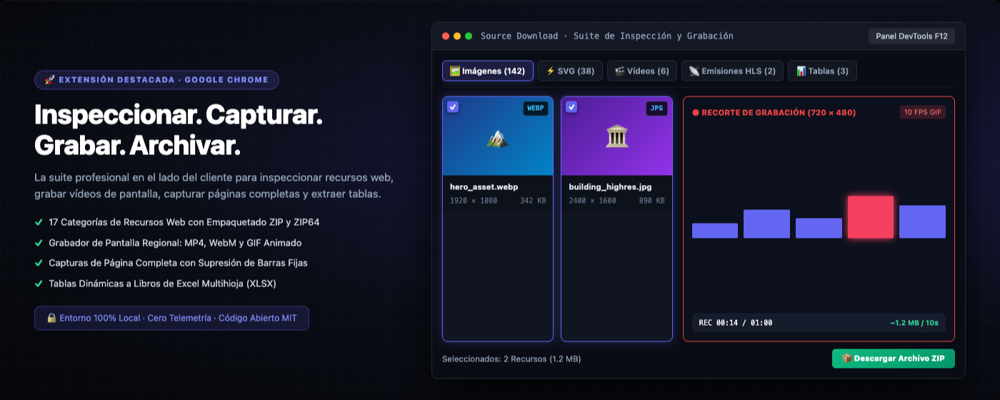
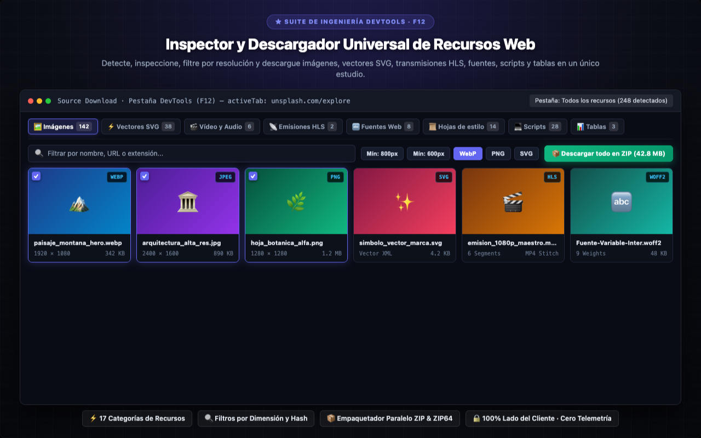
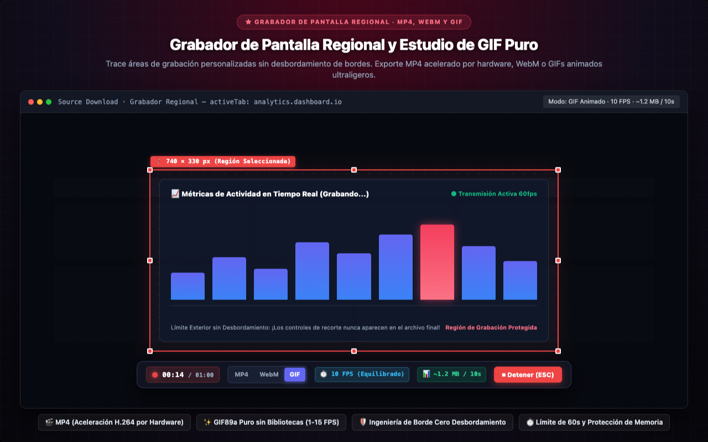
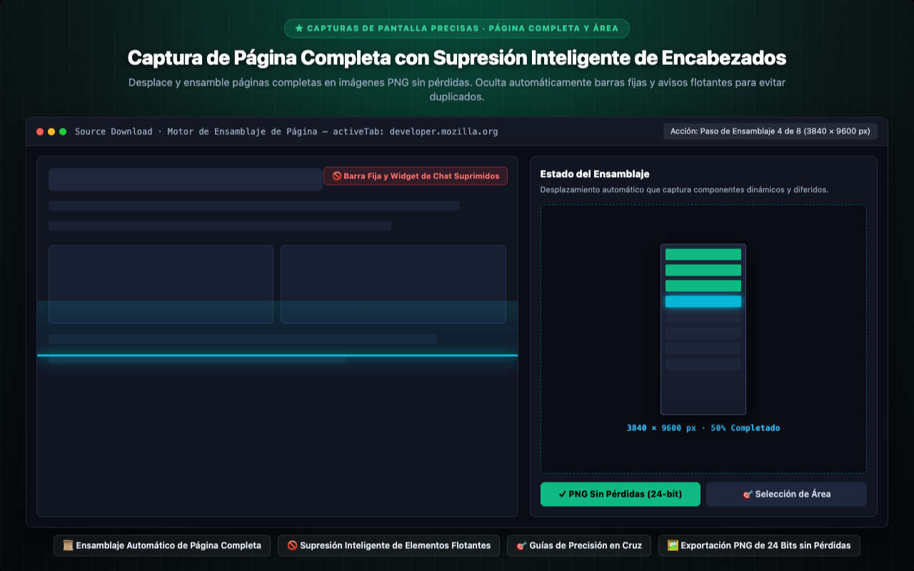
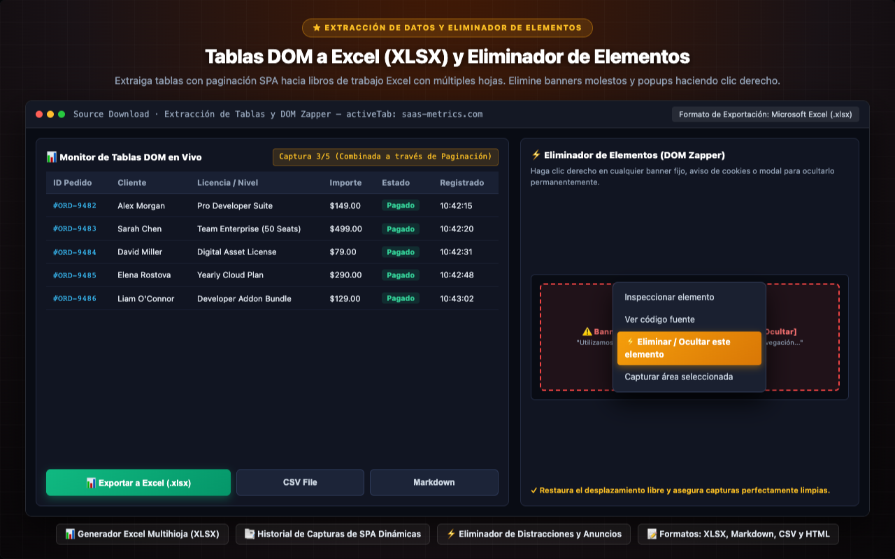
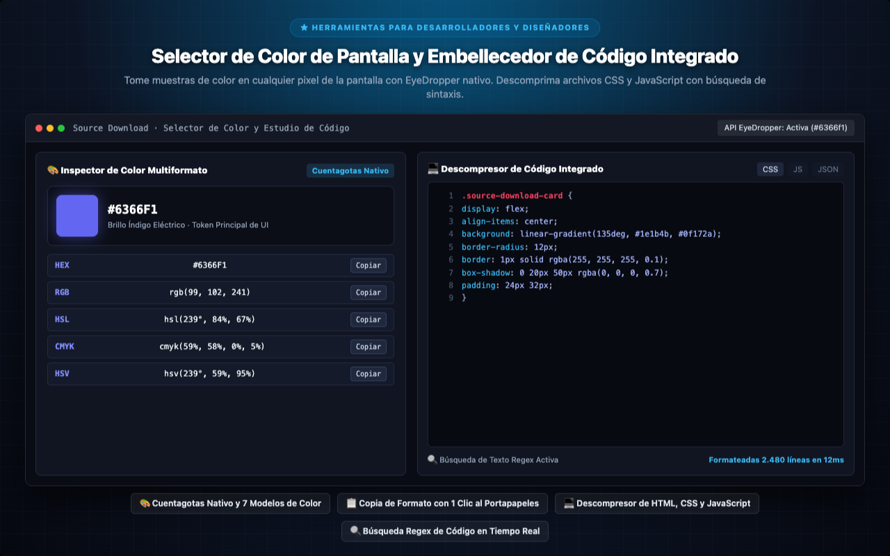

<p align="center">
  
</p>

<h1 align="center">Source Download</h1>

<p align="center">
  <a href="../../README.md"></a>
  <a href="README.tr.md"></a>
  <a href="README.de.md"></a>
  <a href="README.es.md"></a>
  <a href="README.ja.md"></a>
  <a href="README.ru.md"></a>
  <a href="README.zh-CN.md"></a>
</p>

<p align="center">
  <em>El conjunto integral para descarga de recursos web, capturas de página completa y extracción de datos DOM para desarrolladores, diseñadores y QA.</em><br>
  Inspeccione y descargue <b>todos los recursos</b> que carga una página web — imágenes, SVG, videos, audio, JS, CSS, fuentes, JSON, WASM, manifiestos, tablas en vivo y capturas de página completa — organizados limpiamente en un archivo ZIP estructurado.
</p>

<p align="center">
  <a href="https://chromewebstore.google.com/detail/source-download/nockdgincmpfojabnhbofkddgcmnodpd"></a>
  
  
  
  
  
  <a href="../../LICENSE"></a>
  
  
</p>

---

<p align="center">
  
</p>

---

## Hola, soy Turan Burak Yeşilyurt

Durante años construí automatizaciones para **web scraping**, **análisis de datos** y flujos de trabajo de **QA**. Con la llegada de las aplicaciones de página única (SPA), enfrenté la misma dificultad: guardar contenidos resulta tedioso y las Chrome DevTools a menudo resultan abrumadoras. **Source Download** nació para resolver esta necesidad de forma directa, ágil y totalmente local.

Conéctate conmigo en [**LinkedIn**](https://www.linkedin.com/in/turan-burak-yesilyurt/) o visita [**2run.dev**](https://2run.dev).

> **Chrome Web Store:** [Instalar Source Download en Chrome Web Store](https://chromewebstore.google.com/detail/source-download/nockdgincmpfojabnhbofkddgcmnodpd)

---

> **Compromiso de Código Abierto:** La gran mayoría de herramientas similares son envoltorios pesados de librerías de terceros. Source Download es diferente: cada byte — incluido el motor **ZIP**, el generador **XLSX**, el ensamblador **HLS** y el **codificador GIF** — está escrito a mano en JavaScript puro. Cero frameworks, cero dependencias externas, cero telemetría.

---

## Recorrido Visual y Módulos Principales

Explore los módulos de interfaz de alta resolución integrados directamente en Chrome DevTools, Menú de Clic Derecho y Ventana Emergente.

### 1. Inspector y Descargador Universal de Recursos Web
> **★ SUITE DE INGENIERÍA DEVTOOLS · F12** — Detecte, inspeccione, filtre por resolución y descargue imágenes, vectores SVG, transmisiones HLS, fuentes, scripts y tablas en un único estudio.
> 
> `⚡ 17 Categorías de Recursos` · `🔍 Filtros por Dimensión y Hash` · `📦 Empaquetador Paralelo ZIP & ZIP64` · `🔒 100% Lado del Cliente · Cero Telemetría`

<p align="center">
  
</p>

---

### 2. Grabador de Pantalla Regional y Estudio de GIF Puro
> **★ GRABADOR DE PANTALLA REGIONAL · MP4, WEBM Y GIF** — Trace áreas de grabación personalizadas sin desbordamiento de bordes. Exporte MP4 acelerado por hardware, WebM o GIFs animados ultraligeros.
> 
> `🎬 MP4 (Aceleración H.264 por Hardware)` · `✨ GIF89a Puro sin Bibliotecas (1-15 FPS)` · `🛡️ Ingeniería de Borde Cero Desbordamiento` · `⏱️ Límite de 60s y Protección de Memoria`

<p align="center">
  
</p>

---

### 3. Captura de Página Completa con Supresión Inteligente de Encabezados
> **★ CAPTURAS DE PANTALLA PRECISAS · PÁGINA COMPLETA Y ÁREA** — Desplace y ensamble páginas completas en imágenes PNG sin pérdidas. Oculta automáticamente barras fijas y avisos flotantes para evitar duplicados.
> 
> `📜 Ensamblaje Automático de Página Completa` · `🚫 Supresión Inteligente de Elementos Flotantes` · `🎯 Guías de Precisión en Cruz` · `🖼️ Exportación PNG de 24 Bits sin Pérdidas`

<p align="center">
  
</p>

---

### 4. Tablas DOM a Excel (XLSX) y Eliminador de Elementos
> **★ EXTRACCIÓN DE DATOS Y ELIMINADOR DE ELEMENTOS** — Extraiga tablas con paginación SPA hacia libros de trabajo Excel con múltiples hojas. Elimine banners molestos y popups haciendo clic derecho.
> 
> `📊 Generador Excel Multihioja (XLSX)` · `📑 Historial de Capturas de SPA Dinámicas` · `⚡ Eliminador de Distracciones y Anuncios` · `📝 Formatos: XLSX, Markdown, CSV y HTML`

<p align="center">
  
</p>

---

### 5. Selector de Color de Pantalla y Embellecedor de Código Integrado
> **★ HERRAMIENTAS PARA DESARROLLADORES Y DISEÑADORES** — Tome muestras de color en cualquier pixel de la pantalla con EyeDropper nativo. Descomprima archivos CSS y JavaScript con búsqueda de sintaxis.
> 
> `🎨 Cuentagotas Nativo y 7 Modelos de Color` · `📋 Copia de Formato con 1 Clic al Portapapeles` · `💻 Descompresor de HTML, CSS y JavaScript` · `🔍 Búsqueda Regex de Código en Tiempo Real`

<p align="center">
  
</p>

---

Source Download es la suite profesional todo en uno para la inspección, extracción, captura de pantalla y grabación de vídeo y GIF de recursos web, integrada de forma nativa en Google Chrome. Diseñada para desarrolladores, diseñadores y analistas, Source Download facilita la extracción de recursos, análisis de red, capturas completas y grabación en alta definición.

Con tres modos de trabajo flexibles —un panel de ingeniería en DevTools (F12), un menú contextual intuitivo con clic derecho y una ventana emergente rápida en la barra de herramientas—, Source Download detecta, categoriza, formatea y archiva todo lo que carga una página web. Desde fotografías en alta resolución y gráficos vectoriales SVG hasta transmisiones HLS, tablas dinámicas del DOM, fuentes web y respuestas de API, puede inspeccionar cada recurso con métricas técnicas avanzadas y exportarlos individualmente o empaquetados en un archivo ZIP/ZIP64 organizado.


## GUÍA COMPLETA DE CARACTERÍSTICAS Y FUNCIONALIDADES


### 1. DETECCIÓN Y EXTRACCIÓN INTEGRAL DE RECURSOS (17 CATEGORÍAS)

Inspeccione, previsualice y descargue cualquier componente web a través de 17 categorías dedicadas:
- **Imágenes y Medios Ráster:** Filtre y aísle fotografías de alta resolución y gráficos de interfaz frente a pequeños píxeles de seguimiento mediante umbrales personalizados de ancho y alto. Identifique duplicados idénticos a nivel de byte mediante coincidencia de hash SHA-256 en tiempo real. Inspeccione elementos visuales en un visor a pantalla completa con cuadrícula transparente para canales alfa y zoom interactivo.
- **Vectores SVG:** Extraiga elementos SVG en línea del DOM, archivos SVG vinculados y vectores en fondos CSS. Examine el código XML vectorial sin formato, copie el marcado SVG limpio directamente al portapapeles o descargue archivos vectoriales independientes listos para Figma, Sketch, Penpot o Illustrator.
- **Vídeo y Audio:** Detecte etiquetas HTML5 de medios, secuencias blob y enlaces directos. Previsualice audio y vídeo en el reproductor integrado con controles de velocidad y volumen antes de guardar el archivo en su equipo.
- **Detección y Unión de Secuencias HLS:** Intercepte listas de reproducción HTTP Live Streaming (.m3u8). Analice listas maestras y variantes de bitrate (1080p, 720p, 480p), descargue fragmentos en colas paralelas de 6 canales y únalos en un único archivo MP4 reproducible directamente en el navegador, sin necesidad de herramientas externas.
- **Tipografía Web:** Extraiga fuentes web modernas y tipos de letra escalables. Pruebe las tipografías de forma dinámica en una cascada interactiva con frases editables, variaciones de grosor (100-900) y visualización de glifos.
- **Hojas de Estilo y Scripts:** El formateador integrado transforma código ofuscado en sintaxis limpia con resaltado y búsqueda regex.
- **Respuestas de API y JSON:** Monitorice llamadas REST y consultas GraphQL en tiempo real. Inspeccione árboles de objetos JSON formateados, analice parámetros de consulta en la URL, examine cabeceras HTTP y mida la latencia de red.
- **Tablas Dinámicas del DOM:** Monitor en vivo que captura tablas estándar y componentes ARIA grid. Mantenga un historial de capturas a través de la paginación dinámica en aplicaciones SPA, fusione páginas sucesivas y exporte directamente a libros de trabajo Excel (XLSX) con múltiples hojas, tablas Markdown o archivos CSV.
- **Extracción de Texto en Vivo:** Recorra el flujo textual del documento en el orden natural del DOM. Filtre contenido en tiempo real mediante texto simple, expresiones regulares, selectores CSS o consultas XPath complejas.


### 2. GRABADOR REGIONAL DE PANTALLA Y ESTUDIO DE GIF ANIMADO

Capture vídeo en alta definición y GIFs animados ligeros de cualquier área de la pantalla:
- **Marco de Recorte Interactivo:** Dibuje un recuadro de recorte en cualquier parte de la pestaña activa. Ajuste las dimensiones suavemente con 8 controles de arrastre y lectura de coordenadas en tiempo real.
- **Ingeniería de Borde Cero Desbordamiento:** Los controles y encabezados se representan estrictamente fuera del límite de captura. Un margen externo evita que las líneas rojas aparezcan en el vídeo.
- **Barra Flotante sin Superposición:** La barra de control arrastrable se acopla automáticamente por encima o por debajo del recuadro, garantizando que nunca tape el área que se está grabando.
- **Formatos Versátiles de Vídeo y Animación:** Exporte sus grabaciones en vídeo acelerado por hardware MP4, formato web abierto WebM o GIF animado ultraligero.
- **Codificador GIF en JavaScript Puro:** Motor de codificación GIF89a desarrollado 100% en JavaScript vanilla sin dependencias externas, con cuantización de color de 15 bits y compresión LZW de enteros.
- **Niveles de Fotogramas por Segundo (FPS) Configurables:**
  - 15 FPS (Fluido): Alta fluidez para animaciones de interfaz, interacciones web y demostraciones de producto.
  - 10 FPS (Estándar / Equilibrado): El estándar ideal para memes web y reportes de errores técnicos; perfecto equilibrio entre calidad visual y tamaño de archivo.
  - 5 FPS (Compacto / Meme): Tamaño de archivo reducido significativamente; ideal para guías ligeras y tutoriales rápidos.
  - 2 FPS (Stop-Motion / Paso a Paso): Medio segundo por fotograma. Ideal para documentación secuencial y guías de clics; consume 5 veces menos memoria que 10 FPS.
  - 1 FPS (Presentación): Exactamente 1 fotograma por segundo; ideal para transiciones estáticas y consumo mínimo de almacenamiento (10 veces menor que 10 FPS).
- **Estimador de Tamaño en Vivo:** Indicador en la barra que calcula el tamaño estimado del archivo GIF (~X MB cada 10s) en función de las dimensiones y los FPS elegidos.
- **Límite de Seguridad 4K UHD:** Protege la memoria del navegador aplicando un techo de 3840px manteniendo la proporción original para evitar bloqueos en pantallas Retina.
- **Límite de Seguridad de 60 Segundos:** Aplica una duración máxima de 1 minuto para grabaciones en GIF con cuenta regresiva en vivo (00:00 / 01:00) y finalización automática.


### 3. CAPTURAS DE PANTALLA PRECISAS: PÁGINA COMPLETA Y SELECCIÓN DE ÁREA

Obtenga imágenes perfectas de páginas web sin recurrir a servicios en la nube:
- **Captura Completa Continua:** Desplazamiento y ensamblaje automático de páginas web enteras en imágenes PNG sin pérdidas.
- **Supresión Inteligente de Encabezados Fijos:** Oculta temporalmente barras de navegación flotantes, avisos fijos y widgets de chat durante el desplazamiento para evitar duplicados en la imagen final.
- **Sincronización con Carga Perezosa (Lazy-Load):** Simula pausas en el desplazamiento para garantizar que las imágenes diferidas y componentes dinámicos se carguen por completo.
- **Captura de Área de Alta Precisión:** Seleccione cualquier sección rectangular mediante guías en cruz para una descarga inmediata en PNG.


### 4. SELECTOR DE COLOR EN PANTALLA E INSPECTOR

Tome muestras de color en cualquier punto de su pantalla con precisión milimétrica:
- **API Nativa EyeDropper:** Muestree colores de píxeles directamente en la página web o en cualquier área de la ventana del navegador.
- **Inspección Cromática Multiformato:** Convierte automáticamente el color a modelos digitales e impresos: HEX, RGB, RGBA, HSL, HSLA, CMYK y HSV.
- **Copia Rápida al Portapapeles:** Botones dedicados de un clic para pegar valores directamente en hojas de estilo CSS o programas de diseño.


### 5. ELIMINADOR DE ELEMENTOS (ELEMENT ZAPPER)

Limpie elementos molestos de la página antes de capturarla o archivarla:
- **Menú Contextual Integrado:** Haga clic derecho en cualquier banner fijo, aviso de cookies o modal emergente y elija "Eliminar / Ocultar este elemento".
- **Neutralización Inmediata del DOM:** Remueve el elemento seleccionado del árbol DOM al instante, restableciendo el scroll natural y asegurando capturas limpias.


### 6. ARCHIVADO WEB OFFLINE EN UN SOLO ARCHIVO HTML

Guarde páginas web completas como documentos independientes y permanentes:
- **Archivo Autosuficiente:** Empaqueta toda la página en un único archivo .html funcional sin conexión.
- **Recursos Incrustados:** Convierte estilos CSS e imágenes a formato Base64 e inhabilita scripts para asegurar una apertura perfecta en local.
- **Cero Dependencia de la Red:** Consulte sus páginas archivadas en cualquier momento y dispositivo sin conexión a Internet.


### 7. EXTRACCIÓN DE TABLAS EN VIVO A EXCEL (XLSX)

Transforme tablas del navegador en hojas de cálculo estructuradas sin programar:
- **Generador Excel Multihioja:** Transforma tablas del DOM en libros de trabajo de Microsoft Excel (.xlsx) con tipos de celda correctos.
- **Historial Dinámico de Instantáneas:** Registre tablas actualizadas por AJAX y combine los datos paginados en un único archivo.
- **Múltiples Formatos:** Guarde la información como Excel (XLSX), tabla Markdown, archivo CSV o código HTML formateado.


### 8. HERRAMIENTAS PARA DESARROLLADORES: VISOR Y FORMATEADOR DE CÓDIGO

Formatee código comprimido directamente en el navegador:
- **Descompresión Limpia:** Aplica sangrías y espaciado a archivos HTML, CSS, JavaScript y JSON ofuscados.
- **Búsqueda Integrada:** Localice fragmentos mediante búsqueda textual o expresiones regulares en tiempo real.
- **Numeración de Líneas:** Interfaz clara con números de línea y resaltado de sintaxis moderno.


### 9. PLANTILLAS DE NOMBRES DE ARCHIVO PERSONALIZADAS

Organice sus descargas mediante variables dinámicas:
- **Parámetros Disponibles:** Configure esquemas con {domain}, {title}, {type}, {date}, {time} y {ext}.
- **Ajustes por Categoría:** Asigne patrones de nomenclatura distintos para capturas, grabaciones y archivos ZIP.


### 10. EMPAQUETADO AVANZADO EN ZIP Y ZIP64

Reúna cientos de archivos en un único archivo organizado con un solo clic:
- **Motor PKZIP en el Lado del Cliente:** Empaqueta recursos directamente en la memoria local del navegador.
- **Compatibilidad ZIP64:** Gestiona sin problemas archivos que superen los 4 GB o contengan más de 65.535 archivos individuales.
- **Estructura Limpia de Carpetas:** Clasifica automáticamente los recursos en subdirectorios (/images, /videos, /fonts, /css, /js, /documents).


## PERFILES DE USUARIO Y CASOS DE USO


- **Desarrolladores Frontend:** Inspeccionar recursos de red, depurar respuestas de API, extraer iconos SVG y fuentes, auditar hojas de estilo.
- **Diseñadores UI/UX:** Extraer componentes vectoriales, obtener paletas con la pipeta, verificar tipografía responsiva y jerarquías visuales.
- **Ingenieros de QA y Pruebas:** Grabar reproducciones de errores en MP4 o GIF a 2 FPS, capturar páginas completas para pruebas de regresión.
- **Analistas de Datos e Investigadores:** Extraer tablas de datos paginadas sin copiar y pegar manualmente directamente a hojas de cálculo Excel.
- **Creadores de Contenido y Educadores:** Generar GIFs explicativos ligeros para guías y documentación técnica, capturar gráficos nítidos.
- **Archivistas Digitales:** Guardar páginas web completas en archivos HTML independientes que no se degradan con el tiempo.


## PRIVACIDAD, SEGURIDAD Y CUMPLIMIENTO CORPORATIVO


Source Download está construida sobre una arquitectura estricta de privacidad local:
- **Procesamiento 100% Local en Sandbox:** Todas las tareas se ejecutan exclusivamente en la memoria local de su navegador.
- **Cero Telemetría y Cero Conexiones Externas:** La extensión no incluye código de analítica, píxeles de rastreo ni servidores remotos.
- **Compatibilidad con Redes Corporativas e Intranets:** Funciona con total normalidad en entornos cerrados, tras cortafuegos y sin conexión exterior.
- **Sin Registro ni Cuentas:** No requiere crear usuarios, iniciar sesión ni suscribirse; todas las herramientas están activas desde el primer segundo.
- **Cumplimiento con RGPD:** Al no recopilar ni transmitir información de ningún tipo, cumple de manera estricta las normativas de protección de datos.
- **Código Abierto y Auditable:** Desarrollado en JavaScript puro sin librerías de terceros bajo licencia MIT.


## TRANSPARENCIA EN PERMISOS


Source Download solicita únicamente los permisos indispensables para su funcionamiento:
- **activeTab:** Lee recursos y captura la pantalla únicamente en la pestaña activa al invocar la extensión.
- **storage:** Guarda preferencias, esquemas de nombrado y ajustes localmente en Chrome.
- **downloads:** Guarda imágenes, vídeos y archivos ZIP en su carpeta de descargas habitual.
- **contextMenus:** Añade accesos rápidos en el menú del clic derecho (Zapper, Captura de Área, Página Completa).
- **clipboardWrite:** Copia códigos de color, tablas, scripts y capturas directamente a su portapapeles.
- **scripting:** Ejecuta el Element Zapper e inyecta herramientas de inspección en las pestañas activas.


## ATAJOS DE TECLADO Y TRUCOS


- **Abrir DevTools:** Pulse F12 o Ctrl+Mayús+I (Cmd+Option+I en macOS) y haga clic en la pestaña "Source Download".
- **Herramientas de Clic Derecho:** Clic derecho en la página para ocultar elementos, extraer colores o grabar áreas.
- **Detener Grabación:** Pulse la tecla ESC o haga clic en el botón rojo Detener de la barra flotante.
- **Cancelar Selección:** Pulse ESC en cualquier momento para cerrar el marco de recorte o la cruceta de captura.
- **Cambiar Tasa de FPS:** Con el formato GIF activo, haga clic en el indicador de FPS para alternar (10 -> 5 -> 2 -> 1 -> 15 FPS).
- **Cambiar Resolución:** Haga clic en el indicador de resolución para alternar entre 1:1, 1080p, 720p o 480p.


## PREGUNTAS FRECUENTES (FAQ)


P: ¿Se envían mis datos o recursos descargados a servidores externos?
R: No, en absoluto. Todo el procesamiento se realiza al 100% de manera local en su navegador. Ningún dato sale de su equipo.

P: ¿Cómo funciona la unión de transmisiones HLS?
R: La extensión detecta el manifiesto (.m3u8), descarga los segmentos de vídeo en memoria en paralelo y los une directamente en un único archivo MP4 reproducible, sin necesidad de utilidades adicionales como FFmpeg.

P: ¿Por qué la grabación en GIF tiene un límite de 1 minuto?
R: Los GIFs animados de alta calidad almacenan fotogramas sin comprimir en memoria. El límite de 60 segundos y las opciones de FPS evitan saturar la memoria y garantizan estabilidad.

P: ¿Puedo grabar únicamente un área específica de la pantalla?
R: Sí. Con el grabador regional solo debe dibujar un recuadro sobre la zona deseada. Los controles quedan fuera de la zona para ofrecer un resultado limpio.

P: ¿Es posible exportar tablas que abarcan varias páginas paginadas?
R: Sí. El monitor de tablas guarda instantáneas sucesivas conforme navega por las páginas y permite exportar los datos combinados a Excel (.xlsx).

P: ¿Los elementos eliminados con el Element Zapper desaparecen para siempre?
R: El eliminador remueve el elemento únicamente en la sesión actual para facilitar una captura limpia. Al recargar la página web, el elemento volverá a mostrarse con normalidad.

P: ¿Los archivos ZIP64 generados son compatibles con descompresores estándar?
R: Sí, cumplen rigurosamente el estándar PKZIP/ZIP64 y son compatibles con Windows, macOS y Linux.

P: ¿Cuándo conviene utilizar el modo Stop-Motion a 2 FPS en GIF?
R: El modo a 2 FPS es ideal para guías de pasos y tutoriales secuenciales. Consume 5 veces menos memoria que 10 FPS y genera archivos muy compactos que se envían fácilmente por correo o mensajería.

¡Instale Source Download hoy mismo y optimice su flujo de trabajo web en Google Chrome!

---

## Instalación y Guía Rápida

### Método 1: Instalación directa desde Chrome Web Store (Recomendado)
1. Visita la página oficial de [Source Download en Chrome Web Store](https://chromewebstore.google.com/detail/source-download/nockdgincmpfojabnhbofkddgcmnodpd).
2. Haz clic en **Añadir a Chrome**.
3. Abre DevTools (`F12` o `Cmd+Option+I` en macOS) y selecciona la pestaña **Source Download**.

### Método 2: Cargar extensión descomprimida desde el código fuente
1. Clona el repositorio oficial:
```bash
git clone https://github.com/turanburakyesilyurt/source-download.git
cd source-download
```
2. Abre Chrome y navega a `chrome://extensions`.
3. Activa el **Modo de desarrollador** en la esquina superior derecha.
4. Haz clic en **Cargar descomprimida** y selecciona la carpeta del proyecto.

---

## Licencia

Distribuido bajo la [Licencia MIT](../../LICENSE). Copyright © Turan Burak Yeşilyurt. Libre para usar, auditar y bifurcar.
