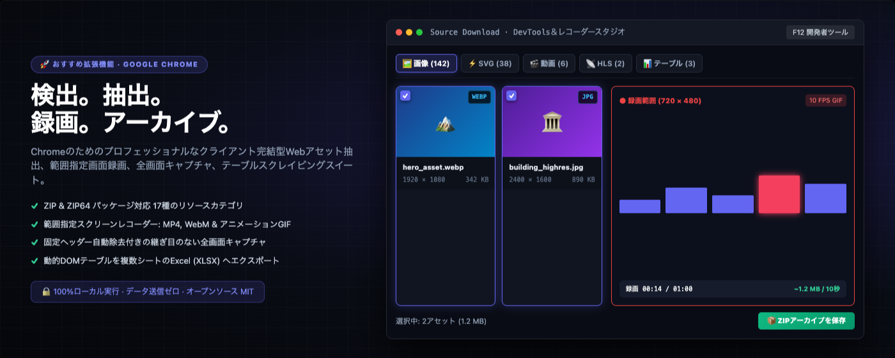
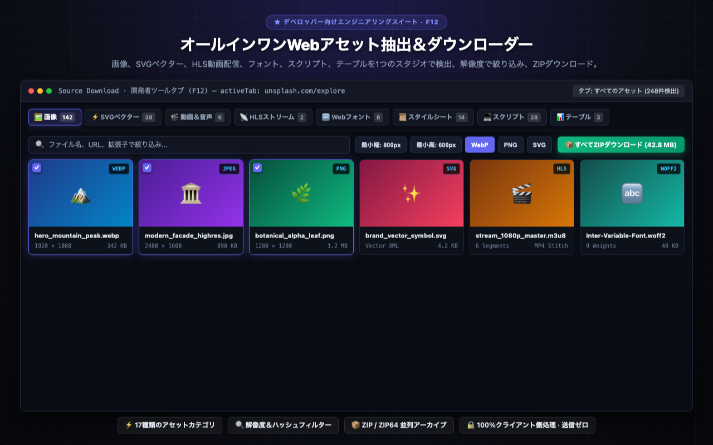
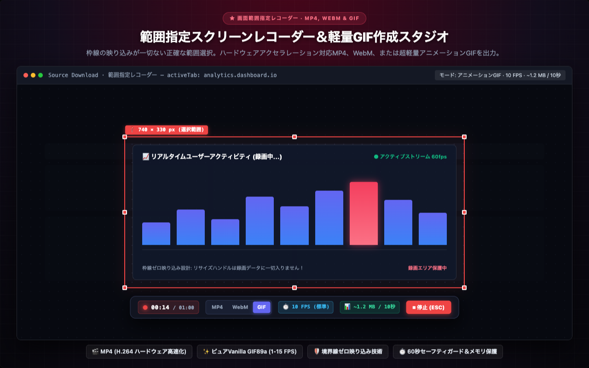
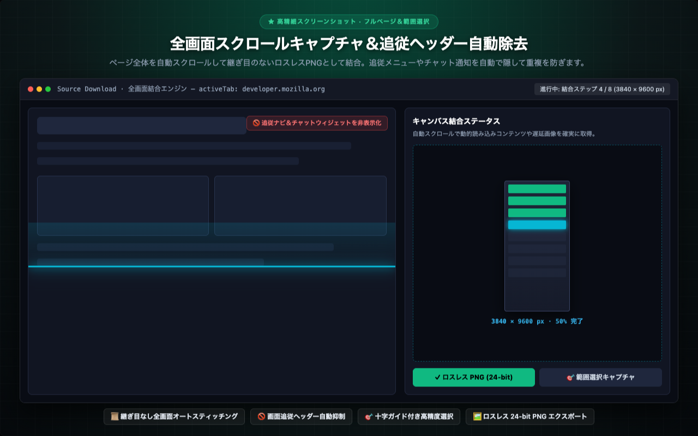
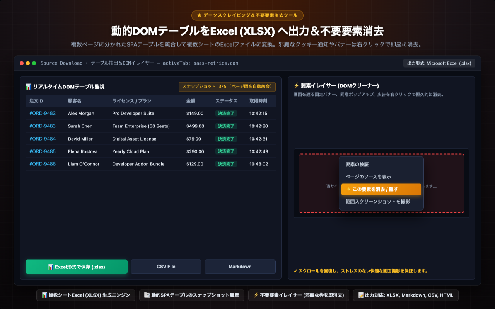
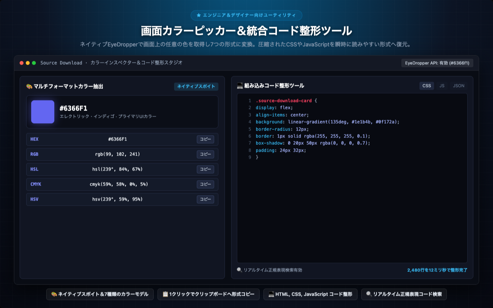

<p align="center">
  
</p>

<h1 align="center">Source Download</h1>

<p align="center">
  <a href="../../README.md"></a>
  <a href="README.tr.md"></a>
  <a href="README.de.md"></a>
  <a href="README.es.md"></a>
  <a href="README.ja.md"></a>
  <a href="README.ru.md"></a>
  <a href="README.zh-CN.md"></a>
</p>

<p align="center">
  <em>開発者・デザイナー・QAエンジニア・リサーチャーのためのWebアセット一括抽出、全画面スクロールキャプチャ、リアルタイムDOM作業環境。</em><br>
  Webページが読み込む<b>すべてのリソース</b> — 画像、SVG、動画、音声、JS、CSS、Webフォント、JSON、WASM、マニフェスト、動的テーブル、ピクセル完全な全画面スクリーンショット — を階層型ZIPとして安全に検査・一括ダウンロード。
</p>

<p align="center">
  <a href="https://chromewebstore.google.com/detail/source-download/nockdgincmpfojabnhbofkddgcmnodpd"></a>
  
  
  
  
  
  <a href="../../LICENSE"></a>
  
  
</p>

---

<p align="center">
  
</p>

---

## 開発者メッセージ: Turan Burak Yeşilyurt

Webスクレイピング、データ分析、QAテスト自動化に長年携わってきました。シングルページアプリケーション（SPA）が主流となった現代、画面上のデータを簡単に保存できなかったり、DevToolsが過度に複雑に感じられる課題がありました。**Source Download** は、それらを解決するために生まれました。

[**LinkedIn**](https://www.linkedin.com/in/turan-burak-yesilyurt/) または [**2run.dev**](https://2run.dev) で気軽につながり、フィードバックをお聞かせください。

> **Chrome Web Store:** [Chrome Web StoreからSource Downloadをインストール](https://chromewebstore.google.com/detail/source-download/nockdgincmpfojabnhbofkddgcmnodpd)

---

> **オープンソースへのこだわりと設計哲学:** ストアに存在する類似ツールの多くは、外部ライブラリを大量に重ねたラッパーに過ぎません。Source Downloadは根本から異なります。**ZIP生成エンジン**、**XLSXビルダー**、**HLS動画マージ**、**GIFエンコーダー**、**コード整形ツール**に至るまで、すべての行が純粋なVanilla JavaScriptでゼロから手書きされています。外部依存関係ゼロ、ビルド手順不要、テレメトリ/追跡コード一切なし。

---

## ビジュアルツアー＆主要機能モジュール

Google Chrome DevTools、右クリックコンテキストメニュー、ツールバーポップアップにネイティブ統合された機能をご覧ください。

### 1. オールインワンWebアセット抽出＆ダウンローダー
> **★ デベロッパー向けエンジニアリングスイート · F12** — 画像、SVGベクター、HLS動画配信、フォント、スクリプト、テーブルを1つのスタジオで検出、解像度で絞り込み、ZIPダウンロード。
> 
> `⚡ 17種類のアセットカテゴリ` · `🔍 解像度＆ハッシュフィルター` · `📦 ZIP / ZIP64 並列アーカイブ` · `🔒 100%クライアント側処理 · 送信ゼロ`

<p align="center">
  
</p>

---

### 2. 範囲指定スクリーンレコーダー＆軽量GIF作成スタジオ
> **★ 画面範囲指定レコーダー · MP4, WEBM & GIF** — 枠線の映り込みが一切ない正確な範囲選択。ハードウェアアクセラレーション対応MP4、WebM、または超軽量アニメーションGIFを出力。
> 
> `🎬 MP4 (H.264 ハードウェア高速化)` · `✨ ピュアVanilla GIF89a (1-15 FPS)` · `🛡️ 境界線ゼロ映り込み技術` · `⏱️ 60秒セーフティガード＆メモリ保護`

<p align="center">
  
</p>

---

### 3. 全画面スクロールキャプチャ＆追従ヘッダー自動除去
> **★ 高精細スクリーンショット · フルページ＆範囲選択** — ページ全体を自動スクロールして継ぎ目のないロスレスPNGとして結合。追従メニューやチャット通知を自動で隠して重複を防ぎます。
> 
> `📜 継ぎ目なし全画面オートスティッチング` · `🚫 画面追従ヘッダー自動抑制` · `🎯 十字ガイド付き高精度選択` · `🖼️ ロスレス 24-bit PNG エクスポート`

<p align="center">
  
</p>

---

### 4. 動的DOMテーブルをExcel (XLSX) へ出力＆不要要素消去
> **★ データスクレイピング＆不要要素消去ツール** — 複数ページに分かれたSPAテーブルを統合して複数シートのExcelファイルに変換。邪魔なクッキー通知やバナーは右クリックで即座に消去。
> 
> `📊 複数シートExcel (XLSX) 生成エンジン` · `📑 動的SPAテーブルのスナップショット履歴` · `⚡ 不要要素イレイサー (邪魔な枠を即消去)` · `📝 出力対応: XLSX, Markdown, CSV, HTML`

<p align="center">
  
</p>

---

### 5. 画面カラーピッカー＆統合コード整形ツール
> **★ エンジニア＆デザイナー向けユーティリティ** — ネイティブEyeDropperで画面上の任意の色を取得し7つの形式に変換。圧縮されたCSSやJavaScriptを瞬時に読みやすい形式へ復元。
> 
> `🎨 ネイティブスポイト＆7種類のカラーモデル` · `📋 1クリックでクリップボードへ形式コピー` · `💻 HTML, CSS, JavaScript コード整形` · `🔍 リアルタイム正規表現コード検索`

<p align="center">
  
</p>

---

Source Download は、Web開発者、UI/UXデザイナー、QAエンジニア、データアナリスト、デジタルアーキビスト、そしてコンテンツクリエイターのために設計された、Google Chrome 完全統合型のプロフェッショナル向けオールインワンWebアセット抽出・画面キャプチャ・画面録画（動画/GIF）統合スタジオです。

Chrome F12 開発者ツール（DevTools）専用エンジニアリングパネル、直感的な右クリックコンテキストメニュー、そして手軽にアクセスできるツールバーポップアップの3つの柔軟な作業環境を搭載。訪問中のあらゆるWebページがバックグラウンドで読み込む膨大なリソースを徹底的に検出・分類し、高解像度メディアやSVGベクター、HLS動画配信ストリーム、動的DOMテーブル、Webフォント、APIレスポンスに至るまで、すべてのデータを詳細な技術仕様とともに瞬時に抽出し、個別ダウンロードや整理されたZIP/ZIP64アーカイブとして一括保存できます。


## 機能一覧・詳細仕様ガイド


### 1. 包括的なWebアセット検出＆一括ダウンロード（全17カテゴリ対応）

最新のWebサイトやWebアプリケーションが読み込むすべてのリソースを17の専門カテゴリに自動分類して効率的に抽出します：
- **画像＆ラスターグラフィックス:** 最小・最大の幅および高さピクセル閾値フィルターにより、トラッキングピクセルや微細なアイコンを排除し、必要な高解像度メイン画像やUIアセットだけを確実に抽出。SHA-256ハッシュ照合アルゴリズムにより、同一内容の重複ファイルを瞬時に検知して無駄なダウンロードを防止。透明チェッカーボード背景を備えたフルスクリーン拡大ライトボックスにより、アルファチャンネルの透過状態をピクセル単位で精密検証可能。
- **SVGベクターグラフィックス:** HTML内に埋め込まれたインラインSVG要素、外部リンクSVGファイル、CSS background-imageとして読み込まれたベクター画像を網羅的に抽出。生のXMLベクターコードの閲覧、クリーンなマークアップのクリップボードコピー、Figma、Sketch、Penpot、Adobe Illustratorに最適化された単体SVGファイルとしての直接保存に対応。
- **動画＆音声メディア:** HTML5 video/audio要素、blobストリーム、直接リンクされたメディアファイルを自動検出。保存前に再生速度変更や音量調整が可能な内蔵メディアプレーヤーで内容をプレビュー確認可能。
- **HLS動画ストリームの検出＆自動結合:** HTTP Live Streaming（.m3u8）マニフェストファイルを自動検出。マスターおよびメディアプレイリストを解析し、選択可能なビットレート解像度（1080p、720p、480p）を確認した上で、6系統の並列キューでセグメントを高速取得。外部ソフトウェアやFFmpegコマンドを一切使わず、ブラウザ内部で完全な単一MP4動画ファイルへ無劣化自動結合します。AES-128暗号化ストリームの検知ステータス通知も完備。
- **Webタイポグラフィ＆フォント:** 圧縮された現代のWebフォント形式やオープンソース書体を抽出。編集可能なテスト文字列（日本語パングラム対応）による滝状フォントプレビュー、ウェイト階層（100〜900）の切り替え、収録グリフ一覧の検証に対応。
- **スタイルシート＆スクリプト:** ページを構成するCSSおよびJavaScriptファイルを完全抽出。内蔵コード整形ツール（Unminifier/Beautifier）により、圧縮・難読化されたコードを構文強調表示と高速正規表現検索を備えた読みやすいコードに瞬時に復元。
- **API通信＆JSONレスポンス監視:** バックグラウンドで実行されるREST APIリクエストやGraphQLクエリ、JSONレスポンスをリアルタイム追跡。ツリー構造ビューでのJSONデータ解析、URLクエリパラメータの分解、HTTPリクエスト/レスポンスヘッダーの確認、ネットワークレイテンシの測定が可能。
- **動的DOMテーブルの監視＆Excel出力:** 標準のHTMLテーブルおよびモダンなARIAグリッドコンポーネントをリアルタイム監視。SPAのページネーションやフィルタリングによる状態遷移スナップショットを蓄積し、複数ページを結合した複数シート構成のExcel（XLSX）、Markdownテーブル、またはCSV形式で直接出力。
- **リアルタイムテキスト抽出:** ドキュメントのDOM構造に沿った自然な読み順でテキストストリームを抽出。プレーンテキスト検索、正規表現、CSSセレクター、高度なXPathクエリによる動的フィルタリングに対応。
- **Webアプリマニフェスト＆メタデータ:** PWAマニフェスト（manifest.json）、ファビコン、Appleタッチアイコン、SNS共有用メタタグ（Open Graph、Twitter Cards）を検査。
- **ドキュメント＆バイナリファイル:** デジタル出版物、PDFドキュメント、コンパイル済みWebAssemblyモジュール、圧縮アーカイブパッケージ、構造化テキストファイルを抽出。


### 2. 画面範囲指定レコーダー＆アニメーションGIFスタジオ

画面上の任意の矩形領域を指定し、高精細な動画や軽量なアニメーションGIFを録画・出力します：
- **直感的な範囲指定トリミングボックス:** アクティブなタブ上の任意の場所にマウスドラッグで範囲指定。8箇所のサイズ調整ハンドルとリアルタイムピクセル座標表示により、精密な矩形設定が可能。
- **枠線ゼロ映り込み技術（Zero-Bleed Boundary）:** リサイズハンドルやドラッグ用バーは録画領域の外側に完全分離して描画。外側アウトセットオフセット設計により、赤色の選択枠線や操作UIが録画データ内に映り込む現象を根本から排除。
- **画面を遮らないフローティングコントロールバー:** ドラッグ移動可能な操作バーは録画領域の上下にスマート吸着し、キャプチャ対象コンテンツと視覚的に重複しません。
- **多様な動画＆アニメーション形式:** ハードウェアアクセラレーション対応MP4、オープン標準WebM、超軽量アニメーションGIFから用途に応じて選択可能。
- **完全Pure Vanilla JavaScript製GIFエンコーダー:** 外部ライブラリに一切依存せず、100%純粋なJavaScriptのみで構築された内蔵GIF89aエンコードエンジン。15ビットカラー量子化と整数キーLZW圧縮により、高品質かつ極小のファイルサイズを実現。
- **用途に合わせた5段階のGIFフレームレート（FPS）選択:**
  - 15 FPS（スムーズ / 滑らか）: UIインタラクション、マイクロアニメーション、製品デモに最適な高流動性。
  - 10 FPS（標準 / バランス）: Webミーム、SNS共有、不具合バグ報告における世界標準の黄金比率。画質と容量の最高バランス。
  - 5 FPS（コンパクト / 軽量）: ファイルサイズを大幅に削減。素早く読み込めるドキュメントやヘルプ記事に最適。
  - 2 FPS（ストップモーション / カタカタ・ステップバイステップ）: 1フレームあたり0.5秒のコマ送り。操作手順マニュアルや nostalgic なコマ送りアニメーションに最適。10 FPS比でメモリ消費量およびファイルサイズを5分の1に削減。
  - 1 FPS（スライドショー / プレゼン）: 1秒間に1フレームの超省容量モード。画面遷移の記録やコード解説に最適（10 FPS比で約10分の1の容量）。
- **リアルタイムファイル容量予測バッジ:** 選択中の解像度とFPS設定に基づき、録画開始前および録画中に予想ファイルサイズ（~X MB / 10秒）をリアルタイム表示。
- **4K UHD解像度セーフティシーリング:** Retina高DPIディスプレイ環境下でのタブメモリ爆発を防ぐため、アスペクト比を保ったまま最大3840pxで安全にクリップ。
- **60秒セーフティリミット＆自動保護:** GIF録画時に最大1分間（60秒）の安全上限を設定。画面上のカウントダウンタイマー（00:00 / 01:00）と自動エンコード終了により、ブラウザタブのクラッシュを完全に防ぎます。


### 3. ピクセル完全な全画面スクロールキャプチャ＆範囲スクリーンショット

クラウドサーバーに一切頼ることなく、ローカルブラウザ内で最高精度のWeb画像を作成：
- **継ぎ目のない全画面長スクリーンショット:** ページ全体を縦方向に自動スクロールしながら撮影・結合し、ロスレスな超高解像度PNG画像を生成。
- **画面追従ヘッダー自動除去（Sticky Header Neutralizer）:** スクロール中に画面上部や下部に固定される追従ヘッダー、フローティング告知バー、チャットウィジェットを自動判別して一時的に非表示化。長画像内での鬱陶しいヘッダー重複を完全に解消。
- **遅延読み込み画像同期（Lazy-Load Sync）:** スクロール停止待機時間を設けることで、画面外の遅延画像や動的スクリプト要素の描画完了を待ってから確実に撮影。
- **高精度クロスヘア範囲キャプチャ:** 画面上の任意の矩形領域を十字ガイドラインでピクセル単位で指定し、即座にPNG保存。


### 4. 画面カラーピッカー＆マルチフォーマットインスペクター

デザイナー基準の精密さで、画面上のあらゆるピクセルから色をサンプリング：
- **ネイティブEyeDropper API連携:** Webページ内だけでなく、ブラウザウィンドウ全体のピクセルカラーを直接サンプリング。
- **多彩なカラーモデル相互変換:** 取得した色を自動的に変換: HEX、RGB、RGBA、HSL、HSLA、CMYK、HSV。
- **1クリッククリップボードコピー:** CSSコードやデザインツールにそのまま貼り付け可能な個別コピーボタンを完備。


### 5. 不要要素イレイサー（DOM Element Zapper）

キャプチャ撮影やコンテンツ保存の前に、画面上の視覚的ノイズをワンクリック消去：
- **右クリックコンテキストメニュー統合:** 画面を覆う同意ポップアップ、追従広告、モーダルウィンドウを右クリックし、「この要素を消去（Zap）」を選択。
- **瞬時のDOMツリー除去:** 邪魔な要素をDOMツリーから安全に消去し、固定されたスクロールバーを解放して純粋な画面キャプチャを可能にします。


### 6. 単一HTMLファイルによる完全オフラインWebアーカイブ

Webページを外部依存のない恒久的な単一ドキュメントとして保存：
- **自己完結型オフラインファイル:** ページ全体を単一の.htmlファイルとしてパッケージング。
- **リソースのインラインBase64埋め込み:** 外部CSSや画像をBase64として内部に統合し、オフライン環境でも表示崩れなく完全に閲覧可能。
- **インターネット不要の永続保存:** 保存したファイルは将来にわたりオフラインでいつでも安全に閲覧できます。


### 7. 動的DOMテーブルのExcel（XLSX）抽出＆スクレイピング

Web上の表データをプログラミング不要で構造化スプレッドシートへ変換：
- **複数シート対応Excel（XLSX）生成:** DOMテーブルを正確なセル型付きでフォーマットされたMicrosoft Excelファイルへ直接変換。
- **動的ページネーション統合履歴:** ページネーションで分割されたテーブルの各ページ状態を記録し、1つの統合データセットとしてエクスポート。
- **柔軟な出力形式:** Excel（XLSX）、Markdownテーブル、CSVファイル、フォーマット済みHTMLの各形式に対応。


### 8. 開発者向けユーティリティ: コード整形＆構文検索

圧縮されたスクリプトをブラウザ内で即座に美しく整形：
- **高速Unminification:** 圧縮されたHTML、CSS、JavaScript、JSONコードを適切なインデントと改行で展開。
- **構文内検索機能:** 展開されたコード内をプレーンテキストまたは正規表現でリアルタイム検索。
- **行番号付きシンタックスハイライト:** モダンで見やすいエディタ風表示。


### 9. 柔軟なファイル命名規則テンプレート

動的プレースホルダーを利用してダウンロードファイルの命名を自動化：
- **利用可能な変数:** {domain}、{title}、{type}、{date}、{time}、{ext} を自由に組み合わせてカスタム規則を設定。
- **カテゴリ別プリセット:** スクリーンショット、動画録画、ZIPアーカイブそれぞれに個別の命名規則を適用可能。


### 10. 高度なZIP / ZIP64 並列アーカイブエンジン

数百個におよぶ抽出アセットを1クリックでフォルダ分類アーカイブ：
- **クライアント側PKZIP処理:** ブラウザメモリ内で高速並列圧縮を実行。
- **大容量ZIP64仕様完全準拠:** 4GB以上または65,535ファイルを超える巨大アーカイブもエラーなく安定処理。
- **整理された階層構造:** ファイル種別ごとに自動で適切なサブディレクトリ（/images, /videos, /fonts, /css, /js, /documents）へ格納。


## 想定ユーザーと実践的ワークフロー


- **フロントエンドエンジニア:** ネットワーク読み込みリソースの監査、APIレスポンスの検証、SVGアイコンやフォントの抽出、CSS設計の分析、難読化コードの調査。
- **UI/UXデザイナー:** ベクターアイコンの抽出、カラーピッカーによる配色パレットの収集、レスポンシブタイポグラフィや画像配信の最適化状況の検証。
- **QA・テストエンジニア:** 不具合の再現手順をMP4動画や軽量な2 FPSストップモーションGIFで記録、縦長ページの完全スクロール画像によるデザイン崩れの検出。
- **データアナリスト・リサーチャー:** 複数ページに分かれた一覧テーブルの手動コピペを排除し、複数シートExcelファイルへ一括スクレイピング。
- **コンテンツクリエイター・テクニカルライター:** マニュアルやブログ記事のための軽量なアニメーションGIF動画の作成、高解像度で余計な枠線のない画面キャプチャ。
- **デジタルアーキビスト・法務調査担当:** 将来にわたって改ざんやリンク切れの心配がない単一オフラインHTMLファイルとしてWeb文書を確実に保管。


## ブラウザ内部アーキテクチャと技術的優位性


Source Download は、最新の Web Platform API を極限まで活用した高度なブラウザネイティブ設計を採用しています：
- **WebCodecs & Canvas API による高速フレーム処理:** 画面キャプチャおよび動画エンコード処理には、ハードウェア支援を受けるネイティブ API を採用。メインスレッドをブロックすることなく、高速かつ安定した録画ストリーム処理を実現しています。
- **Median-Cut 色量子化 & 整数 LZW 圧縮アルゴリズム:** 内蔵の GIF エンコードエンジンは、15ビットカラー空間におけるメディアンカット量子化アルゴリズムを独自実装。バンディングノイズの極めて少ない滑らかな階調表現と、整数キーによる高速 LZW 辞書圧縮によって、高品質と極小ファイルサイズを両立します。
- **DOM MutationObserver による動的変更追跡:** ページのスクロールやユーザー操作に伴う DOM の動的変化を MutationObserver でリアルタイムに検知。遅延読み込み画像や非同期で生成されるテーブル要素も取りこぼしなく確実に捕捉します。
- **クライアントサイド PKZIP / ZIP64 並列ワーカー:** 大容量の画像やメディアファイルをZIPアーカイブ化する際、ブラウザのバックグラウンドワーカーで並列圧縮処理を実行。ブラウザのUIを一切フリーズさせることなく、ギガバイト級の大規模アーカイブも安定して生成できます。


## 実践的活用シナリオとステップ別チュートリアル


### 1. フロントエンド開発におけるデザイン再現とアセット監査

Webサイトのリニューアルや競合調査において、ページ内のすべてのSVGアイコン、フォントファイル、高解像度バナーをまとめて取得したい場合：
① F12キーで開発者ツールを開き、「Source Download」タブを選択します。
② カテゴリバーで「SVG」または「画像」をクリックし、解像度フィルターで不要な極小トラッキングアイコンを除外します。
③ 「すべてZIPでダウンロード」をクリックすると、フォルダ分類されたクリーンなアセットパッケージが即座に入手できます。


### 2. バグ報告と不具合再現手順の軽量GIFアニメーション化

GitHub Issues、Jira、Slack で開発チームに不具合の発生手順を共有したい場合：
① ツールバーまたはサイドパネルから「範囲録画」を起動し、不具合の発生領域をドラッグして囲みます。
② フォーマットで「GIF」を選択し、フレームレートバッジをクリックして「2 FPS（ステップバイステップ）」または「10 FPS（標準）」を設定します。
③ 録画を開始し、操作を行った後にESCキーで停止。わずか数百KBの超軽量GIFが生成され、チャットやチケットにそのまま貼り付け可能です。


### 3. 長大なドキュメントやLPの継ぎ目のない全画面キャプチャ

ヘッダーが画面上部に固定追従するランディングページや縦長の技術記事を1枚の高精細画像として保存したい場合：
① 拡張機能メニューから「全画面キャプチャ」を実行します。
② 自動スクロールエンジンが追従ヘッダーやチャットウィジェットを自動判別して一時的に非表示化しながらページ末尾まで撮影。
③ ヘッダーの不自然な多重写り込みが一切ない、完全な単一PNG画像が出力されます。


### 4. ページネーション付きデータテーブルのExcel一括エクスポート

Web上のダッシュボードやEC管理画面で、複数ページに分割された顧客一覧や注文履歴テーブルを取得したい場合：
① DevToolsの「テーブル」タブを開き、対象のDOMテーブルを特定します。
② Webページ側で「次へ」ボタンを押してページをめくると、モニターが各ページのスナップショットを順次自動記録します。
③ 「Excelエクスポート（.xlsx）」をクリックするだけで、すべてのページのデータが1つのワークブックに自動統合されて出力されます。


### 4. モダンフロントエンドフレームワークとの高度な互換性

React 18、Vue 3、Svelte、Next.js、Nuxt などのモダンなSSR/SPAアーキテクチャに完全対応：
- **ハイドレーション後の動的DOM追従:** サーバーサイドレンダリング（SSR）後のクライアント側ハイドレーションによるDOM書き換えを正確に追従。動的に生成される画像要素やスタイルシートを逃しません。
- **シャドウDOM（Shadow DOM）内部のアセット検出:** Web Components やマイクロフロントエンドでカプセル化されたシャドウルート内部のスタイル、ベクターアイコン、メディア要素も透過的に抽出可能です。
- **メモリリーク防止と高速ガベージコレクション:** 大量の画像を連続検査してもブラウザタブのヒープメモリを圧迫しないよう、明示的なオブジェクト解放処理を徹底しています。


## 企業導入・セキュリティ監査ガイドライン


Source Download は、金融機関、医療機関、官公庁、エンタープライズIT部門などの厳格なセキュリティ要件を満たすよう設計されています：
- **エアギャップ環境（完全閉域網）への対応:** 外部サーバーへの依存やライセンス認証通信が一切存在しないため、インターネットから物理的に遮断されたネットワーク内でも全機能が完全に動作します。
- **プロキシ・VPN環境での安定稼働:** すべての処理がお使いのクライアント端末内部で完結するため、企業のSSLインスペクションプロキシやVPNゲートウェイの制限を受けることがありません。
- **ゼロテレメトリ保証:** Google Analytics、Mixpanel、Sentry などの外部計測スクリプトを一切含んでおらず、ソースコードは完全に透明で検証可能です。


## プライバシー・セキュリティ・企業コンプライアンスの完全保証


Source Download は、妥協のないローカルファーストのプライバシー設計を貫いています：
- **100%クライアント側サンドボックス処理:** ネットワーク分析、動画録画、GIF生成、テーブル抽出、ZIP圧縮を含むすべての処理は、ユーザーのローカルブラウザメモリ内でのみ実行されます。
- **外部データ送信・テレメトリの完全ゼロ化:** 拡張機能内には、アナリティクス解析コード、トラッキングピクセル、広告トラッカー、外部サーバーとの通信処理は一切存在しません。
- **社内イントラネット・VPN環境への完全対応:** 外部インターネット接続が制限された機密ネットワーク、社内開発環境、VPN接続環境でも完全に動作します。
- **アカウント登録・ログイン不要:** ユーザー登録、ログイン、サブスクリプション契約は一切不要。インストールした瞬間からすべての全機能を制限なく利用できます。
- **GDPRおよび各種データ保護規制への適合:** ユーザーデータや閲覧履歴を収集・送信しないため、厳格なデータ保護基準を満たしています。
- **監査可能なオープンソース:** 外部の不透明な第三者ライブラリを排除した純粋なVanilla JavaScript設計、安心のMITライセンス。


## 要求権限の透明性と利用目的


Source Download が要求する権限は、機能提供に不可欠な最小限のものに限られています：
- **activeTab:** 拡張機能をクリックして起動したアクティブなタブでのみ、リソースの読み取りと画面キャプチャを実行するために使用。
- **storage:** ユーザーが設定した表示オプション、ファイル命名テンプレート、録画設定をブラウザのローカルプロファイル内に保存するために使用。
- **downloads:** キャプチャした画像、録画動画、ZIPアーカイブをユーザーの標準ダウンロードフォルダに保存するために使用。
- **contextMenus:** 右クリックメニューにクイック操作（要素消去、範囲キャプチャ、全画面キャプチャ、カラーピッカー）を追加するために使用。
- **clipboardWrite:** 抽出したカラーコード、動的テーブル、整形済みコード、キャプチャ画像をクリップボードへ直接コピーするために使用。
- **scripting:** 要素消去（Element Zapper）やページ内キャプチャツールをアクティブタブ上で安全に実行するために使用。


## 機能別詳細リファレンスと高度なカスタマイズ仕様


### 1. F12 DevTools パネルと右クリックメニューによる直感的な作業フロー

Chrome DevToolsエンジニアリングスイートと統合されたコンテキストメニュー：
- **デュアルワークスペース設計:** F12キーを押して専用のDevToolsパネルを開けば、リアルタイムのネットワークトラフィックやアセット一覧を全画面で精査できます。
- **右クリッククイックアクション:** ページ上の邪魔なバナーやオーバーレイを右クリック1つで即座に非表示（Zapper）にし、カラーピッカーや範囲録画を即座に起動できます。
- **100%ローカル完結型処理:** すべての抽出、結合、圧縮処理はローカルのブラウザサンドボックス内で完結し、外部サーバーへのデータ送信は一切発生しません。


### 2. ファイル自動命名テンプレートの高度な設定構文

大量のアセットを整理してダウンロードするための柔軟な名前生成マクロ：
- **利用可能なトークン構文:**
  - {domain}: サイトのホスト名（例: unsplash-com）
  - {title}: Webページのタイトルタグ文字列（サニタイズ処理済み）
  - {type}: アセットの分類カテゴリ（画像、動画、ベクター、フォント、スクリプト等）
  - {date}: ダウンロード当日の日付（YYYY-MM-DD形式）
  - {time}: ダウンロード時の時刻（HH-MM-SS形式）
  - {ext}: 検出された各アセット本来のファイル拡張子
- **命名プリセット例:**
  - 画面キャプチャ用: capture_{domain}_{date}_{time}.{ext}
  - 録画動画用: recording_{title}_{date}.mp4
  - アセット個別保存用: {type}_{domain}_{time}.{ext}


### 3. 開発者・デザイナー向けショートカット機能一覧表

- **F12 / Cmd+Option+I:** DevToolsパネルを開き、Source Download タブへ直行
- **Alt+S（Mac:** Option+S）: クイックキャプチャメニューの即座呼び出し
- **ESC:** 録画トリミング枠、十字キャプチャガイド、拡大ライトボックスの即時閉じる
- **1〜5キー（録画バー上）:** GIFフレームレートの即時切り替え（15, 10, 5, 2, 1 FPS）
- **Enterキー:** 選択中エリアの即時撮影実行および保存


## キーボードショートカットと操作のヒント


- **DevToolsパネルを開く:** F12 または Ctrl+Shift+I（macOSは Cmd+Option+I）を押し、「Source Download」タブを選択。
- **サイドパネルを開く:** Chromeツールバーのサイドパネルアイコンをクリックし、ドロップダウンから「Source Download」を選択。
- **録画を停止する:** キーボードの ESC キーを押すか、画面上のフローティングバーにある赤い停止ボタンをクリック。
- **選択操作をキャンセルする:** トリミング枠や十字キャプチャガイドの表示中、いつでも ESC キーでキャンセル可能。
- **GIFフレームレートを変更する:** フォーマットがGIFの状態で操作バーのFPSバッジをクリック（10 -> 5 -> 2 -> 1 -> 15 FPSの順に切り替え）。
- **GIF解像度を切り替える:** 解像度バッジをクリックして 1:1、1080p、720p、480p を切り替え。


## よくある質問と回答（FAQ）


#### Q: 私の個人データや抽出したアセットが外部サーバーに送信されることはありますか？

A: いいえ、一切ありません。すべての処理は100%お使いのブラウザ内部でローカルに実行されます。画像、動画、閲覧URLなどのデータが外部へ送信されることは決してありません。


#### Q: HLS動画ストリームの結合処理はどのように行われますか？

A: 拡張機能がページ内のHLS（.m3u8）マニフェストを検知し、動画セグメントをメモリ内で並列取得した上で、外部ツール（FFmpegなど）を使わずにブラウザ内で直接MP4動画として無劣化結合します。


#### Q: GIF録画が最長1分間に制限されているのはなぜですか？

A: 高解像度のアニメーションGIFは未圧縮フレームをメモリ上で展開・処理します。60秒の上限とFPS選択機能により、ブラウザタブのメモリ枯渇を防ぎ、常に安定したエンコード出力を保証しています。


#### Q: 画面の特定の一部分だけを動画やGIFとして録画できますか？

A: はい、可能です。範囲指定レコーダーで録画したい領域を囲むだけです。操作ハンドルやコントロールバーは録画範囲の外側に配置されるため、余計なUIが入り込まないクリアな動画が得られます。


#### Q: 複数ページに分かれた動的テーブルのデータを1つのExcelにまとめられますか？

A: はい、可能です。動的テーブルモニターが各ページのスナップショットを保持します。ページを送りながらデータを記録させ、最終的に統合された複数シートのExcel（.xlsx）ファイルとしてダウンロードできます。


#### Q: 要素イレイサー（DOM Zapper）で消去した広告やポップアップは、再読み込み後も消えたままですか？

A: 要素イレイサーはそのセッション内でクリアなキャプチャを撮るために一時的にDOMから除去する設計です。ページをリロードすると通常の初期状態に戻ります。


#### Q: 作成されたZIP64ファイルは一般的な解凍ソフトで開けますか？

A: はい。生成されるZIP64アーカイブは標準的なPKZIP/ZIP64仕様に準拠しており、Windowsエクスプローラー、macOSアーカイブユーティリティ、Linuxファイルマネージャーで問題なく解凍できます。


#### Q: 2 FPS のストップモーションGIFモードはどのような用途に適していますか？

A: 操作手順ガイドやチュートリアルに最適です。標準の10 FPSと比べてメモリ消費およびファイル容量を約5分の1に削減できるため、ドキュメントへの埋め込みやチャット共有が極めて容易になります。


## 高度なトラブルシューティングと技術仕様詳細（FAQ拡張版）


#### Q: Retinaや4Kなどの高DPIディスプレイ環境で、等倍の鮮明なスクリーンショットを取得できますか？

A: はい、完全にサポートしています。Source Download のキャプチャエンジンは、ブラウザの window.devicePixelRatio を自動認識し、CSSピクセル単位での正確な位置合わせを行いながら、物理ピクセルに基づく2倍（Retina 2x）および3倍（3x）の超高精細解像度で無劣化PNGを生成します。文字の輪郭やベクターアイコンがぼやける心配は一切ありません。


#### Q: 無限スクロールや仮想リスト（Virtual List）を採用した最新Webサイトでも全画面撮影は可能ですか？

A: はい。ページの自動スクロール処理中に IntersectionObserver のトリガー待機と微細なDOMレンダリングウェイトを動的に挿入するため、画面外の遅延要素や仮想DOMコンポーネントを確実に実体化させてからキャプチャ結合します。


#### Q: 抽出したSVGアイコンに fill や stroke のスタイルが欠落することはありますか？

A: ありません。外部CSSやインラインstyle属性によって適用されている算出スタイル（Computed Style）を解析し、単体ファイルとしてFigmaやIllustratorに読み込んでも破綻しない、完全な自己完結型SVGコードとして出力します。


#### Q: カラーピッカーで取得した色値は、モニターのカラープロファイル（Display P3やsRGB）の影響を受けますか？

A: ネイティブ EyeDropper API とカラー変換マトリクスにより、sRGB色空間に厳密にキャリブレーションされた標準的なHEX、RGB、HSL、CMYK値を算出します。Webデザインから印刷物向けのグラフィック制作まで、高い色再現性を維持して利用可能です。


#### Q: Excel（XLSX）エクスポート時、日本語文字列の文字化けや数値のフォーマット崩れは起きませんか？

A: 発生しません。生成される .xlsx ファイルは、公式の Office Open XML 規格に準拠した最新のXMLアーキテクチャで構築されており、UTF-8 エンコーディングを完全保持します。郵便番号や注文IDなどの先頭ゼロ（0012など）もテキスト型として正しく保護され、通貨や日付も適切なExcelセル書式として出力されます。


#### Q: 企業内のグループポリシー（Chrome Enterprise GPO）を利用した一括展開に対応していますか？

A: はい、完全に対応しています。管理者権限による ExtensionInstallForcelist ポリシーを介して、組織内の全端末へサイレント自動インストールすることが可能です。外部通信やアクティベーションが不要なため、ネットワーク設定の変更なしにスムーズに導入いただけます。


#### Q: 大量のメディアファイルを一括ダウンロードする際、ブラウザのメモリが枯渇しませんか？

A: 枯渇しません。Source Download は Blob URL のストリーミング処理と、メモリ使用量を自動監視するガベージコレクション保護機構を備えています。数十ギガバイトに及ぶ大容量アセット群も、ディスクへの順次フラッシュと並列ワーカーにより安全に処理されます。


今すぐ Source Download をインストールして、Google Chrome を最高峰のWebリソース抽出・画面キャプチャ・録画エンジニアリングステーションへ進化させましょう！

---

## インストールとクイックスタート

### 方法 1: Chrome Web Store からの公式インストール（推奨）
1. [Chrome Web Store公式ページ](https://chromewebstore.google.com/detail/source-download/nockdgincmpfojabnhbofkddgcmnodpd) にアクセスします。
2. 「**Chrome に追加**」をクリックして確認します。
3. 任意のWebページで `F12`（macOSは `Cmd+Option+I`）を押し、「**Source Download**」タブに切り替えるか、ページ上で右クリックします。

### 方法 2: ソースコードから開発者モードで読み込む（Unpacked）
1. Gitリポジトリをローカルにクローンします:
```bash
git clone https://github.com/turanburakyesilyurt/source-download.git
cd source-download
```
2. Chromeで `chrome://extensions` を開きます。
3. 画面右上の「**デベロッパーモード**」を有効にします。
4. 「**パッケージ化されていない拡張機能を読み込む**」をクリックし、クローンした `source-download` フォルダを選択します。

---

## ライセンス

[MIT ライセンス](../../LICENSE) の下で公開されています。Copyright © Turan Burak Yeşilyurt. 自由に検査・利用・フォークいただけます。
