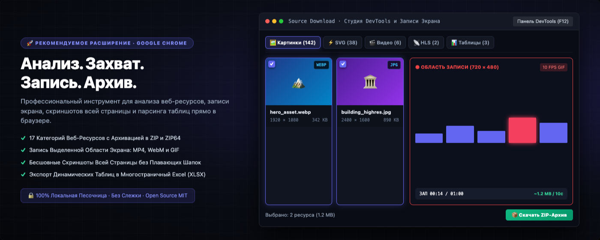
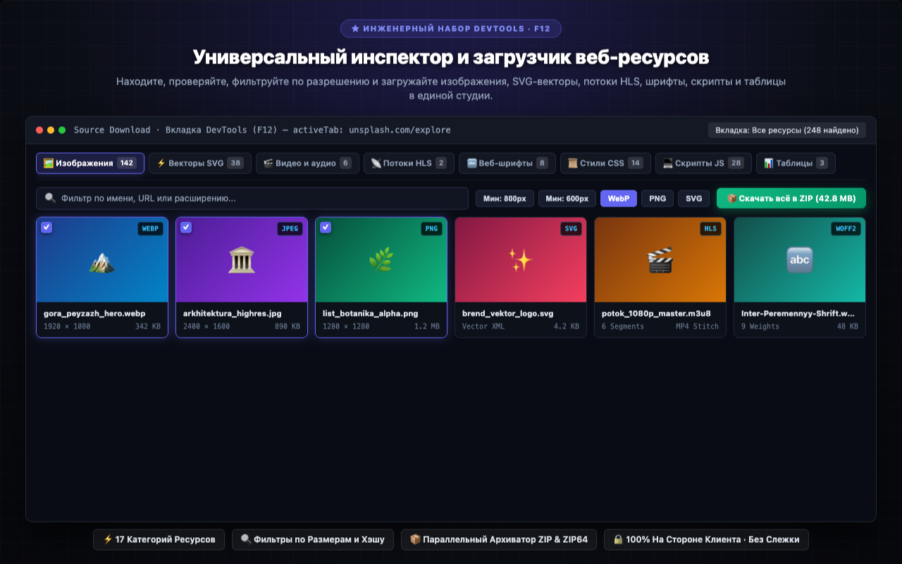
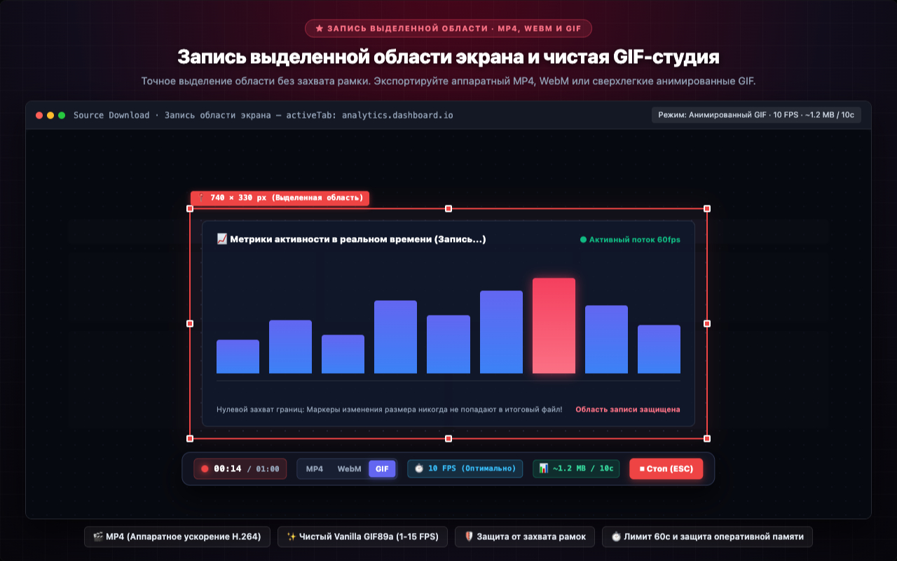
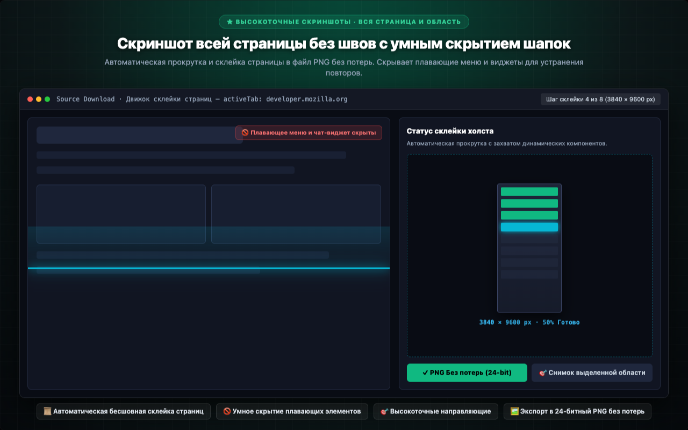
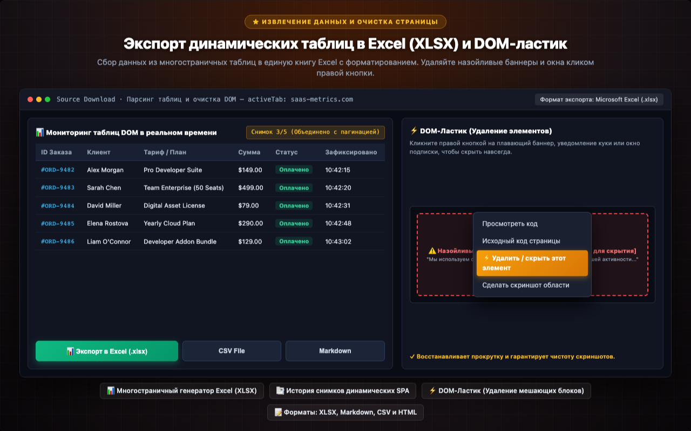
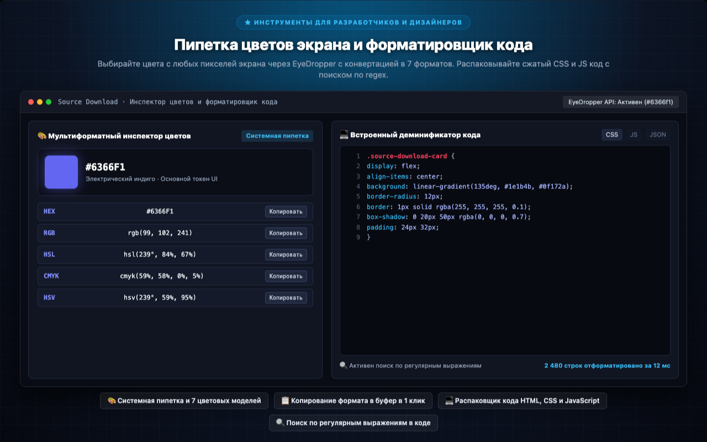

<p align="center">
  
</p>

<h1 align="center">Source Download</h1>

<p align="center">
  <a href="../../README.md"></a>
  <a href="README.tr.md"></a>
  <a href="README.de.md"></a>
  <a href="README.es.md"></a>
  <a href="README.ja.md"></a>
  <a href="README.ru.md"></a>
  <a href="README.zh-CN.md"></a>
</p>

<p align="center">
  <em>Универсальный инструмент для загрузки веб-ресурсов, создания полных скриншотов страниц и извлечения данных DOM для разработчиков, дизайнеров и тестировщиков.</em><br>
  Просматривайте, анализируйте и скачивайте <b>все ресурсы</b> страницы — изображения, SVG, видео, аудио, JS, CSS, шрифты, JSON, WASM, манифесты, таблицы и полностраничные скриншоты — в структурированном ZIP-архиве.
</p>

<p align="center">
  <a href="https://chromewebstore.google.com/detail/source-download/nockdgincmpfojabnhbofkddgcmnodpd"></a>
  
  
  
  
  
  <a href="../../LICENSE"></a>
  
  
</p>

---

<p align="center">
  
</p>

---

## Привет, я Turan Burak Yeşilyurt

В течение многих лет я создавал системы автоматизации для **веб-скрейпинга**, **анализа данных** и **тестирования QA**. С переходом веба на архитектуру SPA возникла проблема: пользователю трудно сохранить то, что отображается на экране, а стандартные DevTools слишком громоздки. **Source Download** создан для быстрого, чистого и полностью локального решения этой задачи.

Свяжитесь со мной в [**LinkedIn**](https://www.linkedin.com/in/turan-burak-yesilyurt/) или посетите [**2run.dev**](https://2run.dev).

> **Chrome Web Store:** [Установить Source Download из Chrome Web Store](https://chromewebstore.google.com/detail/source-download/nockdgincmpfojabnhbofkddgcmnodpd)

---

> **Принцип открытого исходного кода:** Многие сторонние расширения представляют собой громоздкие надстройки над чужими библиотеками. В Source Download каждая строка — включая модуль **ZIP**, генератор **XLSX**, сборщик **HLS** и **GIF-кодировщик** — написана вручную на чистом JavaScript. Никаких фреймворков, никаких внешних зависимостей, никакой сборки и никакой телеметрии.

---

## Визуальный обзор и основные модули

Изучите интерфейсные модули высокого разрешения, интегрированные в DevTools, боковую панель и всплывающее окно Chrome.

### 1. Универсальный инспектор и загрузчик веб-ресурсов
> **★ ИНЖЕНЕРНЫЙ НАБОР DEVTOOLS · F12** — Находите, проверяйте, фильтруйте по разрешению и загружайте изображения, SVG-векторы, потоки HLS, шрифты, скрипты и таблицы в единой студии.
> 
> `⚡ 17 Категорий Ресурсов` · `🔍 Фильтры по Размерам и Хэшу` · `📦 Параллельный Архиватор ZIP & ZIP64` · `🔒 100% На Стороне Клиента · Без Слежки`

<p align="center">
  
</p>

---

### 2. Запись выделенной области экрана и чистая GIF-студия
> **★ ЗАПИСЬ ВЫДЕЛЕННОЙ ОБЛАСТИ · MP4, WEBM И GIF** — Точное выделение области без захвата рамки. Экспортируйте аппаратный MP4, WebM или сверхлегкие анимированные GIF.
> 
> `🎬 MP4 (Аппаратное ускорение H.264)` · `✨ Чистый Vanilla GIF89a (1-15 FPS)` · `🛡️ Защита от захвата рамок` · `⏱️ Лимит 60с и защита оперативной памяти`

<p align="center">
  
</p>

---

### 3. Скриншот всей страницы без швов с умным скрытием шапок
> **★ ВЫСОКОТОЧНЫЕ СКРИНШОТЫ · ВСЯ СТРАНИЦА И ОБЛАСТЬ** — Автоматическая прокрутка и склейка страницы в файл PNG без потерь. Скрывает плавающие меню и виджеты для устранения повторов.
> 
> `📜 Автоматическая бесшовная склейка страниц` · `🚫 Умное скрытие плавающих элементов` · `🎯 Высокоточные направляющие` · `🖼️ Экспорт в 24-битный PNG без потерь`

<p align="center">
  
</p>

---

### 4. Экспорт динамических таблиц в Excel (XLSX) и DOM-ластик
> **★ ИЗВЛЕЧЕНИЕ ДАННЫХ И ОЧИСТКА СТРАНИЦЫ** — Сбор данных из многостраничных таблиц в единую книгу Excel с форматированием. Удаляйте назойливые баннеры и окна кликом правой кнопки.
> 
> `📊 Многостраничный генератор Excel (XLSX)` · `📑 История снимков динамических SPA` · `⚡ DOM-Ластик (Удаление мешающих блоков)` · `📝 Форматы: XLSX, Markdown, CSV и HTML`

<p align="center">
  
</p>

---

### 5. Пипетка цветов экрана и форматировщик кода
> **★ ИНСТРУМЕНТЫ ДЛЯ РАЗРАБОТЧИКОВ И ДИЗАЙНЕРОВ** — Выбирайте цвета с любых пикселей экрана через EyeDropper с конвертацией в 7 форматов. Распаковывайте сжатый CSS и JS код с поиском по regex.
> 
> `🎨 Системная пипетка и 7 цветовых моделей` · `📋 Копирование формата в буфер в 1 клик` · `💻 Распаковщик кода HTML, CSS и JavaScript` · `🔍 Поиск по регулярным выражениям в коде`

<p align="center">
  
</p>

---

Source Download — это профессиональный инструмент для анализа, извлечения веб-ресурсов, создания скриншотов и записи видео/GIF, встроенный непосредственно в браузер Google Chrome. Разработанный для веб-разработчиков, UI/UX дизайнеров, инженеров по тестированию (QA), аналитиков данных, архивистов и создателей контента, Source Download полностью устраняет сложности при сборе данных, перехвате сетевых потоков, создании скриншотов длинных страниц и записи видео высокого разрешения.

Работая в трех удобных режимах — через панель разработчика DevTools (F12), контекстное меню правой кнопки мыши и быстрое всплывающее окно на панели инструментов, — Source Download сканирует и структурирует все ресурсы, загружаемые веб-страницей. От фотографий высокого разрешения и векторной графики SVG до потокового видео HLS, динамических таблиц DOM, веб-шрифтов и ответов API — вы можете проверять подробные технические параметры каждого файла и сохранять их по отдельности или в виде аккуратно организованного архива ZIP/ZIP64.


## ПОЛНЫЙ ОБЗОР ВОЗМОЖНОСТЕЙ


### 1. КОМПЛЕКСНОЕ ОБНАРУЖЕНИЕ И ЗАГРУЗКА РЕСУРСОВ (17 КАТЕГОРИЙ)

Анализируйте и сохраняйте любые компоненты веб-страниц в 17 специализированных категориях:
- **Изображения и растровая графика:** Фильтруйте и отделяйте качественные иллюстрации от невидимых пикселей отслеживания с помощью настраиваемых порогов ширины и высоты. Мгновенно выявляйте байтовые дубликаты файлов с помощью хэширования SHA-256 в реальном времени. Просматривайте графику в полноэкранном лайтбоксе с шахматным фоном прозрачности альфа-канала и масштабированием.
- **Векторная графика SVG:** Извлекайте встроенные элементы SVG DOM, внешние файлы SVG и фоновые векторы CSS. Просматривайте исходный код XML, копируйте чистую разметку SVG в буфер обмена или сохраняйте независимые векторные файлы для Figma, Sketch, Penpot или Adobe Illustrator.
- **Видео и аудио:** Обнаруживайте теги HTML5 media, потоки blob и прямые медиа-ссылки. Воспроизводите видео и аудио во встроенном плеере с регулировкой скорости и громкости перед сохранением на диск.
- **Перехват и объединение потоков HLS:** Перехватывайте плейлисты HTTP Live Streaming (.m3u8). Анализируйте варианты битрейта (1080p, 720p, 480p), загружайте сегменты потока в 6 параллельных потоков и склеивайте их в готовый файл MP4 прямо в браузере без использования сторонних программ вроде FFmpeg. Система сообщает о наличии шифрования AES-128.
- **Веб-типографика:** Извлекайте современные сжатые веб-шрифты и векторные гарнитуры. Тестируйте шрифты в интерактивном режиме с настраиваемыми фразами, вариациями толщины (100-900) и просмотром таблицы глифов.
- **Таблицы стилей и скрипты:** Загружайте файлы CSS и JavaScript целиком. Встроенный деминификатор форматирует сжатый код с подсветкой синтаксиса и быстрым поиском по регулярным выражениям.
- **Ответы API и JSON:** Отслеживайте фоновые запросы REST API и GraphQL в реальном времени. Изучайте древовидные структуры JSON, параметры URL, HTTP-заголовки и сетевые задержки.
- **Динамические таблицы DOM:** Мониторинг в реальном времени таблиц HTML и компонентов ARIA grid. Сохраняйте историю снимков при пагинации в одностраничных приложениях (SPA), объединяйте данные и экспортируйте их в многостраничные книги Excel (XLSX), таблицы Markdown или CSV.
- **Извлечение текстового контента:** Сканируйте текстовый поток документа в естественном порядке DOM. Фильтруйте данные с помощью поиска текста, регулярных выражений, селекторов CSS или выражений XPath.
- **Манифест веб-приложения и метаданные:** Анализируйте манифесты PWA (manifest.json), фавиконки, значки Apple Touch и мета-теги социальных сетей (Open Graph, Twitter Cards).
- **Документы и бинарные файлы:** Извлекайте электронные публикации, файлы PDF, скомпилированные модули WebAssembly, упакованные архивы и структурированные документы.


### 2. ЗАПИСЬ ВЫДЕЛЕННОЙ ОБЛАСТИ ЭКРАНА И GIF-СТУДИЯ

Записывайте видео высокой четкости и компактные анимированные GIF из любой части экрана:
- **Интерактивная рамка кадрирования:** Нарисуйте область записи в любом месте вкладки. Легко настраивайте границы с помощью 8 маркеров и отображения точных пиксельных координат.
- **Технология нулевого захвата границ (Zero-Bleed):** Маркеры и элементы управления располагаются строго за пределами области записи. Внешний отступ гарантирует, что красные линии рамки и кнопки никогда не попадут в готовый файл.
- **Умная плавающая панель:** Панель записи автоматически прикрепляется сверху или снизу рамки, никогда не перекрывая записываемое содержимое.
- **Универсальные форматы экспорта:** Экспортируйте видео с аппаратным ускорением MP4, открытый формат WebM или ультралегкие анимированные GIF.
- **Чистый кодировщик GIF на чистом JavaScript:** Автономный движок GIF89a на чистом vanilla JS без сторонних библиотек с 15-битным квантованием цвета и целочисленным сжатием LZW.
- **Настраиваемые режимы частоты кадров (FPS):**
  - 15 FPS (Плавный): Высокая плавность для анимаций интерфейса, микро-взаимодействий и демонстрации продуктов.
  - 10 FPS (Стандартный / Сбалансированный): Оптимальный стандарт для обучающих материалов, баг-репортов и мемов; идеальный баланс качества и размера.
  - 5 FPS (Компактный): Существенно уменьшенный размер файла для быстрых инструкций.
  - 2 FPS (Пошаговый Stop-Motion): Полсекунды на кадр. Отлично подходит для пошаговых руководств; потребляет в 5 раз меньше оперативной памяти по сравнению с 10 FPS.
  - 1 FPS (Слайд-шоу): Ровно 1 кадр в секунду; идеален для статических экранов, демонстраций кода и минимального размера файла (в 10 раз меньше 10 FPS).
- **Индикатор примерного размера:** Оценка размера итогового GIF-файла (~X МБ за 10 сек) в реальном времени до и во время записи.
- **Защита от перегрузки памяти 4K UHD:** Ограничение максимального разрешения до 3840px с сохранением пропорций для предотвращения сбоев вкладок на дисплеях Retina.
- **Безопасный лимит записи 60 секунд:** Ограничение продолжительности GIF-записи до 1 минуты с обратным отсчетом (00:00 / 01:00) и автоматической финализацией.


### 3. ПИКСЕЛЬНЫЕ СКРИНШОТЫ: ВСЯ СТРАНИЦА И ВЫДЕЛЕННАЯ ОБЛАСТЬ

Создавайте безупречные снимки веб-страниц без использования облачных серверов:
- **Бесшовный скриншот всей страницы:** Автоматическая прокрутка и склейка длинных страниц в четкие файлы PNG без потерь качества.
- **Умное скрытие плавающих шапок:** Автоматически временно скрывает фиксированные заголовки, навигационные меню и виджеты чата во время прокрутки, исключая появление повторов на итоговом скриншоте.
- **Синхронизация с отложенной загрузкой (Lazy-Load):** Имитирует паузы при прокрутке для полной отрисовки динамических компонентов и изображений.
- **Высокоточный снимок области:** Выделение любого прямоугольного участка экрана с помощью направляющих для мгновенного сохранения в PNG.


### 4. СИСТЕМНАЯ ПИПЕТКА И ИНСПЕКТОР ЦВЕТОВ

Считывайте цвета с любого пикселя экрана с точностью профессионального графического редактора:
- **Встроенный EyeDropper API:** Считывание цвета прямо с веб-страницы или любого окна в операционной системе.
- **Мультиформатный инспектор:** Автоматическая конвертация выбранного цвета в популярные цифровые и печатные форматы: HEX, RGB, RGBA, HSL, HSLA, CMYK, HSV.
- **Быстрое копирование в 1 клик:** Удобные кнопки для мгновенной вставки значений в код CSS или макеты дизайна.


### 5. DOM-ЛАСТИК (УДАЛЕНИЕ ЭЛЕМЕНТОВ СТРАНИЦЫ)

Очищайте страницу от мешающих блоков перед скриншотом или сохранением:
- **Контекстное меню браузера:** Кликните правой кнопкой мыши по любому назойливому баннеру, всплывающему окну куки или виджету чата и выберите «Скрыть этот элемент (Zap)».
- **Мгновенная нейтрализация DOM:** Моментально удаляет выбранный элемент из дерева DOM, восстанавливая прокрутку и гарантируя идеальную чистоту снимков.


### 6. АВТОНОМНОЕ ОФЛАЙН-АРХИВИРОВАНИЕ В ОДИН ФАЙЛ HTML

Сохраняйте веб-страницы как полностью независимые документы:
- **Полный автономный архив:** Упаковывает страницу в единый файл .html, работающий без подключения к сети.
- **Встраивание ресурсов:** Конвертирует стили CSS и графику в формат Base64 и отключает скрипты для стабильного просмотра офлайн.
- **Независимость от интернета:** Открывайте сохраненные страницы в любое время на любом устройстве.


### 7. ЭКСПОРТ ДАННЫХ ИЗ ТАБЛИЦ В EXCEL (XLSX)

Превращайте веб-таблицы в структурированные электронные таблицы без программирования:
- **Многостраничный генератор Excel:** Преобразует таблицы DOM в книги Microsoft Excel (.xlsx) с корректными типами ячеек.
- **Память снимков пагинации:** Отслеживает таблицы с динамической подгрузкой и объединяет данные с разных страниц в общий файл.
- **Несколько форматов экспорта:** Сохраняйте данные в Excel (XLSX), таблицы Markdown, файлы CSV или форматированный HTML.


### 8. ИНСТРУМЕНТЫ РАЗРАБОТЧИКА: ДЕМИНИФИКАТОР КОДА

Форматируйте минифицированный код прямо в браузере:
- **Аккуратное форматирование:** Добавляет отступы и переносы строк в сжатый код HTML, CSS, JavaScript и JSON.
- **Встроенный поиск:** Мгновенный поиск фрагментов текста или выражений regex по всему коду скрипта.
- **Номера строк:** Удобная навигация по строкам с современной подсветкой синтаксиса.


### 9. ПОЛЬЗОВАТЕЛЬСКИЕ ШАБЛОНЫ ИМЕН ФАЙЛОВ

Настраивайте автоименование скачиваемых файлов с помощью динамических переменных:
- **Доступные переменные:** {domain}, {title}, {type}, {date}, {time}, {ext}.
- **Шаблоны по категориям:** Отдельные правила именования для скриншотов, видеозаписей и архивов ZIP.


### 10. АРХИВАЦИЯ В ZIP И ZIP64

Объединяйте сотни файлов в аккуратный архив одним нажатием:
- **Локальный архиватор PKZIP:** Сжимает файлы прямо в оперативной памяти браузера.
- **Полная поддержка ZIP64:** Надежно обрабатывает архивы размером более 4 ГБ или содержащие свыше 65 535 файлов.
- **Четкая структура папок:** Автоматически раскладывает файлы по понятным подпапкам (/images, /videos, /fonts, /css, /js, /documents).


## ЦЕЛЕВЫЕ ПОЛЬЗОВАТЕЛИ И СЦЕНАРИИ


- **Frontend-разработчики:** Инспекция сетевых запросов, проверка ответов API, извлечение векторных иконок и шрифтов, аудит CSS-стилей.
- **UI/UX дизайнеры:** Экспорт векторной графики, подбор палитр с помощью пипетки, проверка адаптивной верстки и типографики.
- **QA-инженеры и тестировщики:** Запись воспроизведения багов в MP4 или пошаговом GIF на 2 FPS, создание полных скриншотов страниц.
- **Аналитики данных и исследователи:** Сбор данных из многостраничных таблиц без ручного копирования прямо в электронные таблицы Excel.
- **Создатели контента и преподаватели:** Создание компактных обучающих GIF для руководств, подготовка четких иллюстраций.
- **Архивисты и юристы:** Надежная фиксация содержимого веб-страниц в виде автономных файлов HTML.


## БЕЗОПАСНОСТЬ, ПРИВАТНОСТЬ И СТАНДАРТЫ


Source Download основан на строгой архитектуре локальной конфиденциальности:
- **100% Локальная песочница:** Все операции выполняются исключительно внутри локального браузера.
- **Ноль телеметрии и внешних запросов:** Расширение не содержит аналитики, трекеров активности или обращений к удаленным серверам.
- **Работа в корпоративных интрасетях:** Полноценное функционирование внутри закрытых корпоративных сетей, за VPN и без выхода в интернет.
- **Без регистрации и аккаунтов:** Никаких подписок или входа в систему — все функции доступны сразу после установки.
- **Соответствие стандартам защиты данных:** Полная безопасность благодаря отсутствию сбора или передачи персональных данных.
- **Открытый и проверяемый код:** Разработано на чистом JavaScript без сторонних библиотек под лицензией MIT.


## ИСПОЛЬЗУЕМЫЕ РАЗРЕШЕНИЯ


Source Download запрашивает только минимально необходимые разрешения:
- **activeTab:** Доступ к ресурсам и захвату экрана только на текущей активной вкладке.
- **storage:** Сохранение настроек и шаблонов локально в профиле браузера.
- **downloads:** Сохранение файлов, видео и архивов в стандартную папку загрузок.
- **contextMenus:** Быстрые действия в контекстном меню (Ластик элементов, Скриншот области, Вся страница).
- **clipboardWrite:** Копирует коды цветов, таблицы, форматированный код и снимки прямо в буфер обмена.
- **scripting:** Запускает инструмент удаления элементов (Zapper) и скрипты захвата на активных вкладках.


## ГОРЯЧИЕ КЛАВИШИ И СОВЕТЫ


- **Открыть панель DevTools:** Нажмите F12 или Ctrl+Shift+I (Cmd+Option+I на macOS) и перейдите на вкладку «Source Download».
- **Быстрые инструменты правой кнопки:** Нажмите правой кнопкой мыши на страницу, чтобы скрыть элемент, выбрать цвет или записать область.
- **Остановить запись:** Нажмите клавишу ESC или кнопку «Стоп» на плавающей панели.
- **Отменить выделение:** Нажмите ESC для закрытия рамки кадрирования или прицела скриншота.
- **Изменить частоту FPS:** При выбранном формате GIF нажимайте на бейдж FPS для переключения (10 -> 5 -> 2 -> 1 -> 15 FPS).
- **Изменить разрешение:** Нажмите на индикатор разрешения для выбора 1:1, 1080p, 720p или 480p.


## ЧАСТО ЗАДАВАЕМЫЕ ВОПРОСЫ (FAQ)


#### В: Отправляются ли мои данные или файлы на внешние серверы?

О: Нет, абсолютно исключено. Все вычисления происходят на 100% локально в вашем браузере. Никакие данные не покидают компьютер.


#### В: Как происходит склейка видеопотоков HLS?

О: Расширение перехватывает манифест (.m3u8), параллельно скачивает фрагменты в память браузера и склеивает их в файл MP4 без помощи сторонних программ.


#### В: Почему запись в GIF ограничена 1 минутой?

О: Качественные анимированные GIF хранят несжатые кадры в оперативной памяти. Ограничение в 60 секунд надежно предотвращает сбои браузера.


#### В: Можно ли записать только определенную часть экрана?

О: Да, выделите нужную область с помощью рамки. Элементы управления находятся снаружи и не попадут в запись.


#### В: Можно ли объединить данные из таблицы с пагинацией?

О: Да, монитор таблиц сохраняет снимки при переходах по страницам и позволяет выгрузить все строки в один файл Excel (.xlsx).


#### В: Вернутся ли скрытые DOM-ластиком элементы при перезагрузке?

О: Да, ластик удаляет элементы временно для создания аккуратного скриншота. При обновлении страницы она загрузится в исходном виде.


#### В: Открываются ли созданные архивы ZIP64 стандартными архиваторами?

О: Да, они полностью соответствуют стандарту PKZIP/ZIP64 и открываются встроенными средствами Windows, macOS и Linux.


#### В: Для чего нужен режим Stop-Motion на 2 FPS в GIF?

О: Режим 2 FPS идеален для инструкций по интерфейсам. Он расходует в 5 раз меньше памяти по сравнению с 10 FPS и создает компактные файлы для отправки по почте.


#### В: Поддерживает ли расширение современные форматы с альфа-прозрачностью?

О: Да, встроенный лайтбокс и сетка предварительного просмотра полностью поддерживают прозрачность с отображением шахматного фона и масштабированием.


#### В: Можно ли использовать расширение в закрытых корпоративных сетях (Intranet)?

О: Да, поскольку расширение работает на 100% локально в песочнице браузера и не отправляет никаких внешних сетевых запросов, оно полностью безопасно для закрытых сетей и корпоративных сред.


#### В: Сохраняется ли исходное качество изображений при экспорте?

О: Да, расширение извлекает оригинальные файлы в исходном разрешении и битрейте байт-в-байт без пережатия или ухудшения качества.


#### В: Поддерживается ли работа с большими объемами данных в таблицах?

О: Да, потоковый парсер таблиц оптимизирован для обработки десятков тысяч строк без зависания интерфейса браузера.


Установите Source Download уже сегодня для быстрой, удобной и полностью приватной работы с веб-ресурсами прямо в Google Chrome!

---

## Установка и начало работы

### Способ 1: Установка из Chrome Web Store (Рекомендуется)
1. Перейдите на официальную страницу в [Chrome Web Store](https://chromewebstore.google.com/detail/source-download/nockdgincmpfojabnhbofkddgcmnodpd).
2. Нажмите **Установить**.
3. Откройте Chrome DevTools (`F12` или `Cmd+Option+I` на macOS) и перейдите на вкладку **Source Download**.

### Способ 2: Загрузка распакованного расширения из исходного кода
1. Клонируйте репозиторий GitHub:
```bash
git clone https://github.com/turanburakyesilyurt/source-download.git
cd source-download
```
2. Откройте Chrome и перейдите по адресу `chrome://extensions`.
3. Включите переключатель **Режим разработчика** в правом верхнем углу.
4. Нажмите **Загрузить распакованное расширение** и выберите папку проекта.

---

## Лицензия

Распространяется под [Лицензия MIT](../../LICENSE). Авторские права © Turan Burak Yeşilyurt. Свободно для использования, аудита и форка.
