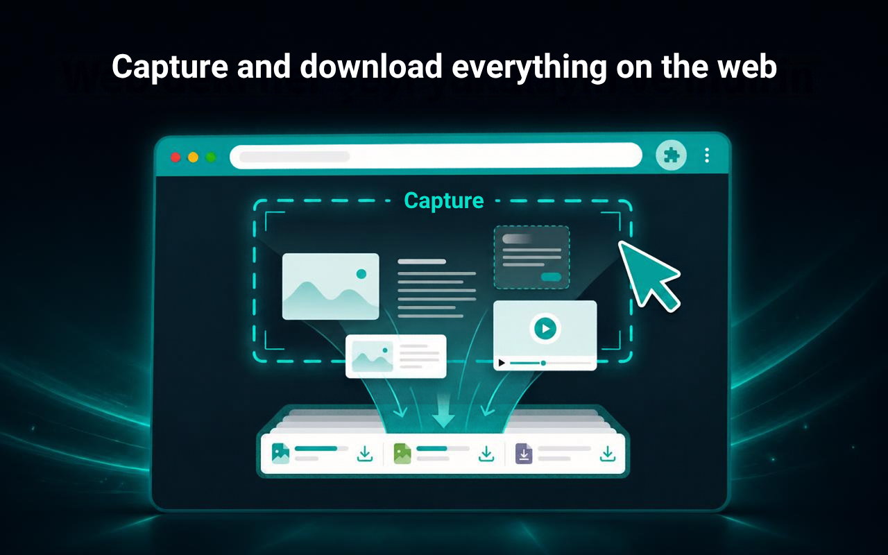
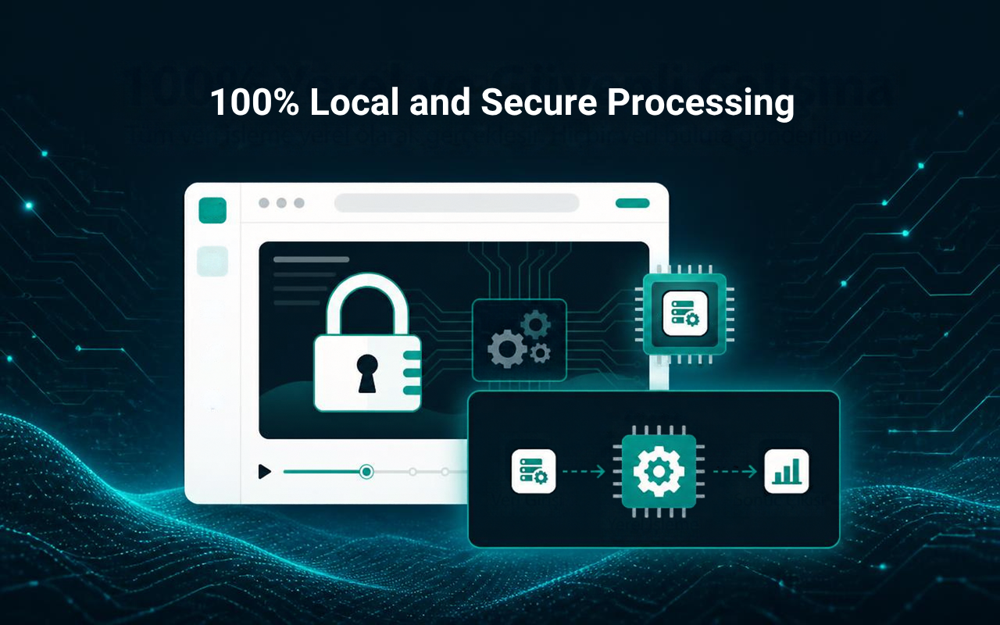
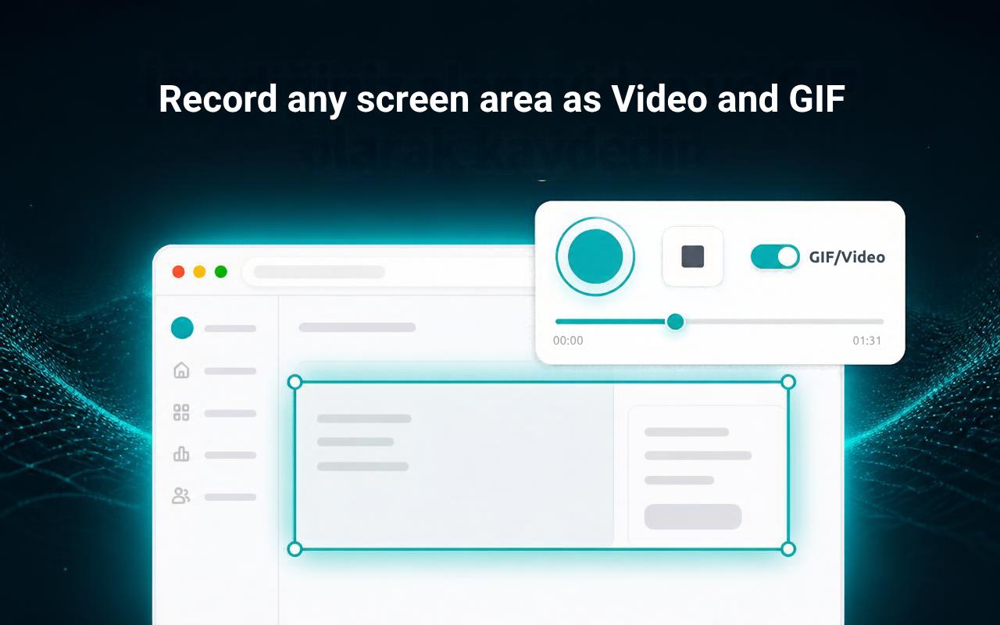
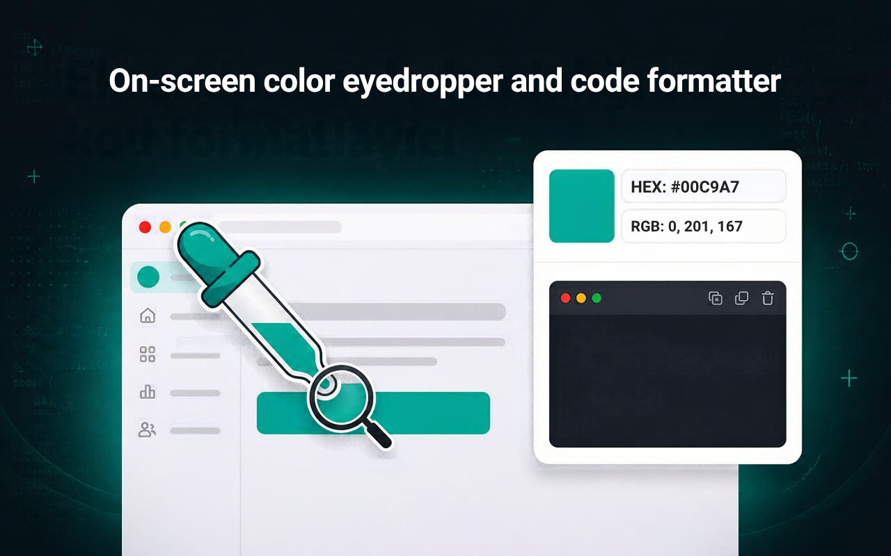
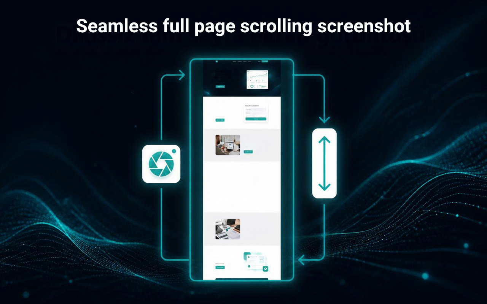

<p align="center">
  
</p>

<h1 align="center">Source Download</h1>

<p align="center">
  <a href="#"></a>
</p>

<p align="center">
  <a href="../../README.md"></a>
  <a href="README.tr.md"></a>
  <a href="README.de.md"></a>
  <a href="README.es.md"></a>
  <a href="README.fr.md"></a>
  <a href="README.it.md"></a>
  <a href="README.ja.md"></a>
  <a href="README.ko.md"></a>
  <a href="README.pt-BR.md"></a>
  <a href="README.ru.md"></a>
  <a href="README.zh-CN.md"></a>
  <a href="README.en-US.md"></a>
  <a href="README.en-GB.md"></a>
  <a href="README.es-419.md"></a>
  <a href="README.pt-PT.md"></a>
  <a href="README.zh-TW.md"></a>
  <a href="README.pl.md"></a>
  <a href="README.nl.md"></a>
  <a href="README.cs.md"></a>
  <a href="README.sv.md"></a>
  <a href="README.da.md"></a>
  <a href="README.fi.md"></a>
  <a href="README.no.md"></a>
  <a href="README.uk.md"></a>
  <a href="README.vi.md"></a>
  <a href="README.id.md"></a>
  <a href="README.th.md"></a>
  <a href="README.fil.md"></a>
  <a href="README.ms.md"></a>
  <a href="README.ar.md"></a>
  <a href="README.he.md"></a>
  <a href="README.fa.md"></a>
  <a href="README.el.md"></a>
  <a href="README.ro.md"></a>
  <a href="README.hu.md"></a>
  <a href="README.sk.md"></a>
  <a href="README.bg.md"></a>
  <a href="README.hr.md"></a>
  <a href="README.sr.md"></a>
  <a href="README.sl.md"></a>
  <a href="README.lt.md"></a>
  <a href="README.lv.md"></a>
  <a href="README.et.md"></a>
  <a href="README.ca.md"></a>
  <a href="README.bn.md"></a>
  <a href="README.hi.md"></a>
  <a href="README.ta.md"></a>
  <a href="README.te.md"></a>
  <a href="README.mr.md"></a>
  <a href="README.gu.md"></a>
  <a href="README.kn.md"></a>
  <a href="README.ml.md"></a>
  <a href="README.sw.md"></a>
  <a href="README.am.md"></a>
</p>

<p align="center">
  <em>ஒரு பக்கம் ஏற்றும் ஒவ்வொரு வலை ஆதாரத்தையும் உலாவி, ஆராய்ந்து, எளிதாக ZIP ஆகப் பதிவிறக்குங்கள்.</em><br>
  Source Download — பக்கத்தின் ஒவ்வொரு ஆதாரமும், ஒரே கிளிக்கில்
</p>

<p align="center">
  <a href="https://chromewebstore.google.com/detail/source-download/nockdgincmpfojabnhbofkddgcmnodpd"></a>
  
  
  
  
  
  
  <a href="../../LICENSE"></a>
  
  
</p>

---

## வணக்கம், நான் Turan Burak Yeşilyurt

பல ஆண்டுகளாக **வலை ஸ்கிராப்பிங்**, **தரவு பகுப்பாய்வு** மற்றும் **QA பணிப்பாய்வுகளுக்கான** தானியக்கங்களை உருவாக்கினேன். பிறகு SPA-கள் வலையை ஆக்கிரமித்தன — நானும் மீண்டும் மீண்டும் ஒரே தடையைச் சந்தித்தேன்: இறுதிப் பயனராக, திரையில் நீங்கள் *காணும்* விஷயங்களை எளிதாகப் பெற முடியாது; டெவலப்பராக, Chrome DevTools பகுதி பெரும்பாலும் போதாததாகவோ மிரட்சியாகவோ தோன்றும். அந்த ஏமாற்றமே **Source Download** ஐ நான் உருவாக்கக் காரணம்.

இது எனது **முதல் திறந்த மூலத் திட்டம்**, எனவே உங்கள் கருத்துகள் எனக்கு மிகவும் முக்கியம் — இதை மேம்படுத்துவதற்கான மிகப்பெரிய உந்துசக்தி அதுவே. மேலும், [**LinkedIn இல் என்னுடன் இணைய**](https://www.linkedin.com/in/turan-burak-yesilyurt/) அல்லது [**2run.dev**](https://2run.dev) ஐப் பார்வையிட மறக்காதீர்கள் — நீங்கள் இதை எப்படிப் பயன்படுத்துகிறீர்கள் என்பதையும், நாம் இணைந்து வேறு என்ன உருவாக்கலாம் என்பதையும் அறிய ஆவலாக இருக்கிறேன். மகிழுங்கள்!

> **Chrome Web Store:** [Chrome Web Store இலிருந்து Source Download ஐ நிறுவுங்கள்](https://chromewebstore.google.com/detail/source-download/nockdgincmpfojabnhbofkddgcmnodpd)

---

> **ஒரு ஒப்புதலும் திறந்த மூல உறுதிமொழியும்:** ஸ்டோரில் நீங்கள் காணும் கிட்டத்தட்ட ஒவ்வொரு "இந்தப் பக்கத்தின் ஆதாரங்களைப் பதிவிறக்கு" கருவியும், மூன்றாம் தரப்பு நூலகங்களின் குவியலைச் சுற்றிய ஒரு உறைதான். இது வேறுபட்டது. Source Download இன் ஒவ்வொரு பைட்டும் — **ZIP எழுதி**, **XLSX உருவாக்கி**, **HLS இணைப்பி**, **GIF என்கோடர்** மற்றும் **குறியீட்டு வடிவமைப்பிகள்** உட்பட — புதிதாகக் கையால் எழுதப்பட்டது. ஃப்ரேம்வொர்க்குகள் இல்லை, வெளிப்புறச் சார்புகள் இல்லை, பில்ட் படி இல்லை, டெலிமெட்ரி இல்லை. வெறும் vanilla JavaScript, ஒரே அமர்வில் படித்துத் தணிக்கை செய்யக்கூடியது.

---

## காட்சிச் சுற்றுலா மற்றும் முக்கிய தொகுதிகள்

Google Chrome DevTools, வலது-கிளிக் மெனு மற்றும் கருவிப்பட்டி பாப்அப்பில் நேரடியாக உள்ளமைந்த உயர் தெளிவுத்திறன் இடைமுகத் தொகுதிகளை ஆராயுங்கள்.

### 1. வலையில் உள்ள அனைத்தையும் பிடித்துப் பதிவிறக்குங்கள்
> **★ DEVTOOLS பொறியியல் தொகுப்பு · F12**

<p align="center">
  
</p>

---

### 2. திரையின் எந்தப் பகுதியையும் வீடியோ, GIF ஆகப் பதிவு செய்யுங்கள்
> **★ பகுதி திரைப் பதிவி · MP4, WEBM & GIF**

<p align="center">
  
</p>

---

### 3. உருட்டி எடுக்கும் முழுப் பக்க ஸ்கிரீன்ஷாட்
> **★ துல்லிய ஸ்கிரீன்ஷாட்கள் · முழுப் பக்கம் & பகுதி**

<p align="center">
  
</p>

---

### 4. நேரடி DOM அட்டவணைகள் Excel (XLSX) மற்றும் CSV ஆக
> **★ தரவு பிரித்தெடுப்பு & உறுப்பு நீக்கி**

<sub>டைனமிக் அட்டவணைகளை, அவற்றின் ஸ்னாப்ஷாட் வரலாற்றுடன், பல தாள் XLSX அல்லது CSV கோப்புகளாக எடுக்கலாம்.</sub>

<p align="center">
  
</p>

---

### 5. திரை வண்ணத் தேர்வி மற்றும் குறியீட்டு வடிவமைப்பி
> **★ டெவலப்பர் & வடிவமைப்பாளர் பணிமேடை**

<p align="center">
  
</p>

---

Source Download என்பது ஒரு வலைப்பக்கம் ஏற்றும் ஒவ்வொரு ஆதாரத்தையும் கண்டறிந்து, ஆராய்ந்து, பதிவிறக்கும் Chrome DevTools பேனல் ஆகும். மீடியா கோப்புகள், டெவலப்பர் ஸ்கிரிப்டுகள், ஸ்டைல் ஆதாரங்கள் அல்லது நெட்வொர்க் பதில்கள் என எது தேவைப்பட்டாலும், அவற்றைத் தனித்தனி கோப்புகளாகவோ, கோப்புறை அமைப்புடன் கூடிய நேர்த்தியான ZIP ஆகவோ சேமிக்கலாம்.

மூன்றாம் தரப்புச் சார்புகள் எதுவும் இன்றி முற்றிலும் புதிதாக உருவாக்கப்பட்டது: ZIP எழுதி, XLSX உருவாக்கி, HLS இணைப்பி மற்றும் குறியீட்டு வடிவமைப்பிகள் அனைத்தும் கையால் எழுதப்பட்ட தூய JavaScript ஆகும். ஃப்ரேம்வொர்க்குகள் இல்லை, பில்ட் படி இல்லை, டெலிமெட்ரி இல்லை. அனைத்தும் உங்கள் உலாவியிலேயே உள்ளூரில் இயங்குகின்றன.

## v1.16.0 இல் புதியவை
- முழுமையான DevTools மற்றும் ஸ்டோர் உள்ளூர்மயமாக்கலுடன் 54 மொழிகளுக்கான முழு பன்மொழி ஆதரவு.
- அனைத்து மீடியா, குறியீடு, API-கள், சேமிப்பகம் மற்றும் ஆவணங்களை உள்ளடக்கிய, நேரடி எண்ணிக்கையுடன் கூடிய 17 பிரத்யேக ஆதார வகைகள்.
- ஒட்டப்பட்ட முழுப் பக்க ஸ்கிரீன்ஷாட்கள் மற்றும் தனிப்பயன் பகுதி ஸ்கிரீன்ஷாட், நிலையாக ஒட்டிக்கொள்ளும் தலைப்புகளை அறிவார்ந்த முறையில் மறைக்கும் வசதியுடன்.
- திரை வீடியோ பதிவு (MP4) மற்றும் விளிம்பு கசிவு இல்லாத, எடை குறைந்த அனிமேஷன் GIF ஏற்றுமதி இயந்திரம்.
- DOM Zapper உறுப்பு நீக்கியுடன், நேரடி DOM அட்டவணைகளை பல தாள்கள் கொண்ட Microsoft Excel (.XLSX) மற்றும் CSV ஆக எடுக்கும் வசதி.
- hex/rgb/hsl மதிப்புகளை உடனடியாக நகலெடுக்கும் திரை வண்ணத் தேர்வி கருவி மற்றும் உள்ளமைந்த குறியீடு அழகுபடுத்தி.
- மேம்படுத்தப்பட்ட DevTools ஸ்னிஃபர் நிலைத்தன்மை மற்றும் அதிக ஒருங்கிணைவு கொண்ட நெட்வொர்க் பைப்லைன்.

## உங்களுக்கு இது ஏன் தேவை
ஸ்கிரீன்ஷாட் போதாது. உண்மையான கோப்புகளைப் பெறுங்கள் — முழுத் தெளிவுத்திறன் படங்கள், உண்மையான வீடியோ ஸ்ட்ரீம்கள், அசல் ஸ்டைல்ஷீட்கள் மற்றும் ஸ்கிரிப்டுகள் — தட்டையான படத்தை அல்ல.

DevTools மிரட்சியாகத் தோன்றுகிறதா? அதே நெட்வொர்க் தரவை, தேடல், வடிகட்டிகள் மற்றும் ஒரு கிளிக் பதிவிறக்கங்களுடன் தூய்மையான, வகைப்படுத்தப்பட்ட கேலரியாக Source Download உங்கள் முன் வைக்கிறது.

SPA-கள் அனைத்தையும் மறைக்கின்றன. டைனமிக் செயலிகள் உருவாக்கும் ஆதாரங்களையும் API அழைப்புகளையும் பக்க மூலத்தில் நீங்கள் ஒருபோதும் காண முடியாது. Source Download அவற்றை நிகழும்போதே, இடைநிலைகள் உட்பட, பிடித்துக்கொள்கிறது.

## இது என்ன செய்கிறது
### அனைத்தையும் கண்டறிதல்
- நெட்வொர்க் பிடிப்பை (HAR + நேரடி கோரிக்கைகள்) மீடியா கோப்புகள், ஸ்கிரிப்டுகள், ஸ்டைல்ஷீட்கள் மற்றும் உட்பொதிந்த ஃப்ரேம்கள் உள்ளிட்ட அனைத்து காட்சி மற்றும் கட்டமைப்பு உறுப்புகளுக்கான DOM ஸ்கேனுடன் இணைக்கிறது.
- **CSS அறிந்தது:** url(...) மற்றும் @import விதிகளுக்குள் உள்ள ஆதாரங்கள் மீள்சுழற்சியாகப் பின்தொடரப்படுகின்றன, இறக்குமதி செய்த ஸ்டைல்ஷீட்களில் புதைந்த எழுத்துருக்கள்கூட கண்டறியப்படுகின்றன.
- **உள்ளடக்க மோப்பம்:** அறியப்படாத கோப்புகளின் சில பைட்டுகள் படிக்கப்பட்டு, அவற்றின் உண்மையான கோப்பு வகைக்கு மாற்றப்படுகின்றன.
- **17 நேரடி எண்ணிக்கை வகைகள்:** பிடிக்கப்பட்ட ஆதாரங்கள் மீடியா, குறியீடு, தரவு, API அழைப்புகள், குக்கீகள், சேமிப்பகம் மற்றும் ஆவணங்களுக்கான தனித் தாவல்களில் நேர்த்தியாக ஒழுங்கமைக்கப்படுகின்றன.

### வடிகட்டு, தேடு, ஆராய்
- கோப்புப் பெயர்கள், URL-கள், MIME வகைகள், மாற்று உரை மற்றும் கோப்பு உள்ளடக்கம் வரை Regex அடிப்படையிலான தேடல்.
- **வகைவாரி வடிகட்டிகள்:** குறைந்தபட்ச/அதிகபட்ச அளவு, மீடியாவுக்கு குறைந்தபட்ச/அதிகபட்ச அகலம் மற்றும் உயரமும் — எடுத்துக்காட்டாக "≥ 1200px கொண்ட முதன்மைப் படங்கள் மட்டும்". API அழைப்புகளை HTTP முறை மற்றும் கோரிக்கை வகையால் வடிகட்டலாம்.
- பட்டியல் அல்லது கட்டக் காட்சி, வரிசைப்படுத்தக்கூடியது, நேரடி சிறுபடச் சுவருடன்.
- **உண்மையான முன்னோட்டங்களுடன் பல தாவல் ஆய்வி:** பெரிதாக்கக்கூடிய லைட்பாக்ஸ், வீடியோ மற்றும் ஆடியோ இயக்கம், நேரடி எழுத்துரு மாதிரி, SVG காட்டி, வரி எண்களுடன் தொடரியல் சிறப்பம்சம் கொண்ட குறியீடு மற்றும் அழகுபடுத்து மாற்றி.
- **API பிரிவுக் காட்சி:** இடதுபுறம் பதில்; வலதுபுறம் முறை, நிலை, வினவல் அளவுருக்கள் மற்றும் கோரிக்கை உடல்.

### சரியாகப் பதிவிறக்கு
- தேர்ந்தெடுத்தவற்றைப் பதிவிறக்கு — நீங்கள் குறியிட்ட கோப்புகள் மட்டும்.
- காட்சியைப் பதிவிறக்கு — தற்போதைய வடிகட்டிகள் மற்றும் தேடலுக்குப் பிறகு தெரியும் அனைத்தும்.
- அனைத்தையும் பதிவிறக்கு — பிடிக்கப்பட்ட ஒவ்வொரு ஆதாரமும், கோப்புறை அமைப்புடன் கூடிய ZIP ஆக, தானியங்கி நகல் நீக்கத்துடன்.
- தொகுதிப் பதிவிறக்கங்கள் வரையறுக்கப்பட்ட ஒருங்கிணைவுடனும் நேரடி முன்னேற்றப் பட்டியுடனும் இயங்குகின்றன; தோல்விகள் தானாகவும் சூழல் மெனுவிலிருந்தும் மீண்டும் முயற்சிக்கப்படுகின்றன.

### HLS மற்றும் சிக்கலான வீடியோ
- உலாவியால் இயல்பாக இயக்க முடியாத ஸ்ட்ரீம்கள் (HLS .m3u8, DASH .mpd, அறியப்படாத கோடெக்குகள்) கருப்புத் திரை பிளேயருக்குப் பதிலாக அறிவார்ந்த மாற்றுக் காட்சியைக் காட்டுகின்றன.
- பிரிவுகளை இணைத்துப் பதிவிறக்கு என்பது HLS ஸ்ட்ரீமை, பேனலிலேயே, இயக்கக்கூடிய ஒரே கோப்பாக மாற்றுகிறது.

### உரைப் பணிமேடை (SPA உள்ளடக்கக் கருவித்தொகுப்பு)
- **உரை தாவல் ஒரு நேரடி உள்ளடக்கக் காட்டி:** தலைப்புகள், பத்திகள், பட்டியல் உருப்படிகள், பொத்தான்கள், div, span என உரை கொண்ட ஒவ்வொரு உறுப்பும் DOM வரிசையில் பிடிக்கப்படுகிறது.
- டைனமிக் அட்டவணைகள் வரையறுக்கப்பட்ட ஸ்னாப்ஷாட் வரலாற்றைப் பராமரிக்கின்றன (எ.கா. "8 ஸ்னாப்ஷாட்கள் · 124 தனித்துவ வரிசைகள்"), எனவே தானாகப் புதுப்பிக்கும் டாஷ்போர்டுகள் இடைநிலைகளை ஒருபோதும் இழக்காது.
- Markdown ஆக ஏற்றுமதி செய்யலாம்; அட்டவணைகளை CSV, HTML அல்லது எங்கள் கையால் எழுதிய XLSX எழுதியால் உருவாக்கப்பட்ட உண்மையான பல தாள் XLSX பணிப்புத்தகமாக ஏற்றுமதி செய்யலாம்.

## பயன்படுத்தும் முறை
1. Source Download ஐ நிறுவி, ஏதேனும் பக்கத்தில் F12 ஐ அழுத்துங்கள்.
2. DevTools கருவிப்பட்டியில் உள்ள Source Download தாவலைக் கிளிக் செய்யுங்கள் (நீட்டிப்புகள் DevTools ஐத் தானாகத் திறக்க Chrome அனுமதிக்காது — அதனால்தான் அது அங்கே உள்ளது).
3. வகைத் தாவல்களைப் பாருங்கள், தேடுங்கள், வடிகட்டுங்கள், வலது பக்க பேனலில் எதையும் ஆராயுங்கள்.
4. தேவையான கோப்புகளைக் குறியிட்டு, தேர்ந்தெடுத்தவற்றைப் பதிவிறக்கு, காட்சியைப் பதிவிறக்கு அல்லது அனைத்தையும் பதிவிறக்கு என்பதை அழுத்துங்கள்.
5. ஒவ்வொரு நெட்வொர்க் கோரிக்கையையும் பிடிக்க, பக்கம் ஏற்றப்படும்போது DevTools பேனலைத் திறந்தே வையுங்கள்.

## நடைமுறைப் பயன்பாடுகள்
- **போட்டியாளர் பகுப்பாய்வு:** எந்தச் சேனலிலிருந்தும் வீடியோ சிறுபடங்களை — குறைந்தபட்ச அகல வடிகட்டியுடன் — ஒரே கோப்புறையில் சேகரிக்கலாம்.
- **குறியீடு இல்லாத வலை ஸ்கிராப்பிங்:** SPA-வின் API அழைப்புகளைக் கவனித்து, தேவையான எண்ட்பாயிண்டுக்கு வடிகட்டி, அதன் துல்லியமான JSON பதில்களைப் பதிவிறக்கலாம்.
- **எழுத்துருவியல் ஆய்வு:** ஒரு தளம் உண்மையில் எந்த எழுத்துருவைப் பயன்படுத்துகிறது எனக் கண்டறிந்து, அசல் எழுத்துருக் கோப்புகளைப் பெறலாம்.
- **பிழை மறுஉருவாக்கம்:** பிழை ஏற்பட்டபோது வெளியிடப்பட்டிருந்த CSS/JS பதிப்புகளை அப்படியே வைத்துக்கொள்ளலாம்.
- **டாஷ்போர்டு தரவு ஏற்றுமதி:** தானாகப் புதுப்பிக்கும் அட்டவணையை, வரலாறு உட்பட, பல தாள் Excel பணிப்புத்தகமாக ஏற்றுமதி செய்யலாம்.
- **QA சோதனை:** ஒவ்வொரு A/B உள்ளமைவிலும் எந்த வீடியோ/ஆடியோ வகை வழங்கப்படுகிறது என சரிபார்க்கலாம்.

## தனியுரிமை
- 100% உள்ளூரில் இயங்குகிறது. சேவையகம் இல்லை, பகுப்பாய்வு இல்லை, எந்தத் தரவும் உங்கள் கணினியை விட்டு வெளியேறாது.
- **தேவையானதை மட்டுமே கேட்கிறது:** சேமிப்பகம் (உங்கள் விருப்பத்தேர்வுகள்), கிளிப்போர்டு (URL-கள் மற்றும் வண்ணங்களை நகலெடுக்க), பதிவிறக்கங்கள் (Chrome வழியாகக் கோப்புகளைச் சேமிக்க), சூழல் மெனுக்கள், ஸ்கிரிப்டிங் மற்றும் ஹோஸ்ட் அணுகல் (பக்கங்களை ஸ்கேன் செய்யவும் கோப்பு உள்ளடக்கத்தைப் பெறவும்).
- கோப்புகள் Chrome இன் வழக்கமான பதிவிறக்க முறையின் வழியாகச் சேமிக்கப்படுகின்றன — மறைமுகப் பதிவிறக்கங்கள் இல்லை.

## தேவைகள்
- Chrome 116 அல்லது புதியது (Manifest V3).
- பக்கம் ஏற்றப்படும்போது பேனல் திறந்திருந்தால் சிறந்த முடிவுகள் கிடைக்கும், ஏனெனில் அப்போதுதான் நெட்வொர்க் பிடிப்பு நடக்கிறது.

Source Download ஒரு திறந்த மூல திட்டம் — கருத்துகள், யோசனைகள் மற்றும் pull request-கள் வரவேற்கப்படுகின்றன.

LinkedIn இல் இணையுங்கள்: https://www.linkedin.com/in/turan-burak-yesilyurt/

---

## நிறுவல் மற்றும் விரைவுத் தொடக்கம்

### முறை 1: Chrome Web Store இலிருந்து நேரடியாக நிறுவுதல் (பரிந்துரைக்கப்படுகிறது)
1. அதிகாரப்பூர்வ [Source Download Chrome Web Store பக்கத்தைப்](https://chromewebstore.google.com/detail/source-download/nockdgincmpfojabnhbofkddgcmnodpd) பாருங்கள்.
2. **Chrome இல் சேர்** என்பதைக் கிளிக் செய்து அனுமதிகளை வழங்குங்கள்.
3. Chrome DevTools ஐத் திறந்து (`F12` அல்லது `Ctrl+Shift+I` / macOS இல் `Cmd+Option+I`) **Source Download** தாவலைக் கிளிக் செய்யுங்கள், அல்லது பக்கத்தில் எங்கு வேண்டுமானாலும் வலது-கிளிக் செய்யுங்கள்.

### முறை 2: மூலத்திலிருந்து அன்பேக் செய்த நீட்டிப்பை ஏற்றுதல் (டெவலப்பர் பயன்முறை)
1. அதிகாரப்பூர்வ GitHub களஞ்சியத்தை குளோன் செய்யுங்கள்:
```bash
git clone https://github.com/turanburakyesilyurt/source-download.git
cd source-download
```
2. Google Chrome ஐத் திறந்து `chrome://extensions` க்குச் செல்லுங்கள்.
3. மேல் வலது மூலையில் உள்ள **டெவலப்பர் பயன்முறை** சுவிட்சை இயக்குங்கள்.
4. **அன்பேக் செய்ததை ஏற்று** என்பதைக் கிளிக் செய்து, குளோன் செய்த `source-download` திட்டக் கோப்புறையைத் தேர்ந்தெடுங்கள்.

---

## உரிமம்

[MIT உரிமத்தின்](../../LICENSE) கீழ் வெளியிடப்பட்டது. பதிப்புரிமை © Turan Burak Yeşilyurt. பயன்படுத்த, ஆய்வு செய்ய, ஃபோர்க் செய்ய இலவசம்.
