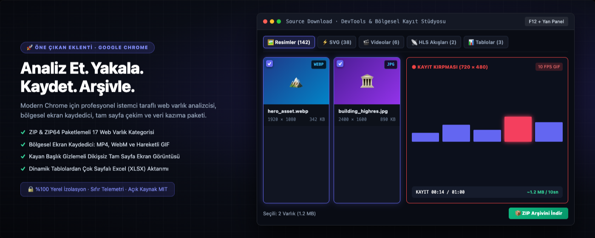
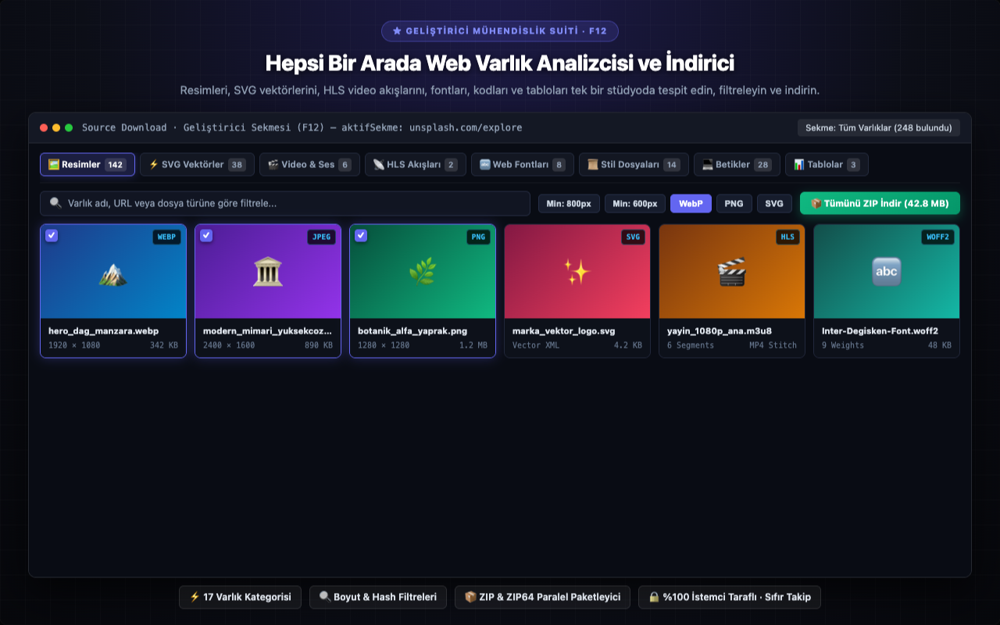
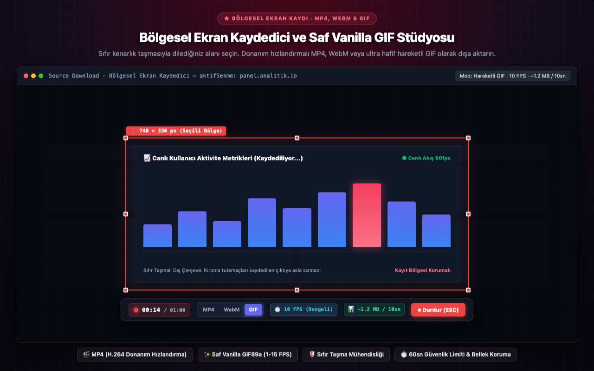
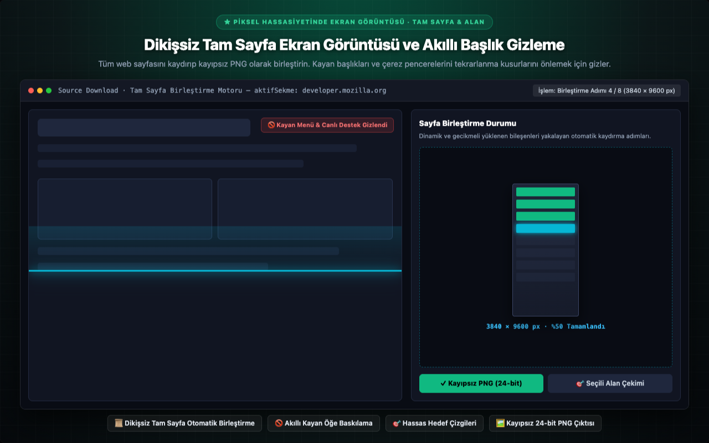
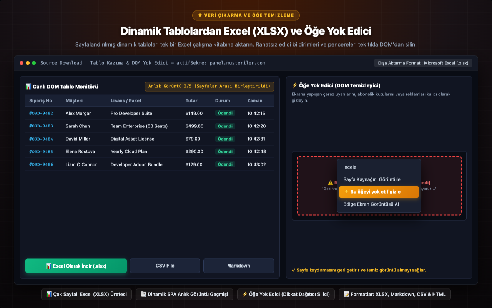
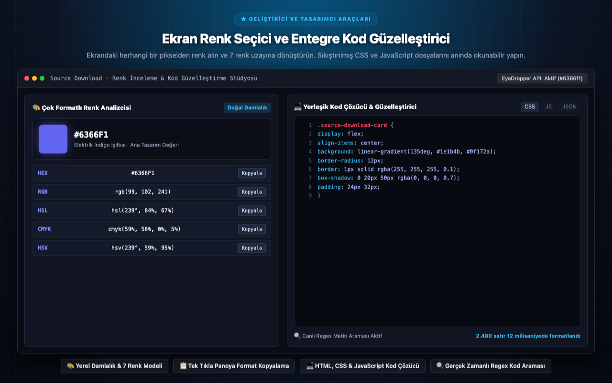

<p align="center">
  
</p>

<h1 align="center">Source Download</h1>

<p align="center">
  <a href="../../README.md"></a>
  <a href="README.tr.md"></a>
  <a href="README.de.md"></a>
  <a href="README.es.md"></a>
  <a href="README.ja.md"></a>
  <a href="README.ru.md"></a>
  <a href="README.zh-CN.md"></a>
</p>

<p align="center">
  <em>Geliştiriciler, tasarımcılar ve araştırmacılar için hepsi bir arada web varlık indirici, tam sayfa ekran görüntüsü motoru ve veri çıkarma tezgâhı.</em><br>
  Bir web sayfasının yüklediği <b>tüm varlıkları</b> — görseller, SVG, video, ses, JS, CSS, yazı tipleri, JSON, WASM, manifestler, canlı tablolar ve dikişsiz tam sayfa ekran görüntüleri — tek tek veya klasör yapısı korunmuş bir ZIP olarak zahmetsizce inceleyin ve indirin.
</p>

<p align="center">
  <a href="https://chromewebstore.google.com/detail/source-download/nockdgincmpfojabnhbofkddgcmnodpd"></a>
  
  
  
  
  
  <a href="../../LICENSE"></a>
  
  
</p>

---

<p align="center">
  
</p>

---

## Merhaba, Ben Turan Burak Yeşilyurt

Yıllarca **web scraping**, **veri analizi** ve **QA otomasyonları** üzerine sistemler kurdum. Modern web tek sayfalı uygulamalara (SPA) evrildikçe hep aynı engelle karşılaştım: son kullanıcı olarak ekranda gördüğünüz bir şeyi kolayca bilgisayarınıza indiremiyorsunuz, geliştirici olarak ise Chrome DevTools penceresi kimi zaman yetersiz kimi zaman ise aşırı kalabalık hissettiriyor. **Source Download** tam olarak bu ihtiyacı eksiksiz karşılamak için doğdu.

Geri bildirimleriniz ve deneyimleriniz benim için son derece değerlidir. Bana [**LinkedIn profilimden**](https://www.linkedin.com/in/turan-burak-yesilyurt/) veya [**2run.dev**](https://2run.dev) üzerinden dilediğiniz zaman ulaşabilirsiniz.

> **Chrome Web Store:** [Chrome Web Store Üzerinden Source Download'ı Yükleyin](https://chromewebstore.google.com/detail/source-download/nockdgincmpfojabnhbofkddgcmnodpd)

---

> **Açık Kaynak Sözü ve Felsefemiz:** Mağazadaki birçok "kaynak indirici" araç, onlarca üçüncü parti kütüphanenin üst üste yığılmasıyla çalışır. Source Download tamamen farklıdır. **ZIP motoru**, **XLSX oluşturucusu**, **HLS birleştiricisi**, **GIF kodlayıcısı** ve **kod formatlayıcıları** dahil her bir satır saf JavaScript ile elle yazılmıştır. Çerçeve (framework), bağımlılık, derleme adımı ve telemetri/izleyici yoktur.

---

## Görsel Tur ve Temel Modüller

Google Chrome DevTools, Yan Panel ve Araç Çubuğu içerisine entegre edilen yüksek çözünürlüklü arayüz modüllerini keşfedin.

### 1. Hepsi Bir Arada Web Varlık Analizcisi ve İndirici
> **★ GELİŞTİRİCİ MÜHENDİSLİK SUİTİ · F12** — Resimleri, SVG vektörlerini, HLS video akışlarını, fontları, kodları ve tabloları tek bir stüdyoda tespit edin, filtreleyin ve indirin.
> 
> `⚡ 17 Varlık Kategorisi` · `🔍 Boyut & Hash Filtreleri` · `📦 ZIP & ZIP64 Paralel Paketleyici` · `🔒 %100 İstemci Taraflı · Sıfır Takip`

<p align="center">
  
</p>

---

### 2. Bölgesel Ekran Kaydedici ve Saf Vanilla GIF Stüdyosu
> **★ BÖLGESEL EKRAN KAYDI · MP4, WEBM & GIF** — Sıfır kenarlık taşmasıyla dilediğiniz alanı seçin. Donanım hızlandırmalı MP4, WebM veya ultra hafif hareketli GIF olarak dışa aktarın.
> 
> `🎬 MP4 (H.264 Donanım Hızlandırma)` · `✨ Saf Vanilla GIF89a (1-15 FPS)` · `🛡️ Sıfır Taşma Mühendisliği` · `⏱️ 60sn Güvenlik Limiti & Bellek Koruma`

<p align="center">
  
</p>

---

### 3. Dikişsiz Tam Sayfa Ekran Görüntüsü ve Akıllı Başlık Gizleme
> **★ PİKSEL HASSASİYETİNDE EKRAN GÖRÜNTÜSÜ · TAM SAYFA & ALAN** — Tüm web sayfasını kaydırıp kayıpsız PNG olarak birleştirin. Kayan başlıkları ve çerez pencerelerini tekrarlanma kusurlarını önlemek için gizler.
> 
> `📜 Dikişsiz Tam Sayfa Otomatik Birleştirme` · `🚫 Akıllı Kayan Öğe Baskılama` · `🎯 Hassas Hedef Çizgileri` · `🖼️ Kayıpsız 24-bit PNG Çıktısı`

<p align="center">
  
</p>

---

### 4. Dinamik Tablolardan Excel (XLSX) ve Öğe Yok Edici
> **★ VERİ ÇIKARMA VE ÖĞE TEMİZLEME** — Sayfalandırılmış dinamik tabloları tek bir Excel çalışma kitabına aktarın. Rahatsız edici bildirimleri ve pencereleri tek tıkla DOM'dan silin.
> 
> `📊 Çok Sayfalı Excel (XLSX) Üreteci` · `📑 Dinamik SPA Anlık Görüntü Geçmişi` · `⚡ Öğe Yok Edici (Dikkat Dağıtıcı Silici)` · `📝 Formatlar: XLSX, Markdown, CSV & HTML`

<p align="center">
  
</p>

---

### 5. Ekran Renk Seçici ve Entegre Kod Güzelleştirici
> **★ GELİŞTİRİCİ VE TASARIMCI ARAÇLARI** — Ekrandaki herhangi bir pikselden renk alın ve 7 renk uzayına dönüştürün. Sıkıştırılmış CSS ve JavaScript dosyalarını anında okunabilir yapın.
> 
> `🎨 Yerel Damlalık & 7 Renk Modeli` · `📋 Tek Tıkla Panoya Format Kopyalama` · `💻 HTML, CSS & JavaScript Kod Çözücü` · `🔍 Gerçek Zamanlı Regex Kod Araması`

<p align="center">
  
</p>

---

Source Download; web geliştiricileri, UI/UX tasarımcıları, test mühendisleri (QA), dijital arşivciler ve veri araştırmacıları için doğrudan Google Chrome içine entegre edilmiş hepsi bir arada profesyonel web varlık inceleme, çıkarma, ekran görüntüsü ve video/GIF kayıt stüdyosudur.

F12 DevTools Geliştirici Paneli, Yan Panel (Side Panel) ve araç çubuğu açılır penceresiyle çalışan Source Download; ziyaret ettiğiniz herhangi bir sayfanın yüklediği tüm kaynakları derinlemesine teknik metriklerle inceler. Yüksek çözünürlüklü görsellerden SVG vektör çizimlerine, HLS video akışlarından dinamik DOM tablolarına, yazı tiplerinden API yanıtlarına kadar her öğeyi anında tespit eder, kategorize eder, biçimlendirir ve tek tek ya da organize bir ZIP/ZIP64 arşivi olarak kaydetmenizi sağlar.


## KAPSAMLI ÖZELLİK VE YETENEKLER


### 1. KAPSAMLI VARLIK TESPİTİ VE İNDİRME (17 KATEGORİ)

Herhangi bir modern web sitesinin yüklediği tüm bileşenleri 17 özel kaynak kategorisinde inceleyin ve indirin:
- **Görseller ve Raster Medya:** Özel genişlik ve yükseklik piksel eşikleriyle yüksek çözünürlüklü vitrin görsellerini takip piksellerinden ve küçük simgelerden anında ayırt edin. Bayt seviyesinde SHA-256 karma eşleme ile birebir kopya dosyaları anında saptayın Şeffaflık ızgarasına sahip tam ekran yakınlaştırılabilir ışıklı kutuda alfa kanallarını inceleyin.
- **SVG Vektör Çizimleri:** Satır içi SVG DOM elemanlarını, bağlantılı SVG dosyalarını ve CSS arka plan vektörlerini çıkarın. Ham XML vektör kodunu görüntüleyin, temiz SVG işaretlemesini panoya kopyalayın veya doğrudan Figma, Sketch ya da Illustrator uyumlu bağımsız vektör varlıkları indirin.
- **Video ve Ses Dosyaları:** HTML5 medya etiketlerini, blob akışlarını ve doğrudan medya bağlantılarını tespit edin. İndirmeden önce dahili medya oynatıcıda oynatma kontrolleriyle önizleyin.
- **HLS Akış Algılama ve Birleştirme:** HTTP Canlı Yayın (.m3u8) bildirimlerini anında yakalayın. Master ve medya oynatma listelerini ayrıştırın, kullanılabilir bit hızı seçeneklerini (1080p, 720p, 480p) denetleyin, akış parçalarını 6 kanallı paralel sıralarla indirin ve harici yazılıma gerek kalmadan doğrudan tarayıcınızda tek bir MP4 dosyasında birleştirin. AES-128 şifrelemesi içeren yayınlarda anında durum bildirimi sunar.
- **Web Tipografisi:** Sıkıştırılmış modern web fontlarını ve ölçeklenebilir açık yazı tiplerini çıkarın. Yazı tiplerini canlı şelale görünümünde düzenlenebilir metinlerle dinamik olarak test edin, yazı tipi ağırlıklarını (100-900) ve glif tablolarını inceleyin.
- **Stil Dosyaları ve Scriptler:** CSS ve JavaScript dosyalarını indirin. Dahili unminifier/beautifier motoru ile sıkıştırılmış kodları sözdizimi vurgulaması ve anlık aramayla temiz formata dönüştürün.
- **API ve JSON Yanıtları:** REST API isteklerini, GraphQL sorgularını ve JSON yanıtlarını gerçek zamanlı izleyin. Ağaç görünümlü JSON verilerini, URL sorgu parametrelerini, HTTP başlıklarını ve ağ gecikme sürelerini ölçün.
- **Dinamik DOM Tabloları:** Standart tabloları ve modern ARIA ızgara bileşenlerini yakalayan canlı monitör. Tek Sayfalı Uygulama (SPA) sayfalamalarında anlık görüntü geçmişi tutun, durumları birleştirin ve doğrudan çok sayfalı Excel (XLSX), Markdown veya CSV formatında dışa aktarın.
- **Canlı Metin Çıkarma:** Belge metin akışını doğal DOM sırasıyla tarayın. Düz metin, Regex, CSS seçicileri veya XPath ile gerçek zamanlı içerik filtreleyin ve dışa aktarın.
- **Web Uygulaması Bildirimi ve Meta Veriler:** PWA manifest dosyalarını, faviconları, dokunmatik simgeleri ve sosyal medya önizleme etiketlerini (Open Graph, Twitter Cards) denetleyin.
- **Belgeler ve İkilik Dosyalar:** Dijital yayınları, taşınabilir belge dosyalarını, derlenmiş WebAssembly modüllerini, arşiv paketlerini ve yapılandırılmış metinleri çıkarın.


### 2. BÖLGESEL EKRAN KAYDI VE HAREKETLİ GIF STÜDYOSU

Ekranınızın dilediğiniz bölgesinden yüksek tanımlı video ve hafif animasyonlu GIF'ler kaydedin:
- **Etkileşimli Kırpma Alanı:** Sekmede dilediğiniz yere bir kırpma kutusu çizin. 8 tutamaç ve anlık koordinat okuyucularıyla pürüzsüzce boyutlandırın.
- **Sıfır Taşma (Zero-Bleed) Sınır Mühendisliği:** Tutamaçlar ve sürükleme başlıkları kayıt sınırının tamamen dışında render edilir. Harici anahat ofseti kırmızı seçim kenarlıklarının kayıtlı videoya taşmasını kesinlikle engeller.
- **Çakışmayan Yüzen Kontrol Çubuğu:** Kırpma kutunuzun hemen üstüne veya altına kenetlenen sürüklenebilir kayıt çubuğu, çekim alanıyla asla çakışmaz.
- **Çoklu Dışa Aktarma Formatları:** Donanım hızlandırmalı MP4, açık web WebM veya hafif animasyonlu GIF olarak dışa aktarın.
- **Saf JavaScript GIF Kodlayıcı:** Sıfır harici bağımlılıkla 100% saf vanilla JavaScript ile geliştirilmiş GIF89a motoru. 15-bit renk kuantizasyonu ve tamsayı anahtarlı LZW sıkıştırması sunar.
- **Özelleştirilebilir Kare Hızı (FPS):** İhtiyacınıza göre 5 farklı kademe:
  - 15 FPS (Akıcı): Akıcı arayüz animasyonları, mikro etkileşimler ve ürün tanıtım demoları.
  - 10 FPS (Standart / Dengeli): Web memeleri ve hata raporları için endüstri standardı altın oran; kalite ile dosya boyutu arasında ideal denge.
  - 5 FPS (Kompakt / Meme): Belirgin şekilde azaltılmış dosya boyutu; hızlı yüklenen hafif öğreticiler için ideal.
  - 2 FPS (Stop-Motion / Tık-Tık Adım Adım): Kare başına yarım saniye. Adım adım kılavuzlar ve nostaljik animasyonlar için ideal; 10 FPS'e göre 5 kat daha az bellek tüketir ve 5 kat küçük dosya üretir.
  - 1 FPS (Slayt Gösterisi): Saniyede tam 1 kare. Statik geçişler, kod incelemeleri ve minimum dosya boyutu.
- **Canlı Boyut Tahmincisi:** Seçtiğiniz çözünürlük ve kare hızına göre tahmini dosya boyutunu (~X MB / 10s) kayıt öncesinde ve anında gösteren canlı rozet.
- **4K UHD Güvenlik Tavanı:** Retina ekranlarda sekme çökmelerini önlemek için en boy oranını koruyarak 3840px güvenlik tavanı uygular.
- **60 Saniye Güvenlik Sınırı:** GIF formatında maksimum 1 dakikalık (60 saniye) emniyet sınırı ve canlı geri sayım (00:00 / 01:00).


### 3. PİKSEL KUSURSUZLUĞUNDA TAM SAYFA VE BÖLGESEL EKRAN GÖRÜNTÜSÜ

Bulut servislerine bağımlı olmadan kusursuz web görselleri yakalayın:
- **Dikişsiz Tam Sayfa Yakalama:** Tüm web sayfasını dikey kaydırıp birleştirerek net PNG görüntüler oluşturun.
- **Akıllı Yapışkan Başlık Baskılama:** Kaydırma sırasında sabit ve kayan başlıkları otomatik olarak geçici gizler; ekran görüntüsünde başlık tekrarlarını tamamen önler.
- **Tembel Yükleme (Lazy-Load) Senkronizasyonu:** Dinamik resimlerin ve bileşenlerin tam render olmasını sağlamak için kaydırma duraklamalarını simüle eder.
- **Hassas Bölgesel Ekran Görüntüsü:** Artı imleç kılavuzlarıyla ekranda istediğiniz dikdörtgen alanı seçin ve anında indirin.


### 4. EKRAN RENK DAMLALIĞI VE İNCELEYİCİ

Tasarımcı hassasiyetiyle ekranın herhangi bir noktasından renk örnekleyin:
- **Yerel EyeDropper API:** Web sayfasından veya tarayıcı penceresinin herhangi bir yerinden piksel rengi örnekleyin.
- **Çok Formatlı Renk İnceleyici:** Örneklenen rengi otomatik olarak popüler dijital ve baskı renk modellerine dönüştürür: HEX, RGB, RGBA, HSL, HSLA, CMYK, HSV.
- **Tek Tıkla Panoya Kopyalama:** Değerleri CSS veya tasarım dosyalarına yapıştırmak için anlık kopyalama butonları.


### 5. ÖĞE GİZLEYİCİ (ELEMENT ZAPPER)

Ekran görüntüsü almadan veya sayfayı arşivlemeden önce gereksiz kalabalığı temizleyin:
- **Sağ Tık Bağlam Menüsü Entegrasyonu:** Rahatsız edici yapışkan banner'lara, çerez bildirimlerine veya sohbet pencerelerine sağ tıklayıp "Bu öğeyi gizle (Zap)" seçin.
- **Anında DOM Nötralizasyonu:** Hedef öğeyi DOM ağacından anında kaldırır, sayfa kaydırmasını geri getirir ve tertemiz görüntüler sağlar.


### 6. TEK DOSYALIK ÇEVRİMDIŞI HTML ARŞİVLEME

Web sayfalarını kalıcı ve bağımsız belgeler olarak saklayın:
- **Kendine Yeten Arşiv:** Tüm web sayfasını tek bir çevrimdışı .html dosyası olarak paketler.
- **Kaynak Gömme:** Harici CSS stillerini ve görselleri Base64 formatında içine gömer, scriptleri nötralize ederek çevrimdışı açılışta çökmesini engeller.
- **Sıfır Bulut Bağımlılığı:** Kaydedilen arşivleri internet bağlantısı olmadan dilediğiniz cihazda inceleyin.


### 7. CANLI TABLOLARDAN EXCEL'E (XLSX) VERİ KAZIMA

Kod yazmadan web tablolarını yapılandırılmış çalışma kitaplarına dönüştürün:
- **Çok Sayfalı Excel (XLSX) Üretici:** DOM tablolarını doğru hücre tipleriyle biçimlendirilmiş Microsoft Excel çalışma kitaplarına dönüştürür.
- **Dinamik Anlık Görüntü Hafızası:** AJAX ile güncellenen tabloları izleyin, sayfalama adımlarındaki verileri birleştirin.
- **Çoklu Format Desteği:** Yakalanan verileri Excel (XLSX), Markdown, CSV veya biçimlendirilmiş HTML olarak kaydedin.


### 8. GELİŞTİRİCİ SUITE: KOD GÜZELLEŞTİRİCİ VE SÖZDİZİMİ İNCELEYİCİ

Sıkıştırılmış kodları doğrudan tarayıcınızda düzenleyin ve inceleyin:
- **Temiz Unminification:** Sıkıştırılmış HTML, CSS, JS ve JSON kodlarını girintili ve okunaklı hale getirir.
- **Entegre Arama:** Gerçek zamanlı metin eşleme ve Regular Expressions ile kod içinde anlık arama yapın.
- **Satır Numaralandırması:** Okunabilir satır numaraları ve modern sözdizimi renklendirmesi.


### 9. ÖZEL ŞABLONLU DOSYA ADLANDIRMA

İndirmelerinizin organizasyonunu akıllı şablonlarla yönetin:
- **Dinamik Şablon Belirteçleri:** {domain}, {title}, {type}, {date}, {time}, {ext} ile özel adlandırma kuralları tanımlayın.
- **Kategori Önayarları:** Ekran görüntüleri, video kayıtları ve ZIP arşivleri için ayrı isimlendirme şablonları belirleyin.


### 10. GELİŞMİŞ ZIP VE ZIP64 PAKETLEME

Yüzlerce dosyayı tek tıkla organize bir arşivde toplayın:
- **İstemci Taraflı PKZIP Motoru:** İndirilen varlıkları doğrudan tarayıcı belleğinde yerel olarak paketler.
- **ZIP64 Mimarisi:** 4 GB dosya boyutunu veya 65.535 dosya sınırını aşan büyük arşivleri sorunsuz şekilde yönetir.
- **Düzenli Klasör Yapısı:** Dosyaları temiz alt klasörlere (/images, /videos, /fonts, /css, /js, /documents) otomatik ayırır.


## HEDEF KULLANICILAR VE İŞ AKIŞLARI


- **Ön Yüz Geliştiricileri:** Ağ kaynaklarını inceleyin, API yanıtlarını ayrıştırın, SVG ve fontları çekin, CSS stillerini ayıklayın, kod demetlerini unminify edin.
- **Arayüz Tasarımcıları (UI/UX):** Vektör simgeleri dışa aktarın, renk damlalığıyla paletleri kopyalayın, tipografi hiyerarşisini ve responsive görsel davranışlarını inceleyin.
- **Test ve QA Mühendisleri:** Hata bildirimlerini MP4 veya 2 FPS stop-motion GIF ile kaydedin, dikişsiz dikey regresyon görüntüleri alın, konsol hatalarını belgelendirin.
- **Veri Analistleri ve Araştırmacılar:** Sayfalama adımlarındaki tablo verilerini kopyala-yapıştır yapmadan doğrudan çok sayfalı Excel dosyalarına aktarın, CSV ve JSON çıktıları alın.
- **İçerik Üreticileri ve Eğitmenler:** Teknik belgeler, bültenler ve kılavuzlar için hafif, döngülü animasyonlu GIF'ler üretin, yüksek çözünürlüklü temiz ekran görüntüleri yakalayın.
- **Dijital Arşivciler ve Hukuk Uzmanları:** Makaleleri, anlaşmaları ve web belgelerini yıllar sonra bile bozulmadan açılabilecek tek dosyalık çevrimdışı HTML olarak güvenle saklayın.


## GİZLİLİK, GÜVENLİK VE KURUMSAL UYUMLULUK


Source Download katı bir yerel gizlilik mimarisi ile tasarlanmıştır:
- **100% Yerel Kum Havuzu İşlemi:** Ağ analizi, video kaydı, GIF kodlaması, tablo kazıma ve arşivleme dahil tüm işlemler yalnızca yerel tarayıcı kum havuzunda yürütülür.
- **Sıfır Dış Ağ İsteği ve Sıfır Telemetri:** Eklenti hiçbir analiz kodu, izleme pikseli, reklam takipçisi veya uzak sunucu bağlantısı barındırmaz.
- **Şirket İçi ve Kurumsal İntranet Desteği:** Yerel ağlarda (intranet), VPN arkasında veya internet erişimi kısıtlı kurumsal ortamlarda eksiksiz ve bağımsız çalışır.
- **Hesap Zorunluluğu Yok:** Kayıt, üyelik, oturum açma veya abonelik gerekmez. Tüm özellikler doğrudan kullanıma açıktır.
- **KVKK ve GDPR ile Tam Uyum:** Kullanıcı verisi toplanmadığı ve aktarılmadığı için en katı veri koruma yönetmelikleriyle tam uyumludur.
- **Denetlenebilir Açık Kaynak:** Üçüncü taraf kütüphane barındırmayan saf vanilla JavaScript mimarisi, MIT Lisansı.


## İZİN ŞEFFAFLIĞI


Source Download yalnızca temel işlevler için gereken asgari izinleri talep eder:
- **activeTab:** Yalnızca eklentiyi çalıştırdığınız etkin sekmede kaynakları okumayı, DOM ağacını incelemeyi ve ekran görüntüsü almayı sağlar.
- **storage:** Arayüz tercihlerinizi, dosya adlandırma şablonlarınızı ve kayıt ayarlarınızı tarayıcınızda yerel olarak saklar.
- **downloads:** Yakalanan görselleri, videoları ve ZIP arşivlerini varsayılan indirme klasörünüze kaydeder.
- **contextMenus:** Sağ tık menüsüne hızlı eylemler (Element Zapper, Alan Görüntüsü, Tam Sayfa) ekler.
- **sidePanel:** Ana görüntüleme alanınızı daraltmadan varlıkları yönetmek için Yan Panel eşlikçisini sunar.


## KLAVYE KISAYOLLARI VE PRATİK İPUÇLARI


- **DevTools Panelini Aç:** F12 veya Ctrl+Shift+I (macOS için Cmd+Option+I) tuşlarına basın ve "Source Download" sekmesine geçin.
- **Yan Paneli Aç:** Chrome araç çubuğundaki Yan Panel simgesine tıklayın ve Source Download'ı seçin.
- **Kaydı Durdur:** ESC tuşuna basın veya kayan çubuktaki kırmızı Durdur butonuna tıklayın.
- **Çekimi İptal Et:** Kırpma alanını veya artı imleci kapatmak için dilediğiniz an ESC tuşuna basın.
- **GIF Kare Hızını Değiştir:** Format GIF iken çubuktaki FPS rozetine tıklayarak 10 -> 5 -> 2 -> 1 -> 15 FPS arasında geçiş yapın.
- **GIF Çözünürlüğünü Değiştir:** Çözünürlük rozetine tıklayarak 1:1, 1080p, 720p veya 480p modlarına geçin.


## SIKÇA SORULAN SORULAR (SSS)


#### S: Source Download verilerimi harici sunuculara gönderir mi?

C: Kesinlikle hayır. Her şey 100% yerel olarak tarayıcınızda çalışır. Hiçbir görsel, video veya URL üçüncü taraf sunuculara iletilmez.


#### S: HLS akış birleştirici nasıl çalışır?

C: Eklenti HLS (.m3u8) bildirimini yakalar, video parçalarını doğrudan tarayıcınızda indirir ve harici araçlara gerek kalmadan tek bir MP4 dosyasında birleştirir.


#### S: GIF kaydı neden 1 dakika ile sınırlandırılmıştır?

C: Yüksek çözünürlüklü animasyonlu GIF'ler sıkıştırılmamış kareleri bellekte tutar. 60 saniyelik sınır ve FPS seçenekleri tarayıcınızın donmasını önler.


#### S: Ekranımın yalnızca belirli bir bölgesini kaydedebilir miyim?

C: Evet. Bölgesel Ekran Kaydedici ile dilediğiniz alana bir kutu çizin. Tutamaçlar ve kontrol çubukları çekim alanının dışında kalarak temiz bir görüntü sunar.


#### S: Sayfalar arası güncellenen dinamik tabloları aktarabilir miyim?

C: Evet. Canlı Tablo monitörü anlık görüntü geçmişi tutar. Tabloyu sayfalandırdıkça durumları kaydeder ve birleştirilmiş veriyi çok sayfalı Excel (.xlsx) olarak indirmenizi sağlar.


#### S: Element Zapper ile gizlenen reklam veya çerez pencereleri sayfayı yenileyince geri gelir mi?

C: Evet. Element Zapper o anki oturumda temiz ekran görüntüsü almak için öğeyi geçici olarak DOM'dan kaldırır; sayfa kalıcı olarak bozulmaz ve yenilendiğinde orijinal haline döner.


#### S: ZIP64 arşivi standart işletim sistemi araçlarıyla açılabilir mi?

C: Evet. Oluşturulan ZIP64 arşivleri Windows Dosya Gezgini, macOS Arşiv İzlencesi ve Linux dosya yöneticileri ile standart PKZIP standartlarında tam uyumludur.


#### S: 2 FPS stop-motion GIF modu hangi durumlarda tercih edilmelidir?

C: 2 FPS modu, yazılım adımlarını veya tıklama rehberlerini kare kare göstermek için mükemmeldir. Standart 10 FPS'e kıyasla 5 kat daha az bellek harcar ve 5 kat daha küçük dosya boyutu oluşturur.


Google Chrome için en hızlı, kapsamlı ve tamamen yerel web varlık stüdyosu olan Source Download'ı hemen indirin!

---

## Kurulum ve Hızlı Başlangıç

### Yöntem 1: Chrome Web Store Üzerinden Kurulum (Önerilen)
1. Resmi [Source Download Chrome Web Store](https://chromewebstore.google.com/detail/source-download/nockdgincmpfojabnhbofkddgcmnodpd) mağaza sayfasını ziyaret edin.
2. **Chrome'a Ekle** butonuna tıklayarak kurulumu onaylayın.
3. Herhangi bir web sayfasında `F12` (veya `Ctrl+Shift+I` / `Cmd+Option+I`) basarak **Source Download** sekmesine geçin veya araç çubuğundan **Yan Panel**'i açın.

### Yöntem 2: Kaynak Koddan Geliştirici Modu ile Kurulum
1. Depoyu yerel bilgisayarınıza klonlayın:
```bash
git clone https://github.com/turanburakyesilyurt/source-download.git
cd source-download
```
2. Chrome tarayıcısında `chrome://extensions` adresine gidin.
3. Sağ üst köşedeki **Geliştirici modu** (Developer mode) anahtarını açın.
4. **Paketlenmemiş öğe yükle** butonuna tıklayın ve klonladığınız `source-download` klasörünü seçin.

---

## Lisans

[MIT Lisansı](../../LICENSE) kapsamında yayınlanmıştır. Telif Hakkı © Turan Burak Yeşilyurt. Özgürce kullanın, inceleyin ve geliştirin.
