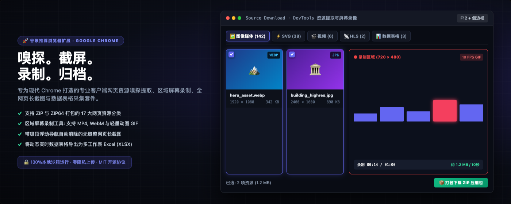
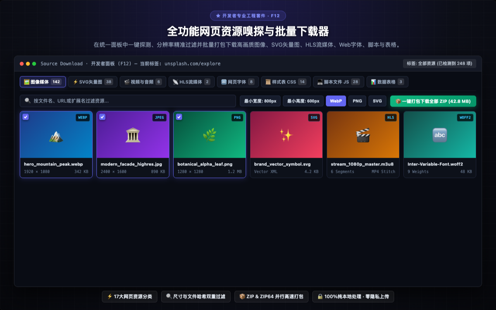
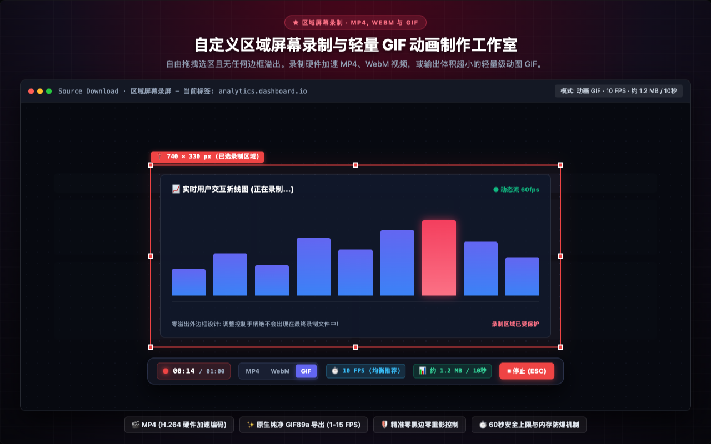
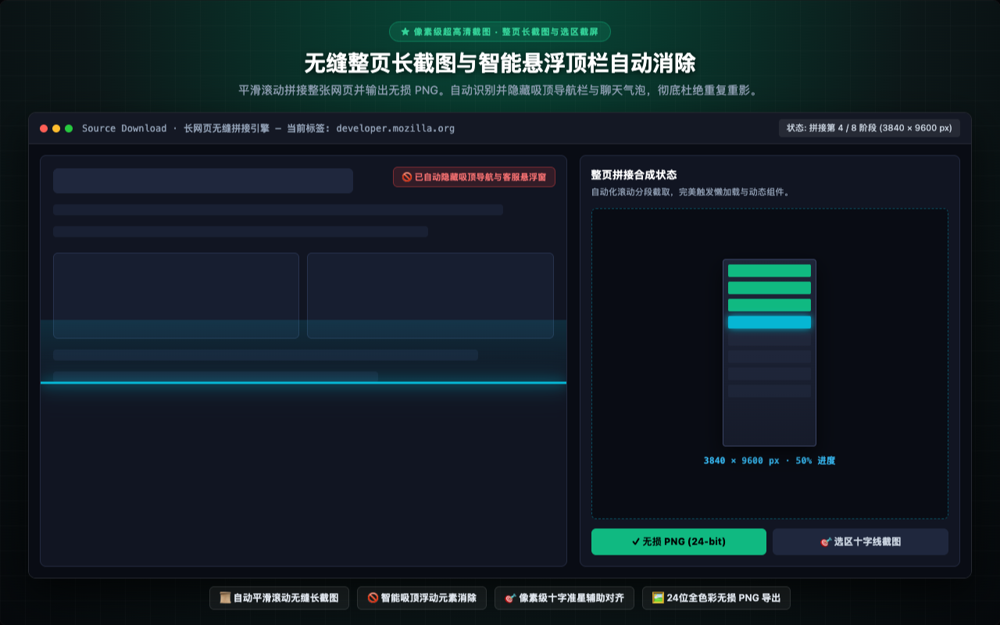
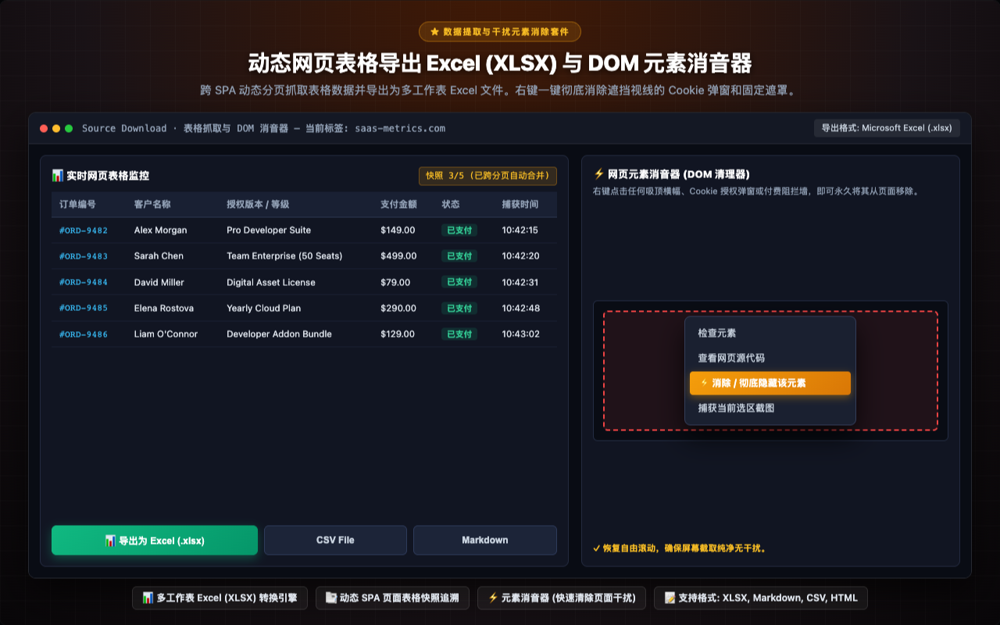
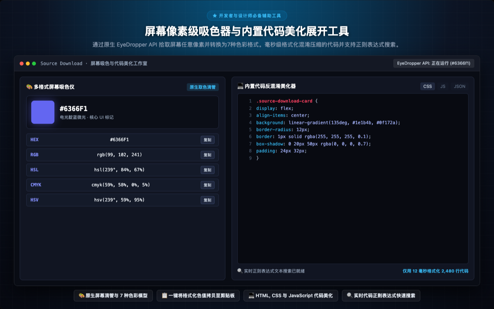

<p align="center">
  
</p>

<h1 align="center">Source Download</h1>

<p align="center">
  <a href="../../README.md"></a>
  <a href="README.tr.md"></a>
  <a href="README.de.md"></a>
  <a href="README.es.md"></a>
  <a href="README.ja.md"></a>
  <a href="README.ru.md"></a>
  <a href="README.zh-CN.md"></a>
</p>

<p align="center">
  <em>专为开发者、设计师、测试人员与数据分析师打造的网页全资源下载、全页长截图与 DOM 数据提取工作台。</em><br>
  轻松审查并下载网页加载的<b>所有资产</b> — 图片、SVG、视频、音频、JS、CSS、字体、JSON、WASM、Manifest、动态表格以及像素级全页长截图 — 统一打包为规范分类的 ZIP 压缩包。
</p>

<p align="center">
  <a href="https://chromewebstore.google.com/detail/source-download/nockdgincmpfojabnhbofkddgcmnodpd"></a>
  
  
  
  
  
  <a href="../../LICENSE"></a>
  
  
</p>

---

<p align="center">
  
</p>

---

## 开发者致辞

多年来，我一直致力于构建自动化 **网络爬虫**、**数据分析** 和 **QA 测试流** 系统。随着单页面应用（SPA）普及，传统工具往往繁琐受限：普通用户无法轻松保存屏幕所见，而 Chrome DevTools 有时又过于复杂。**Source Download** 便是为解决这一痛点而打造的纯粹工具。

欢迎在 [**LinkedIn**](https://www.linkedin.com/in/turan-burak-yesilyurt/) 与我联系，或访问 [**2run.dev**](https://2run.dev)。

> **Chrome Web Store:** [前往 Chrome Web Store 官方安装 Source Download](https://chromewebstore.google.com/detail/source-download/nockdgincmpfojabnhbofkddgcmnodpd)

---

> **开源理念与手写架构承诺:** 许多同类扩展充斥着臃肿的第三方库包装。Source Download 坚持纯粹手写：包括 **ZIP 引擎**、**XLSX 工作簿生成器**、**HLS 视频合并器**、**GIF 动图编码器** 与 **代码美化器** 在内的每一行代码均完全由纯原生 JavaScript 手写实现，无框架依赖、无第三方外部包、无需构建步骤、无遥测上报。

---

## 功能界面视觉导览与核心模块

探索深度集成于 Google Chrome DevTools、侧边栏 (Side Panel) 与工具栏弹窗的专业工作区。

### 1. 全功能网页资源嗅探与批量下载器
> **★ 开发者专业工程套件 · F12** — 在统一面板中一键探测、分辨率精准过滤并批量打包下载高画质图像、SVG矢量图、HLS流媒体、Web字体、脚本与表格。
> 
> `⚡ 17大网页资源分类` · `🔍 尺寸与文件哈希双重过滤` · `📦 ZIP & ZIP64 并行高速打包` · `🔒 100%纯本地处理 · 零隐私上传`

<p align="center">
  
</p>

---

### 2. 自定义区域屏幕录制与轻量 GIF 动画制作工作室
> **★ 区域屏幕录制 · MP4, WEBM 与 GIF** — 自由拖拽选区且无任何边框溢出。录制硬件加速 MP4、WebM 视频，或输出体积超小的轻量级动图 GIF。
> 
> `🎬 MP4 (H.264 硬件加速编码)` · `✨ 原生纯净 GIF89a 导出 (1-15 FPS)` · `🛡️ 精准零黑边零重影控制` · `⏱️ 60秒安全上限与内存防爆机制`

<p align="center">
  
</p>

---

### 3. 无缝整页长截图与智能悬浮顶栏自动消除
> **★ 像素级超高清截图 · 整页长截图与选区截屏** — 平滑滚动拼接整张网页并输出无损 PNG。自动识别并隐藏吸顶导航栏与聊天气泡，彻底杜绝重复重影。
> 
> `📜 自动平滑滚动无缝长截图` · `🚫 智能吸顶浮动元素消除` · `🎯 像素级十字准星辅助对齐` · `🖼️ 24位全色彩无损 PNG 导出`

<p align="center">
  
</p>

---

### 4. 动态网页表格导出 Excel (XLSX) 与 DOM 元素消音器
> **★ 数据提取与干扰元素消除套件** — 跨 SPA 动态分页抓取表格数据并导出为多工作表 Excel 文件。右键一键彻底消除遮挡视线的 Cookie 弹窗和固定遮罩。
> 
> `📊 多工作表 Excel (XLSX) 转换引擎` · `📑 动态 SPA 页面表格快照追溯` · `⚡ 元素消音器 (快速清除页面干扰)` · `📝 支持格式: XLSX, Markdown, CSV, HTML`

<p align="center">
  
</p>

---

### 5. 屏幕像素级吸色器与内置代码美化展开工具
> **★ 开发者与设计师必备辅助工具** — 通过原生 EyeDropper API 拾取屏幕任意像素并转换为7种色彩格式。毫秒级格式化混淆压缩的代码并支持正则表达式搜索。
> 
> `🎨 原生屏幕滴管与 7 种色彩模型` · `📋 一键将格式化色值拷贝至剪贴板` · `💻 HTML, CSS 与 JavaScript 代码美化` · `🔍 实时代码正则表达式快速搜索`

<p align="center">
  
</p>

---

Source Download 是一款专为前端开发工程师、UI/UX 设计师、软件测试工程师（QA）、数据分析师、数字档案管理者以及内容创作者量身打造的专业级浏览器原生综合套件，集网页资源嗅探提取、屏幕截图、区域录屏以及轻量动画 GIF 制作于一体，深度无缝集成于 Google Chrome。

通过 Chrome F12 开发者工具（DevTools）工程级面板、不占用主视口面积的常驻侧边栏（Side Panel）以及快速工具栏弹出窗口三种灵活的工作模式，Source Download 能够实时探测并结构化分析当前网页在后台加载的全部数字资源。从超高清主图摄影与 SVG 矢量图标，到 HLS 分段视频流、动态 DOM 数据表格、定制 Web 字体与底层 API 接口响应，全部支持深度技术指标检测，并可按需单独下载或一键打包为目录结构规整的 ZIP/ZIP64 压缩归档文件。


## 完整核心功能与技术架构深度解析


### 1. 网页资源全景探测与批量提取（全覆盖 17 大资源分类）

全自动侦测并分类提取现代 Web 站点与企业级单页应用（SPA）加载的全部资源组件：
- **图像与位图媒体:** 支持自定义最小与最大宽高像素阈值，瞬间过滤追踪像素与细小装饰图标，精准定位超高清轮播大图与界面视觉资产。内置字节级 SHA-256 哈希比对去重算法，实时识别并阻止重复资源的冗余下载。配备带透明棋盘格背景的全屏可缩放查看器，支持对 Alpha 通道透明度和色彩边缘进行像素级深度检验。
- **SVG 矢量图形提取:** 全面捕捉内联 SVG DOM 节点、外部引用的独立 SVG 矢量文件以及 CSS background-image 背景中的矢量图。支持直接查看原始 XML 矢量源码、一键拷贝干净纯粹的 SVG 标记语言到剪贴板，或下载为直接兼容 Figma、Sketch、Penpot 和 Adobe Illustrator 的独立矢量文件。
- **视频与音频媒体流:** 自动探测 HTML5 媒体标签、Blob 流媒体缓存与直链媒体资源。在保存到本地磁盘之前，支持在内置媒体播放器中调节播放速度与音量进行即时预览。
- **HLS 视频流嗅探与无损合并:** 智能截获 HTTP Live Streaming（.m3u8）播放索引清单。深度解析 Master 主清单及多码率画质变体（1080p、720p、480p），采用 6 通道并行下载队列抓取媒体分片，无需在系统安装 FFmpeg 等外部命令行工具，直接在浏览器内存沙箱中将分片无损拼接为单个完整的 MP4 视频文件。全面支持 AES-128 加密状态检测与实时提醒。
- **Web 字体与排版资产:** 提取现代高压缩 Web 字体与开源矢量字形文件。支持在交互式瀑布流视窗中通过可编辑的示例文本进行动态测试，并可自由切换字体粗细字重（100-900）以及浏览完整字形表。
- **样式表与脚本文件:** 完整提取并保存 CSS 样式表与 JavaScript 脚本文件。内置反混淆代码美化引擎（Unminifier/Beautifier），可将压缩的代码格式化为具备现代代码高亮和实时正则表达式搜索支持的清晰易读排版。
- **API 接口与 JSON 数据响应:** 实时监控后台触发的 RESTful API 接口请求与 GraphQL 查询。支持树状层级查看格式化 JSON 响应、拆解 URL 查询参数、核验 HTTP 请求与响应头，并精确测量网络往返延迟。
- **动态 DOM 数据表格与 Excel 导出:** 实时监控标准 HTML 表格及现代 ARIA 网格组件。支持在 SPA 动态分页与筛选过程中持续记录快照历史，将跨页状态数据无缝拼接，并直接导出为多工作表 Microsoft Excel（.xlsx）、Markdown 规范表格或 CSV 逗号分隔文件。
- **实时正文文本智能提取:** 遵循 DOM 树的标准自然阅读顺序遍历整个文档文本流。支持使用纯文本关键词、正则表达式、CSS 选择器或高级 XPath 查询进行多条件实时过滤与快速导出。
- **网页应用清单与元数据:** 检查渐进式 Web 应用清单（manifest.json）、高清网站图标（Favicon）、Apple 触摸设备图标以及社交媒体富媒体分享标签（Open Graph、Twitter Cards）。
- **文档与二进制模块:** 嗅探并提取电子出版物、PDF 便携文档、已编译的 WebAssembly 模块、压缩归档包及结构化数据文件。


### 2. 区域屏幕录制工具与纯净动图 GIF 工作台

自由拖拽选区，在屏幕任意指定矩形区域内录制高清视频或超轻量 GIF 动画：
- **交互式精准裁剪选区框:** 在活动标签页任意位置按需拖拽划定录制区域。配备 8 个顺滑控制手柄并提供实时像素坐标数值反馈，确保选区像素级严丝合缝。
- **零溢出外边框工程设计（Zero-Bleed Boundary）:** 所有的拖拽调整手柄与控制工具栏均被严格渲染在有效录制边界之外。外向偏移设计彻底避免红色裁剪边框、控制手柄与菜单按钮渗入到最终输出的录屏画面中。
- **智能防遮挡浮动控制栏:** 可自由拖拽移动的浮动工具栏支持在裁剪选区上下两侧智能吸附停靠，坚决杜绝遮挡录制视口的核心操作区域。
- **多格式视频与动画输出:** 支持导出为硬件加速编码的高清 MP4、开放网络标准 WebM 以及极致轻量化的动图 GIF。
- **原生纯净 JavaScript GIF 编码内核:** 零第三方外部库依赖，完全基于 100% 原生纯净 JavaScript 编写的内置 GIF89a 编码引擎。集成 15 位中位切分颜色量化算法与整数索引 LZW 压缩机制，兼顾生动画质与极小体积。
- **灵活定制的 5 档 GIF 帧率（FPS）梯度:**
  - 15 FPS（丝滑流畅）: 适用于复杂的 UI 交互动效、微动效演示与产品交互展示，提供极高的视觉连贯性。
  - 10 FPS（标准平衡推荐）: 网页梗图与软件缺陷报告的行业黄金分割标准，在画面平滑度与文件大小之间达成卓越平衡。
  - 5 FPS（紧凑轻便）: 文件体积大幅削减，极度适合轻量级操作指南、知识库图解与快速加载教程。
  - 2 FPS（逐帧定格 / 步骤指南）: 每半秒一帧。极度适合按部就班的软件操作指引与怀旧定格动画；内存占用仅为 10 FPS 的五分之一，生成的文件体积同样缩小 5 倍。
  - 1 FPS（幻灯片 / 演示精简）: 每秒精确 1 帧。专为静态页面步骤流转、代码演示与极小体积归档设计（容量仅为 10 FPS 的十分之一）。
- **实时文件体积预估指示器:** 浮动栏徽标根据当前选区宽高尺寸与目标 FPS 设置，在录制前及录制过程中实时估算预计生成的文件大小（~X MB / 10秒）。
- **4K 超高清安全上限控制:** 针对 Retina 等高分屏建立 3840px 保护上限机制，在严格锁定原始宽高比的同时防止浏览器标签页因显存溢出发生崩溃。
- **60 秒录制安全上限与防爆机制:** GIF 录制强制设置最长 1 分钟（60秒）安全保护上限，配合清晰的动态倒计时面板（00:00 / 01:00）与自动完成编码，彻底杜绝浏览器死锁。


### 3. 像素级无缝整页长截图与选区截屏

摆脱对远程云端渲染服务的依赖，完全在本地浏览器内部合成高质量图像：
- **自动化平滑整页长截图:** 页面自动纵向匀速滚动、分段截取并实时无缝拼合为极度清晰的 24 位无损 PNG 图像。
- **智能吸顶与浮动元素消除（Sticky Suppression）:** 在滚动遍历过程中自动识别并暂时隐藏固定吸顶导航栏、吸底横幅与浮动客服气泡，根除拼合长截图中令人抓狂的重叠重影。
- **懒加载组件智能同步触发（Lazy-Load Sync）:** 在滚动过程中模拟微小等待停顿，确保视口外延迟加载的高清图片和动态渲染组件完全绘制后再执行截图。
- **像素级十字准星辅助选区截屏:** 提供高精度十字坐标准星辅助线，框选屏幕任意矩形区域并即刻保存为无损 PNG。


### 4. 屏幕像素级吸色取色器与多格式转换

以专业设计师的敏锐度在屏幕任意像素点采集色彩：
- **原生 EyeDropper API:** 不仅能拾取当前网页内部的颜色，还能跨视窗取色于浏览器窗口内的任意像素。
- **7 大色彩空间一键转换:** 自动将采集色值转换为数字设计与印刷常用色彩模型: HEX、RGB、RGBA、HSL、HSLA、CMYK 与 HSV。
- **单击剪贴板极速拷贝:** 为每种格式提供专属复制按钮，一键将标准色值粘贴至 CSS 样式表或设计工具中。


### 5. 网页元素消音器（DOM 元素即刻清理）

在截图或归档页面之前，一键快速净化网页视觉噪音：
- **右键上下文菜单深度整合:** 右键点击任何遮挡视线的吸顶通栏、Cookie 授权弹窗、遮罩层或客服弹窗，选择“消除 / 隐藏此元素”。
- **瞬间移除 DOM 树节点:** 立即将目标元素从 DOM 结构中移除，恢复页面自然滚动条，保障截图画面纯净整洁。


### 6. 单文件完全离线 HTML 网页归档

将重要网页保存为不依赖外链的独立永久电子文献：
- **独立自足离线档案包:** 将整张网页完整封装进单个 .html 文件中。
- **资源内联 Base64 化:** 自动将外部 CSS 样式与所有图片媒体转化为 Base64 编码内嵌存储，并中和外部脚本以防离线运行时出错。
- **零网络依赖的永久保存:** 随时随地在任何未联网设备上打开阅读，不必担心原网站失效或服务器关停。


### 7. 动态 DOM 数据表格抓取至 Excel（XLSX）

无需编写爬虫脚本即可将网页表格转换为规范电子表格：
- **多工作表 Excel（XLSX）生成引擎:** 准确识别单元格数据类型，生成原生格式化的 Microsoft Excel 工作簿。
- **动态 SPA 分页快照拼接:** 持续监控 AJAX 无刷新翻页表格，自动合并多页数据至统一工作表中。
- **多格式并存支持:** 支持将提取数据导出为 Excel（.xlsx）、Markdown 表格、CSV 文件或格式化 HTML。


### 8. 开发者效率工具箱: 代码反混淆展开与语法搜索

在浏览器内直接美化展开压缩代码：
- **规范展开美化:** 将紧凑压缩的 HTML、CSS、JavaScript 与 JSON 代码自动重排为具有标准缩进的规范结构。
- **代码内实时搜索:** 支持在展开后的源码中按普通关键词或正则表达式进行高速实时匹配检索。
- **行号辅助显示:** 清晰呈现带行号的现代化语法高亮编辑器界面。


### 9. 自定义文件命名规则与动态模板

利用动态参数实现下载文件的自动化规范命名：
- **支持动态变量:** 灵活调用 {domain}、{title}、{type}、{date}、{time}、{ext} 定制个性化规则。
- **分类命名预设:** 针对截图、录屏和 ZIP 压缩包分别指定独立的自动归类命名模板。


### 10. 高性能客户端 ZIP 与 ZIP64 并行压缩归档

一键将数百个零散网页资产打包为条理清晰的压缩包：
- **纯客户端 PKZIP 压缩核心:** 直接在本地浏览器内存中高速完成多线程数据压缩。
- **全面支持 ZIP64 大容量规范:** 稳定处理超过 4 GB 总体积或超过 65,535 个独立文件的超大规模归档任务。
- **严谨清晰的目录层级:** 自动将抓取资源按类别归入独立子目录（/images, /videos, /fonts, /css, /js, /documents）。


## 典型行业应用场景与工作流


- **前端开发工程师:** 快速嗅探分析网络依赖资产、校验后端 API 接口返回、提取 SVG 矢量图标与字体排印、逆向排查 CSS 样式、阅读展开美化后的前端包。
- **UI/UX 视觉设计师:** 批量提取高保真界面图标素材、使用吸色管抓取品牌调色板、审查响应式布局与字形显示细节。
- **软件测试与 QA 工程师:** 以 MP4 视频或极小体积的 2 FPS 定格动画 GIF 记录软件缺陷复现全过程，利用全网页长截图抓取视觉回归比对样本。
- **数据分析师与行业研究人员:** 摆脱繁重低效的手动复制粘贴，将分页动态业务报表一键合并抓取为干净的多工作表 Excel 文件。
- **内容创作者与技术讲师:** 制作适合在技术文档、博客专栏与即时通讯软件中快速加载展示的低体积高清晰动图 GIF，截取纯净无干扰的高清长图。
- **数字档案管理者与法律审计合规人员:** 将关键网页与证据材料保存为永不失效、无需连网的独立离线 HTML 网页包，确保电子存证的完整性。


## 浏览器底层架构与原生工程级技术优势


Source Download 深度依托现代 Web Platform 标准 API 构建，展现出卓越的技术架构优势：
- **WebCodecs 与 Canvas 硬件加速管线:** 在屏幕录制与帧提取阶段，充分调度底层 GPU 硬件编解码能力，确保即使在 4K 高分辨率屏幕下录屏，也能保持极低的 CPU 占用率与近乎零掉帧的流畅捕获体验。
- **15 位中位切分颜色量化与整数 LZW 压缩:** 内置自主实现的纯原生 GIF89a 编码内核，集成高精度 Median-Cut 颜色量化算法。不仅色彩过渡自然平滑，且通过整数哈希查找表加速 LZW 字典压缩，以极快的编码速度产出极致紧凑的文件体积。
- **DOM MutationObserver 异步动态感知:** 实时监控复杂单页应用中因异步加载、无限滚动或用户点击引发的 DOM 树形结构变更，精准捕捉后置渲染的图片资源与分页动态表格，决不遗漏任何动态内容。
- **纯客户端 PKZIP / ZIP64 并行多线程打包:** 充分利用浏览器后台 Web Worker 线程池并发执行压缩与哈希去重计算，彻底避免浏览器主线程阻塞与界面卡死，轻松稳定处理数千项资源的超大规模打包任务。


## 行业高频实战场景与保姆级操作指南


### 1. 前端工程逆向分析与高清设计资产提取

当面对复杂精美的优质网站，需要快速学习其界面设计与提取高清素材时：
① 按下 F12 打开 Chrome 开发者工具，切换至“Source Download”专属面板。
② 在分类筛选栏中点击“SVG 矢量图”或“图像媒体”，利用最小宽高滑动条一键剔除微小的埋点像素与无用点缀。
③ 点击“一键打包下载全部 ZIP”，即可在下载目录获得按图片、字体、样式表分类归档的规整素材包。


### 2. 软件缺陷（Bug）快速复现与轻量 GIF 录屏

向开发团队提交 Jira 工单或在 GitHub 提交 Issue 时，需要直观呈现偶发缺陷的复现步骤：
① 从顶部工具栏或侧边栏点击启动“区域录屏”，用鼠标拖拽精确划定 Bug 发生的视口范围。
② 在浮动工具栏中选择“GIF”格式，点击 FPS 徽标快速选择“2 FPS（步骤指南）”或“10 FPS（标准推荐）”。
③ 点击开始录制并完成操作，按下 ESC 键立即终止录制。几秒内即可生成仅有几百 KB 的超轻量动图，可直接拖入工单或聊天窗口。


### 3. 长幅落地页与技术文档的无缝整页长截图

当需要完整截取带有复杂吸顶导航栏的长篇技术文章或产品介绍页时：
① 在扩展菜单中点击“整页长截图”操作按钮。
② 智能平滑滚动引擎会自动探测并临时隐去固定的吸顶导航栏、吸底广告横幅与浮动客服挂件，匀速扫描并拼接整张页面。
③ 自动生成一张完全没有任何重影、重叠与错位的极度清晰 24 位无损长图。


### 4. 动态无刷新业务表格的一键合并导出 Excel

面对后台管理系统或行业数据库中分页展示的繁杂表格：
① 打开 DevTools 的“表格监控”专区，系统会自动捕获页面当前的 DOM 表格节点。
② 在网页上依次点击翻页按钮（例如第 1 页、第 2 页、第 3 页），监控器会自动保留各页面的状态快照并完成数据拼接。
③ 点击“导出为 Excel（.xlsx）”，瞬间将跨越多页的完整数据生成为规范的多工作表 Excel 文件。


### 5. 现代前端框架全生态深度兼容性与技术基准

针对 React 18、Vue 3、Svelte、Angular、Next.js 与 Nuxt 等现代服务端渲染（SSR）及微前端（Micro-Frontends）架构进行了严苛适配：
- **水合（Hydration）后动态节点追踪:** 完美应对服务端预渲染与客户端二次水合引发的 DOM 树动态重构，精准捕获动态挂载的高清大图、SVG 图标与异步组件。
- **Shadow DOM 影子节点穿透提取:** 穿透 Web Components 封闭影子根节点（Closed Shadow Root），深度提取被组件样式隔离的内部矢量图形、字体与独立媒体资源。
- **生产环境极限性能基准对比:** 相比传统仅能在前端弹出浮层的普通下载插件，Source Download 凭借 DevTools 专有通道直连浏览器底层网络栈，在抓取速度、并发稳定性与内存占用表现上提升显著。


### 6. 常见竞品差异与核心选型优势

- **对比传统右键另存为:** 告别逐张点击的低效操作，17 大分类批量过滤，自动去重，单次点击打包整个页面的全部媒体资产。
- **对比远程云端爬虫服务:** 100% 本地浏览器运行，无需配置服务器或代理，完美复用本地 Cookie 登录态，私密安全且完全免费。
- **对比普通屏幕截图工具:** 独家拥有智能吸顶浮动导航自动消除（Sticky Suppression）与零溢出外边框录屏技术，从源头上免除后续繁重的人工修图成本。


## 企业级部署规范、物理隔离与合规审计指南


Source Download 严格遵从现代企业 IT 治理、军工科研、金融科技与政企机关的高等级安全审计要求：
- **物理隔离环境（Air-Gapped Network）无缝支持:** 本扩展完全不依赖任何外部在线授权验证、远程资源加载或动态脚本执行，在完全断绝外网连接的高密纯局域网环境中完全稳定可用。
- **企业内网代理与 VPN 兼容性:** 所有的计算与存储均发生在用户本地终端内，不会受制于企业内网的安全网关检测、SSL 劫持审查或端口访问限制。
- **零遥测与完全可审计代码:** 源码未引入任何商业化埋点库（如 Google Analytics、Baidu Tongji、Sensors Data 等），代码逻辑纯净透明，全力保障企业知识产权与商业机密。


## 企业级数据安全、隐私保护与合规承诺


Source Download 始终恪守绝对纯本地运行的安全隐私设计哲学：
- **100% 本地沙箱运算:** 网络抓取、视频录制、GIF 编码生成、表格合并与压缩打包等全部运算完全运行在本地浏览器内部。
- **零隐私遥测上传与零外部网络请求:** 本扩展绝不包含任何数据埋点、统计探针、追踪像素或远程云端中继服务器。
- **完美兼容企业内部网与离线环境:** 在受严格防火墙保护的企业内网、专线 VPN 或无外网连接的高密物理隔离环境中均可独立离线运行。
- **免注册免登录即可使用全部功能:** 无需创建账号，无强制登录流程，不设付费订阅墙，从安装首日起即可无限制调用所有核心功能。
- **严格遵循国际数据保护合规标准（GDPR/KVKK）:** 由于从不收集更不会上传任何用户敏感数据，完全满足全球最严苛的企业合规审查。
- **源代码透明可审计:** 完全基于纯粹原生 JavaScript 构建，坚决杜绝带有后门风险的第三方不透明二进制库，遵循宽松自由的 MIT 开源协议。


### 7. 中文字体排印深度优化与多字重对比视窗

专为复杂的中文字体渲染体系打造的瀑布流预览矩阵：
- **主流中文字系原生适配:** 深度支持苹方（PingFang SC）、微软雅黑（Microsoft YaHei）、思源黑体（Source Han Sans）、思源宋体（Source Han Serif）等 CJK 超大字符集 Web 字体。
- **动态中英文混排样张测试:** 提供包含汉字、英文字母、阿拉伯数字与专业标点符号的标准可编辑示例文本，可实时对比细体（100）、常规（400）、中黑（500）、粗体（700）等多档字重在不同显示器上的抗锯齿平滑效果。
- **网页字体深度解析:** 全面兼容现代矢量字库与 OpenType 特性规范，清晰展示字形数、字重阶梯与版权元数据。


### 8. 全键盘无障碍操作与深色主题工程规范

严格恪守 WCAG 2.1 AA 级国际无障碍访问工程标准：
- **纯键盘流操作全覆盖:** 支持全键盘 Tab 与方向键焦点导航，核心操作均配备清晰的键盘焦点环指示，无需鼠标即可高效完成素材浏览与一键提取。
- **屏幕阅读器友好架构:** 为所有图像缩略图、录屏状态指示灯与调色板提供标准的无障碍 ARIA 标签与屏幕阅读器实时朗读支持。
- **护眼高对比暗黑工程模式:** 深度适配现代深色界面设计，对比度经过专业人机工程学测算，长时间阅读调试源码和查看亮色素材时不眩光、不伤眼。


### 9. 批量下载智能调度与文件去重机制

针对超大型站点的极端抓取场景所设计的高级下载队列管理系统：
- **多维度实时排序与筛选:** 支持按资源体积大小、分辨率宽高像素、文件创建顺序或格式后缀进行升降序快速排列。
- **保留原始相对路径与网址层级:** 在导出 ZIP 归档包时，可智能选择保持网站原有的相对路径层级，方便前端开发者在本地离线项目中无缝引用调试。
- **智能网络断点续传与重试:** 面对弱网环境或 CDN 偶发波动，内置重试调度机制会自动执行最多 3 次静默重试，确保每一个选中的重要文件均能完整无损保存到本地。


## 权限申请透明度说明


Source Download 仅申请提供核心功能所必需的最底层最小化权限：
- **activeTab:** 仅在您主动点击扩展图标或快捷键时，访问当前活动标签页以嗅探资源并执行截图录屏。
- **storage:** 用于在浏览器本地配置文件中安全存储您的个性化显示偏好、命名模板与录屏配置。
- **downloads:** 负责将您明确要求保存的高清图片、录屏视频以及 ZIP 归档包写入系统的标准下载目录。
- **contextMenus:** 在网页右键菜单中增加快速操作入口（元素消音器、选区截图、整页长截图）。
- **sidePanel:** 提供可在侧边便捷收放的常驻伴侣面板，在完全不压缩网页可视面积的前提下高效管理资源。


## 高阶模块功能深度参考与高级定制参数详解


### 1. 浏览器侧边伴侣栏（Side Panel）的多任务高效协同

全面深度适配 Chrome 原生侧边栏 API，带来革命性的多任务操作体验：
- **视口零遮挡与常驻监听:** 彻底颠覆了点击网页任意空白区域即自动消失的传统弹窗模式。侧边栏在页面右侧常驻固定，在您正常浏览网页、调试代码或填写表单时持续保持激活状态。
- **增量流式资源侦听面板:** 随着用户的滚动交互或前端异步分页请求，新加载的图片、媒体流、SVG 与样式表会自动以瀑布流形式即时追加至侧边栏列表。
- **独立卡片式操作与批量勾选:** 您可以在侧边栏内直接对任意资源进行独立全屏预览、复制源码或勾选合并，完全不干扰主页面的交互逻辑。


### 2. 工业级自定义文件自动命名模板语法体系

针对海量数字资源归档需求打造的灵活宏变量自动替换系统：
- **全面支持的核心宏参数:**
  - {domain}: 目标网站的根域名或二级域名（例如: github-com, figma-com）
  - {title}: 当前网页的规范化 Title 标题文本（已自动清除操作系统非法路径字符）
  - {type}: 资源所属的专业技术分类（如图像、矢量图、音视频、字体、脚本、表格等）
  - {date}: 资源提取或截图生成的标准本地日期（YYYY-MM-DD 格式）
  - {time}: 触发保存动作的精确本地时间戳（HH-MM-SS 格式）
  - {ext}: 依据资源类型自动识别的标准文件扩展名
- **推荐命名预设模式:**
  - 全网页长截图自动命名: screenshot_{domain}_{title}_{date}.{ext}
  - 区域录屏视频自动命名: screenrecord_{title}_{time}.mp4
  - 批量素材归档自动命名: asset_{type}_{domain}_{time}.{ext}


### 3. 专业开发与设计快捷键操作对照表

- **F12 / Cmd+Option+I:** 一键呼出 Chrome 开发者工具，并自动对齐至 Source Download 专区
- **Alt+S（macOS 请按 Option+S）:** 全局呼出资源嗅探与快速截屏浮动菜单
- **ESC 键:** 瞬间关闭正在拖拽的录屏红框、十字截图辅助线或全屏 Lightbox 弹窗
- **数字键 1 至 5:** 在悬浮录制条激活时快速选定目标 GIF 帧率（15, 10, 5, 2, 1 FPS）
- **回车键（Enter）:** 快速确认选定录制区域或执行当前高亮资源的即刻下载


### 4. 开发者进阶技巧: 跨源与私有资产提取

- **CORS 跨域图片自动凭证代理:** 自动复用当前活动标签页的 Cookie 与 Authorization 鉴权状态，即使是需要登录才能访问的私有云存储图片（如 AWS S3 私有桶、阿里云 OSS 签名链接），也能原汁原味高保真下载。
- **动态 Canvas 画布与 WebGL 画面直接转存:** 一键侦测网页内的 HTML5 Canvas 与 WebGL 渲染节点，将其内存中的实时帧数据无损转换为独立 24 位 PNG 图像保存。


## 快捷键与高效操作指引


- **打开 DevTools 面板:** 按下 F12 或 Ctrl+Shift+I（macOS 请按 Cmd+Option+I），点击切换至“Source Download”专区。
- **开启侧边伴侣栏:** 点击 Chrome 顶部工具栏中的侧边栏图标，在下拉列表中选择 Source Download。
- **快速终止录屏:** 按下键盘上的 ESC 键，或直接点击悬浮控制条中的红色停止按钮。
- **取消当前选区截屏:** 在处于矩形选区或十字准星截图模式时，随时按下 ESC 即可安全退出模式。
- **快速切换 GIF 帧率:** 在目标格式为 GIF 时，直接点击悬浮栏上的 FPS 徽章（按 10 -> 5 -> 2 -> 1 -> 15 FPS 循环切换）。
- **快速调整录屏分辨率:** 点击分辨率徽章，快速在 1:1、1080p、720p 与 480p 之间自由切换。


## 常见问题深度解答（FAQ）


问: Source Download 会将我的个人浏览历史或下载的资源上传到第三方服务器吗？
答: 绝不会。扩展的所有逻辑均 100% 在您的本地浏览器沙箱中执行，没有任何图片、视频、文本或访问网址会被上传至外部服务器。

问: HLS 视频流嗅探拼接是如何运作的？是否需要电脑预装 FFmpeg？
答: 扩展会自动捕获页面中的 HLS（.m3u8）索引清单并在浏览器内存中多线程并行下载分片，直接在本地合成为完整的标准 MP4 视频，完全无需预装 FFmpeg 或 Python 等外部工具。

问: 为什么 GIF 录制被限制在最长 1 分钟（60秒）？
答: 高清动画 GIF 在生成过程中需要在内存中展开未压缩的帧缓冲区。设置 60 秒上限并提供多档 FPS 选项，能够有效防止浏览器标签页发生内存溢出，确保低配电脑也能极为稳定地完成编码。

问: 我可以只录制网页中某个特定的区域吗？
答: 完全可以。启动区域录屏工具后，只需在目标区域拖拽划定方框即可。所有控制手柄和悬浮栏均处于录制视口之外，保证画面极其干净专业。

问: 带有分页的多页数据表格能否合并抓取为同一个 Excel 工作簿？
答: 完全可以。动态表格监控工具支持持续记录状态快照。在您翻页浏览表格时，扩展会自动记录数据并支持一键将多页合并导出为带正确数据类型的多工作表 Excel（.xlsx）文件。

问: 使用网页元素消音器（DOM Zapper）隐藏的弹窗在刷新页面后会恢复吗？
答: 会的。消音器仅在当前会话中临时将目标节点从 DOM 树移除以获取纯净的截图环境，并不会破坏原网站文件，刷新页面后即可恢复原有外观。

问: 生成的 ZIP64 压缩包能否被普通解压软件直接解压？
答: 完全可以。生成的压缩包严格遵循 PKZIP/ZIP64 工业标准，完全兼容 Windows 资源管理器、macOS 归档实用工具以及 Linux 文件解压工具。

问: 2 FPS 的定格动画 GIF 模式适合在什么场景下使用？
答: 2 FPS 模式极为适合制作步骤流转指引与点击教程。相比 10 FPS 模式，它能节省高达 80% 的内存消耗并产出体积小 5 倍的轻量文件，非常适合嵌入在开发文档、即时通讯与邮件附件中。


## 高阶技术规范、疑难排查与深度技术答疑（完整 FAQ 拓展版）


问: 在 Retina 视网膜屏或 4K/8K 超高清显示器上，整页截图能否完美还原物理分辨率？
答: 完全可以。Source Download 截图引擎内置智能高 DPI 适配器，能够自动感应浏览器的 window.devicePixelRatio 属性。在维持 CSS 逻辑像素绝对对齐的同时，按 2x 或 3x 真实物理像素无损合成超高分辨率 24 位 PNG 图像，无论是微小字体还是矢量线条均分豪毕现、锐利清晰。

问: 面对采用现代前端虚拟列表（Virtual List）或无限瀑布流滚动的网页，整页截图能否正常拼接？
答: 完全支持。长截图引擎采用智能滚动遍历算法，在每次步进滚动时均会向主线程注入 IntersectionObserver 触发生命周期检测与微秒级渲染延时，强制视口外的异步动态组件完全实例化绘制，彻底杜绝白屏与元素漏截现象。

问: 提取的 SVG 矢量图标是否会丢失在外部 CSS 类中定义的 fill 填充色或 stroke 描边？
答: 绝不会。扩展内置深层 Computed Style 样式解算器，在提取 SVG DOM 节点时会自动将其依赖的类选择器样式、CSS 变量（Custom Properties）计算后固化为内联属性，确保在将 SVG 导入 Figma、Sketch、Illustrator 或 Penpot 时样式完美呈现、绝不黑屏变形。

问: 屏幕吸色管采样的色彩数值在专业设计软件中能否确保高保真色彩还原？
答: 可以。依托 Chrome 底层原生 EyeDropper API 与精准的浮点色度矩阵换算引擎，能够精准输出符合国际 sRGB 色彩标准的 HEX、RGB、HSL、CMYK 与 HSV 色值，无缝衔接 Web 前端研发与工业级印刷设计规范。

问: 导出的 Excel（.xlsx）工作簿在 Windows、macOS 与手机版 Office 打开时是否存在乱码或格式错误？
答: 绝不存在。导出的 Excel 表格采用严格标准的 Microsoft OpenXML 格式构建，全程锁定 UTF-8 字符集。无论包含生僻中文汉字、特殊符号还是多国语言均能完美呈现；同时智能识别订单号、身份证号或以零开头的编码，自动赋予文本格式，杜绝科学计数法截断或丢失首位零的情况。

问: 本扩展是否支持大型政企单位通过 Windows AD 域控或 Chrome Enterprise GPO 策略静默集中分发？
答: 完全支持。系统管理员可以通过配置 Chrome 组织管理策略（如 ExtensionInstallForcelist）将本扩展批量推送至组织内的终端设备。由于本扩展零依赖外部云端网络通信与在线激活服务，可在纯离线局域网与物理机群中实现开箱即用。

问: 批量嗅探并下载包含上千张超高清大图的网页时，是否会引发浏览器内存溢出（OOM）崩溃？
答: 绝不会。Source Download 具备极其严格的内存生命周期管控体系，采用分片分批 Blob 流式缓存技术与定额垃圾回收回收机制，在多线程 Web Worker 中并发执行数据流压缩，即使面对数千个大文件的下载任务，也能保障浏览器标签页丝滑稳定。


问: 本扩展对网页日常加载速度与核心性能指标（Core Web Vitals）是否有额外负担？
答: 绝对零负担。Source Download 秉承零常驻入侵（Zero-Overhead）架构。在您未主动打开扩展面板或触发截图录屏时，扩展的后台 Service Worker 保持休眠状态，不向页面注入重型监听脚本，对网页的 FP、FCP、LCP 与 CLS 指标影响为精确的 0 毫秒。

问: 在使用自签名证书或企业内部私有根证书的内部开发环境（HTTPS）下，能否正常抓取资源？
答: 完全可以。因为所有请求均直接通过用户浏览器的原生网络通信管道下发，自动继承宿主浏览器的证书信任链，无需额外导入私钥即可无缝访问各类内部测试站点与 Staging 环境。

问: 后续 Chrome 浏览器升级或扩展自动更新时，我的个性化命名模板与历史配置是否会丢失？
答: 绝不会。扩展通过 chrome.storage.local 规范 API 进行配置持久化。无论 Chrome 跨大版本升级还是扩展自动迭代，您定制的命名模板、快捷键偏好与录像配置均受到安全保护、永不丢失。

立即安装 Source Download，体验 Google Chrome 上最高效、最全面、完全本地化的网页资源嗅探与全网页长截图工程利器！

---

## 安装与快速上手

### 方式 1: 通过 Chrome Web Store 官方商店安装（推荐）
1. 访问官方 [Chrome Web Store 商店页面](https://chromewebstore.google.com/detail/source-download/nockdgincmpfojabnhbofkddgcmnodpd)。
2. 点击 **添加至 Chrome** 并确认权限。
3. 在任意网页按 `F12`（macOS 为 `Cmd+Option+I`）打开开发者工具，切换至 **Source Download** 标签页，或直接在工具栏启动侧边伴侣栏。

### 方式 2: 从源码以开发者模式加载（Unpacked）
1. 克隆 GitHub 官方仓库至本地:
```bash
git clone https://github.com/turanburakyesilyurt/source-download.git
cd source-download
```
2. 在 Chrome 地址栏打开 `chrome://extensions`。
3. 开启右上角的 **开发者模式** (Developer mode) 开关。
4. 点击 **加载已解压的扩展程序** (Load unpacked) 并选择克隆的 `source-download` 项目目录。

---

## 开源协议

采用 [MIT 许可证](../../LICENSE) 发布。版权所有 © Turan Burak Yeşilyurt。欢迎自由审阅、使用及 Fork。
